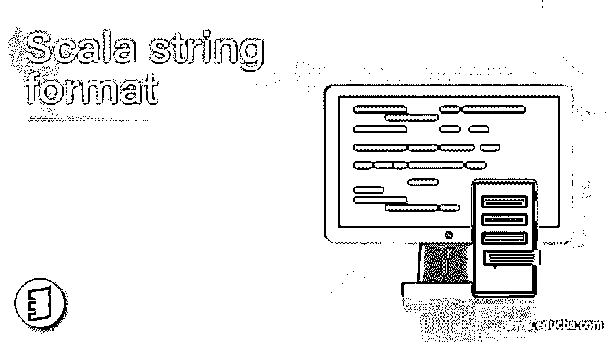

# Scala 字符串格式

> 原文：<https://www.educba.com/scala-string-format/>

## Scala 字符串格式介绍

在编程语言中，当我们想要打印字符串消息之间的变量值时，需要字符串格式。在这种情况下，需要字符串格式；这使得代码易于阅读和理解。此外，通过使用字符串格式，我们可以通过调用 Scala 中的两个可用方法，轻松地将变量值或动态值放入字符串消息中。Scala 为我们提供了两种方法来格式化构建中的字符串。在接下来的章节中，我们将更详细地讨论这两种方法，如何在编程时使用它们，Scala 为我们提供了两种格式化方法。

### 句法

到目前为止，我们知道 string 格式用于格式化我们的输出消息，它既可以在日志中使用，也可以保存在数据库中以备将来使用。让我们详细看看 Scala 中格式化字符串的语法，见下文；

<small>网页开发、编程语言、软件测试&其他</small>

**1。format()方法:**在这个方法中，我们可以根据需要传递不同的参数。我们可以在准备的任何字符串消息上调用它，并在其中传递参数。

`String.format(value1, value2, value3..)`

**2。formatted()方法:**该方法可用于 scala 中的任何对象。它可以是 double、integer 或 string。它可以拿起任何物体。请参见下面的语法以便更好地理解；

`anyobject.formatted("your string here ....")`

### 如何在 Scala 中格式化字符串？

到目前为止，我们知道我们使用 Scala 中的格式来格式化我们的字符串。如果程序员想用消息单独跟踪值，这种格式很方便；此外，这种格式化有助于保存日志，这在识别应用程序中的错误时非常有用。在 Scala 中，我们有两种方法来格式化我们的字符串消息；这些是 Scala 的内置方法；我们不需要包含任何库来使用它们，因此使用起来也很方便。在下一节中，我们将详细讨论这些方法，它们是如何工作的，以及它们的签名。让我们来看看他们每个人的细节，见下文；

**1。format():** 这个方法接受任意数量的参数，这取决于我们在创建字符串消息时传递的变量。我们可以在字符串消息上调用这个方法。它已经定义了一些符号来打印消息之间的各种对象。第一，看它的签名；

`String.format(value1, value2, value3..)
Symbols defined by the format method ;`

**a) %d:** 这个符号用于在 Scala 中打印消息内部的整数值。但这是最常见的，并在各种编程语言中使用，如 c，c++等。如果要打印字符串消息之间的任何整数，可以使用%d 作为符号。为了更好的理解，我们将看一个如何使用它的练习例子，见下文；

**举例:**

“嗨，我今天已经做了%d 组练习了！!"

**b) %f:** 这个符号用于在 Scala 中打印消息内部的任何浮点值。但这是最常见的，用于各种编程语言，如 c，c++等。如果您想打印字符串消息之间的任何浮点数，您可以使用%f 作为符号。为了更好的理解，我们将看一个如何使用它的练习例子，见下文；

**举例:**

“嗨，今年 SBI 银行的贷款利率提高了%f!”！!!!"

**c) %c:** 这个符号用于在 Scala 中打印消息内的任何字符值。但这是最常见的，用于各种编程语言，如 c，c++等。如果要打印字符串消息之间的任何字符，可以使用%c 作为那里的符号。为了更好的理解，我们将看一个如何使用它的练习例子，见下文；

**举例:**

“嗨，%c 再见！!!!"

**d) %s:** 这个符号用于在 Scala 中打印消息内的任何字符串值。但这是最常见的，并在各种编程语言中使用，如 c、c++等。如果您想要打印字符串消息之间的任何字符串，您可以使用%c 作为符号。为了更好地理解，我们将看到一个如何使用它的实践例子，见下文；

**举例:**

“嗨，%s 再见！!!!"

**2。formatted()方法:**通过使用这个方法，我们可以用任何对象来处理。它可以是整数、双精度、浮点，甚至是字符串本身。我们可以在方法内部传递字符串消息，并在 scala 中按照我们的意愿格式化字符串。第一，看它的签名，更好的理解它的用法；

`signature;
anyobject.formatted("message")`

在上面的代码行中，我们对一个对象调用这个方法，所以基本上，这个方法被设计成只对对象进行操作。在里面，我们可以传递包含感谢符号的字符串消息来打印对象变量的值。

这种方法的所有符号也是一样的。我们可以在任何字符串消息中使用它们，尽管它们在任何编程语言中都很常见。

### 例子

下面提到了不同的例子:

#### 示例#1

在这个例子中，我们使用 Scala 中的 format()方法来格式化我们的字符串。

**代码:**

`object Main extends App{
// Your code here!
println("Using format() method in Scala ************************")
val m1 = "Hello i am inteteger %d"
val m2 = "Hello i am string %s"
val m3 = "Hello i am character %c"
val m4 = "Hello i am float %f"
val value1 = 15
val value2 = "Hello World !!"
val value3 = 'z'
val value4 = 10.1
val result1 = m1.format(value1)
val result2 = m2.format(value2)
val result3 = m3.format(value3)
val result4 = m4.format(value4)
println("result is ::::::")
println("result one is ::::::" + result1)
println("result two is ::::::" + result2)
println("result three is ::::::" + result3)
println("result four is ::::::" + result4)
}`

**输出:**

#### 实施例 2

在这个例子中，我们使用 Scala 中的 formatted()方法来格式化我们的字符串。

**代码:**

`object Main extends App{
// Your code here!
println("Using formatted() method in Scala ************************")
val m1 = "Hello i am inteteger %d"
val m2 = "Hello i am string %s"
val m3 = "Hello i am character %c"
val m4 = "Hello i am float %f"
val value1 = 15
val value2 = "Hello World !!"
val value3 = 'z'
val value4 = 10.1
val result1 = value1.formatted(m1)
val result2 = value2.formatted(m2)
val result3 = value3.formatted(m3)
val result4 = value4.formatted(m4)
println("result is ::::::")
println("result one is ::::::" + result1)
println("result two is ::::::" + result2)
println("result three is ::::::" + result3)
println("result four is ::::::" + result4)
}`

**输出:**

### 结论

通过使用这些方法，我们可以以任何方式格式化我们的字符串，这既可以用于日志目的，也可以用于向用户显示适当和简单的消息。这些是内置的方法，所以它非常容易使用，可读性强，也容易理解。

### 推荐文章

这是一个 Scala 字符串格式的指南。在这里，我们讨论如何在 Scala 中格式化字符串，并举例说明代码和输出。您也可以看看以下文章，了解更多信息–

1.  [合并字节](https://www.educba.com/scala-byte/)
2.  [Scala IDE](https://www.educba.com/scala-ide/)
3.  [Scala 映射函数](https://www.educba.com/scala-map-function/)
4.  [标量元组](https://www.educba.com/scala-tuples/)

