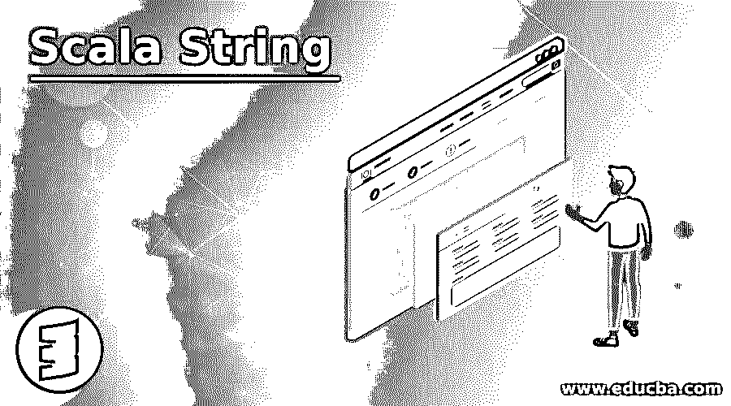

# Scala 字符串

> 原文：<https://www.educba.com/scala-string/>

## Scala 字符串介绍

Scala String 类本质上也是不可变的，这意味着一旦创建就不能更改。字符串只不过是一个字符序列或一组字符。字符串就像常量一样，一旦创建就无法更改。但是我们也可以让我们的字符串成为相互的，但是为此我们需要使用字符串生成器，它也和 java 一样。

### 如何在 Scala 中定义一个字符串？

在 scala 中，我们可以用两种方法创建字符串:使用字符串文字和 b 定义字符串。

<small>网页开发、编程语言、软件测试&其他</small>

`varmyStr: String = "your value"`

在这个例子中，我们通过在文本前分配一个字符串关键字来创建一个字符串对象。

`varmyStr = "your value"`

在这种语法中，我们使用字符串文字来创建一个字符串对象。这两种方法都与 java 相同，只是稍有修改。

### 如何在 Scala 中初始化 String？

我们必须在声明字符串的时候初始化它。

**代码:**

`object Main extends App{
// Your code here!
varmyStr : String = "hello."
println("Initializing the string using String keyword " + myStr)
}`

`object Main extends App{
// Your code here!
varmyStr = "hello."
println("Initializing the string using String literal " + myStr)
}`

通过这两种方法，我们可以在 Scala 中初始化字符串。

在 scala 中我们有字符串插值，通过它我们可以在 Scala 中创建字符串对象。

这种字符串插值可以通过以下三种方式实现:

**1。f '插值器:**这个 f '插值器允许我们像在 C 编程语言中那样格式化字符串。

让我们举一个例子来格式化字符串，我们尝试用字符串值附加 float。

`println(f"$student%s is $weight%2.2f heavy")`

**2。s '插值器:**通过使用这个插值器，我们可以用字符串本身直接处理我们的变量，我们只需要在字符串上使用' s '来添加它们。我们只需要处理想要用$variable 显示的字符串变量。

`println(s"start ($variablename)")`

**3。raw' interpolate:** 除此之外，该插值不会对字符串中的文字进行任何转义，它的工作方式与 a 's '插值相同。

### Scala 字符串的方法

下面给出了 Scala 中可用的内置方法:

*   **String concat(String str):** 将当前字符串末尾的字符串连接起来。
*   **intcompareTo(Object o):** 这个方法将一个字符串对象与另一个对象进行比较。
*   **char charAt(int index):** 这个方法将返回出现在提到的索引处的字符。
*   **intlength():** 返回字符串的长度。
*   **booleanmatches(字符串正则表达式):**用正则表达式匹配字符串。
*   **String replaceAll(字符串正则表达式，字符串替换):**用正则表达式匹配替换字符串。
*   **in hashCode():**提供 hashcode。
*   **intcomparetignorecase(String str):**此方法不区分大小写。
*   **intcompareTo(String another String):**这个方法比较字符串的内容。
*   **字符串替换(char oldChar，char newChar):** 用新的替换字符串。
*   **booleanaequalsignorecase(String another String):**此方法不区分大小写。
*   **String[]Split(String regex):**用提供的参数拆分字符串。
*   **String substring(intbeginIndex):**返回新的子串。
*   **String toLowerCase():** 将字符串转换成小写。
*   **String trim()** :去掉空格。
*   **String toString():** 这个对象(已经是字符串了！)本身就是返回的。
*   **String toUpperCase():** 转换成大写。
*   **char[] toCharArray():** 这个方法将字符串转换成字符数组。
*   **intlastIndexOf(intch):** 这个方法返回字符串中最后一个出现的字符的索引。
*   **byte getBytes():** 这个方法返回数组的字节。
*   **String intern():** 这个方法返回规范的表示。
*   **booleancontentEquals(StringBuffersb):**该方法采用字符串缓冲区对象。如果序列与字符串缓冲区匹配，它将返回 true。
*   **String[] split(String regex，int limit):** 这个方法根据正则表达式和 limit 来拆分字符串。

### Scala 字符串示例

下面是提到的例子:

#### 示例#1

定义和声明字符串。

**代码:**

`object Main extends App{
// Your code here!
varmystr = "Hello, Scala!"
var mystr1 : String = "by string";
println("with string literal :: " + mystr)
println("with string keyword :: " + mystr1)
}`

**输出:**

#### 实施例 2

这个方法将返回字符串的长度。

**代码:**

`object Main extends App{
// Your code here!
varmystr = "check string length.."
var length =  mystr.length
println("length is " + length)
}`

**输出:**

#### 实施例 3

该方法将以大写形式返回字符串。

**代码:**

`object Main extends App{
// Your code here!
varmystr = "hello world...!!"
println("before upper case is " + mystr)
var upper =  mystr.toUpperCase
println("After upper case is " + upper)
}`

**输出:**

#### 实施例 4

将字符串转换成小写字母。

**代码:**

`object Main extends App{
// Your code here!
varmystr = "HELLO WORLD BYEBYEBEY...!!"
println("before lower case is " + mystr)
var lower =  mystr.toLowerCase
println("After lower case is " + lower)
}`

**输出:**

#### 实施例 5

在字符串中执行修剪。

**代码:**

`object Main extends App{
// Your code here!
varmystr = "    HELLO   WORLD    BYEBYEBEY...!!   "
println("before lower case is " + mystr)
var trim =  mystr.trim
println("After lower case is " + trim)
}`

**输出:**

#### 实施例 6

在这个方法中，我们用新的子串替换我们的子串。

**代码:**

`object Main extends App{
// Your code here!
varmystr = "    HELLO   WORLD    BYEBYEBEY...!!   "
println("before lower case is " + mystr)
var trim =  mystr.replace("HELLO ", "good replcae string")
println("After lower case is " + trim)
}`

**输出:**

#### 实施例 7

在这个方法中，我们比较字符串，如果字符串匹配，它将返回整数。

**代码:**

`object Main extends App{
// Your code here! For compare to
varmystr = "One string"
var mystr1 = "One string match"
if(mystr.compareTo(mystr1) == 0){
println("string matches!!!")
}else{
println("string does not matches !!!")
}
}`

**输出:**

### 结论

在 Scala 中，String 类也像 Java 一样是不可变的。这意味着对象一旦创建就不能更改。我们也可以通过使用字符串和字符串前的字符串来创建。此外，我们使用字符串生成器使字符串在 Scala 语言中可变。但是我们需要明确地说明这一点。

### 推荐文章

这是一个 Scala 字符串的指南。这里我们讨论 Scala 字符串的介绍，如何定义字符串，如何初始化字符串的方法和例子。您也可以看看以下文章，了解更多信息–

1.  [Scala While 循环](https://www.educba.com/scala-while-loops/)
2.  [Scala 高阶函数](https://www.educba.com/scala-high-order-functions/)
3.  [Scala 中的构造函数](https://www.educba.com/constructors-in-scala/)
4.  [Scala 中断](https://www.educba.com/break-in-scala/)

