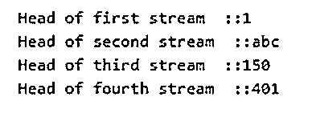
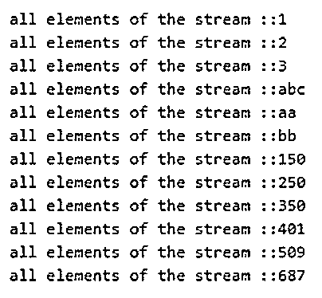

# 斯卡拉流

> 原文：<https://www.educba.com/scala-stream/>

## Scala 流简介

scala 流也是存储数据的 Scala 集合的一部分。这类似于 scala 中的 list，只有一点不同。在 scala stream 中，只有在需要的时候才会计算值 Scala Stream 是一个懒惰列表，它只在需要的时候计算值，因此通过不立即加载值来提高程序的性能。

**语法:**

<small>网页开发、编程语言、软件测试&其他</small>

`valstream_name = value1 #:: value2 #:: value3 #:: Stream.empty`

在 scala 中，我们使用#::操作符来创建一个流并给它们赋值。但是在 list 中，我们只使用::操作符来创建它们。同样，在 scala stream 中，我们在语法末尾使用 Stream.empty。

`valmyStream = 10 #:: 20 #:: 30 #:: Stream.empty`

所以这样我们可以给 s 流赋值，但是它只会计算第一个值。

### Scala 中的 Stream 是如何工作的？

正如我们所见，scala 流是惰性列表，它们就像 scala 上的列表，唯一的区别是它们的元素是惰性计算的，而不是一次计算。只有我们请求的元素才会被计算，因此提高了程序的性能。但是 scala 中的流速度很快。

**举例:**

`varmystm = 10 #:: 20 #:: 30 #:: Stream.empty`

在这里，流的头部是 10，而 20，30 是流的尾部。因此，在输出中，也将打印头部，而不是尾部，因为它们还没有被计算。在这个例子中，我们在流中有 3 个元素。

在 scala 中，我们有序列、列表和流。

#### 1.顺序

这也是存储元素的集合的一部分，或者我们可以说是元素序列。但是这个集合以某种特定的顺序存储元素。但是一旦我们将元素定义到集合中，就不能改变它们的顺序。这导致对其元素的顺序处理，因此可能需要更多时间来处理它们。

**包:Scala . collection . seq>T3】在这个包里我们可以找到这个类。**

#### 2.目录

这也是 scala 中 collection 的一部分。这也用于存储元素组，这是 scala 中 sequence 的子类。scala 中的 List 是 sequence 的默认实现。逐一列出流程的所有元素。仅计算一个值并不严格。

**Package:Scala . collection . immutable . list>T3】在这个里面我们可以找到这个类。**

#### 3.溪流

这也是收集的一部分，除了一个改变，它是基于懒惰的方法。这意味着一次只能计算一个元素。除此之外，它拥有 scala 中 list 的所有特征。Stream 也是 sequence 的子类。

List 和 Stream 都并行处理它们的元素，因此可以提高性能，如果您希望您的任何集合并行处理，那么您将需要> > Scala . collection . parallel。Stream 比 List 需要更少的内存，因为它一次只计算一个元素。

**性能特征**:从性能的角度来看，我们无法决定哪一个更好，但是我们知道 stream 是基于惰性方法的，它在需要时计算元素，所以我们可以说它可以为我们提供比其他集合更好的性能。

| 不变的 | 头 | 尾巴 | 应用 | 更新 | 预先考虑 | 附加 | 插入 |
| 溪流 | 英语字母表中第三个字母 | 英语字母表中第三个字母 | 英语字母表中第十二个字母 | 英语字母表中第十二个字母 | 英语字母表中第三个字母 | 英语字母表中第十二个字母 | – |
| 目录 | 英语字母表中第三个字母 | 英语字母表中第三个字母 | 英语字母表中第十二个字母 | 英语字母表中第十二个字母 | 英语字母表中第三个字母 | 英语字母表中第十二个字母 | – |

我们可以看看 scala 中流和列表集合的性能特点。以防不可改变。

这里常数的意思是:

*   **L:** 这个符号定义了这个操作依赖于集合的大小，我们可以说它与集合的长度成正比，本质上是线性的。
*   这将需要恒定的时间。
*   **-:** 此符号表示上述集合不支持此操作。

### Scala 流的例子

下面是提到的例子:

#### 示例#1

在这个例子中，我们正在创建不同的流列表。

**代码:**

`object Main extends App{
// Initializing the stream with values.
val mystm1 = 001 #:: 002 #:: 003 #:: Stream.empty
val mystm2 = "abc" #:: "aa" #:: "bb" #:: Stream.empty
val mystm3 = 150 #:: 250 #:: 350 #:: Stream.empty
val mystm4 = 401 #:: 509 #:: 687 #:: Stream.empty
//print stream
println("Values in stream first  ::" + mystm1)
println("Values in stream second  ::" + mystm2)
println("Values in stream third  ::" + mystm3)
println("Values in stream four  ::" + mystm4)
}`

**输出:**

#### 实施例 2

在这个例子中，我们正在检索每个流列表的头部。

**代码:**

`object Main extends App{
// Initializing the stream with values.
val mystm1 = 001 #:: 002 #:: 003 #:: Stream.empty
val mystm2 = "abc" #:: "aa" #:: "bb" #:: Stream.empty
val mystm3 = 150 #:: 250 #:: 350 #:: Stream.empty
val mystm4 = 401 #:: 509 #:: 687 #:: Stream.empty
//print sstream head
println("Head of first stream  ::" + mystm1.head)
println("Head of second stream  ::" + mystm2.head)
println("Head of third stream  ::" + mystm3.head)
println("Head of fourth stream  ::" + mystm4.head)
}`

**输出:**

#### 实施例 3

在这种情况下，我们正在检索流的尾部。

**代码:**

`object Main extends App{
// Initializing the stream with values.
val mystm1 = 001 #:: 002 #:: 003 #:: Stream.empty
//print sstream tail
println("Head of first stream  ::" + mystm1.tail)
}`

**输出:**

#### 实施例 4

打印流的所有值。

**代码:**

`object Main extends App{
val mystm1 = 001 #:: 002 #:: 003 #:: Stream.empty
val mystm2 = "abc" #:: "aa" #:: "bb" #:: Stream.empty
val mystm3 = 150 #:: 250 #:: 350 #:: Stream.empty
val mystm4 = 401 #:: 509 #:: 687 #:: Stream.empty
mystm1.toStream.foreach(x =>
println("all elements of the stream ::" + x)
)
mystm2.toStream.foreach(x =>
println("all elements of the stream ::" +x)
)
mystm3.toStream.foreach(x =>
println("all elements of the stream ::" + x)
)
mystm4.toStream.foreach(x =>
println("all elements of the stream ::" + x)
)
}`

**输出:**

### 结论

在 Scala Stream 中，我们一次计算一个元素的值，而不是一次全部。这可以在关注性能的情况下使用。在访问流的元素时，它遵循最后一种方法。

### 推荐文章

这是一个 Scala 流的指南。这里我们讨论 stream 如何在 scala 中工作，并给出相应的编程例子。您也可以看看以下文章，了解更多信息–

1.  [Scala While 循环](https://www.educba.com/scala-while-loops/)
2.  [Scala 高阶函数](https://www.educba.com/scala-high-order-functions/)
3.  [Scala 中断](https://www.educba.com/break-in-scala/)
4.  [Scala 中的构造函数](https://www.educba.com/constructors-in-scala/)

