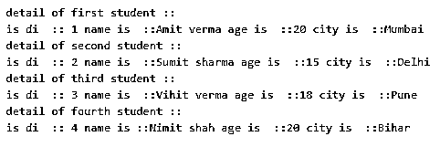

# Scala 案例

> 原文：<https://www.educba.com/scala-case/>


## Scala Case 类介绍

scala 中的 Case 类可以通过使用 case 关键字来定义。这个类和 scala 中的其他类一样，是一个普通的类，但是这些类是不可变的，这意味着一旦赋值，我们就不能改变它们的值。同样，scala 中的 case 类不需要 new 关键字来创建类的对象；它们有一个名为 apply()的默认方法，负责创建对象。scala 中的 Case 类用于模式匹配。

**语法**

<small>网页开发、编程语言、软件测试&其他</small>

在定义 case 类时，我们只需要一个 case 关键字，后跟我们的类名和一个参数列表；如果有，否则也可以是空的。此外，我们可以有一个语法练习示例，以便初学者理解。

```
Case class class_name_here(list_of_parameter)
```

**举例:**

```
Case class Demo(name:String)
```

这里我们定义了一个名为 demo 的 case 类，并在括号内传递了一个参数。如果不需要，该参数列表也可以为空；这完全取决于需求。

### Scala 中的 Case 类是如何工作的？

scala 中的 Case 类使用 apply 方法，管理对象的创建；在使用 case 类时，我们不需要使用新的关键字。还有，对于对象的比较，这个类使用 equals 方法，这个类本质上是不可变的；另外，我们在这个类中使用的参数默认是 public。它们主要用于 scala 中的模式匹配。

现在让我们看看如何为 case 类创建对象；

**举例:**

```
case class Demo(id: Int)
val demo_var = Demo(100)
```

在上面的代码行中，我们将一个 case 类定义为 Demo，在下一行中，我们试图通过创建它的对象并为变量赋值来使用 case 类。但是我们在这里没有使用新的关键字来实例化它。现在，让我们看看在 scala 中使用 case 类参数的语法。

**举例:**

```
case class Demo(id: Int, name: String, age: Int)
val case_var = Demo(200, "test case", "30")
// now try to print the parameter.
println(case_var.name)
```

上面几行代码将工作，并在控制台中输出相应的名称。但是如果我们试图重新分配 case 类的参数，那么也是不可能的；默认情况下，所有参数都是公共的。让我们试着重新分配它；见下文；

**举例:**

```
case_var.name = "this will not work."
```

此外，case 类对象是基于对象的结构进行比较的，而不是像 java 那样通过引用进行比较。如果对象的结构相同，那么它们被认为是相等的。让我们看看如何定义它们；

**举例:**

```
case class Demo(id: Int, name: String, age: Int)
val case_var1 = Demo(200, "test case", "30")
val case_var2 = Demo(200, "test case", "30")
val result = case_var1 == case_var2
```

在上面的代码行中，我们创建了两个 case 对象。两者在结构和价值上都是一样的。所以以 scala 中的 class 为例，它会比较对象的结构而不是它的引用。所以上面几行代码的输出将为真。此外，我们可以为此创建对象的副本，它为我们提供了 copy()方法，但它将创建实例的一个浅层副本。让我们来看一个例子，看看如何用代码实现它。

**举例:**

```
case class Demo(id: Int, name: String, age: Int)
val case_var1 = Demo(200, "test case", "30")
val case_var2 = case_var1.copy(id = case_var1.id, name = case_var1.name, age = case_var1.age)
// print the values
printn(case_var2)
```

在本例中，我们创建了两个对象，但是第二个对象是第一个对象的副本。因此，我们使用 copy()方法来创建 case 对象的浅层副本。

当和这些术语经常互换使用时，我们也有一个 case 对象。我们来讨论一些与类/对象相关的要点，下面会提到；

*   不包含任何参数的类称为对象。
*   Scala case 对象与 Scala 中的其他对象相同，但它们是 case 类和 case 对象的组合。
*   Case 对象比 scala 中的其他对象包含更多的特性和属性。
*   Case 对象是可序列化的，默认情况下，它们包含 hashcode 方法的实现。

### Scala 案例示例

下面提到了不同的例子:

#### 示例#1

一个简单的例子，让初学者看看如何处理 case 类并打印细节。

**代码:**

```
case class Student (id:Int, name:String, age:Int, city: String)
object Main
{
def main(args: Array[String])
{
var s1 = Student(001, "Amit verma", 20, "Mumbai")
var s2 = Student(002, "Sumit sharma", 15, "Delhi")
var s3 = Student(003, "Vihit verma", 18, "Pune")
var s4 = Student(004, "Nimit shah", 20, "Bihar")
println("detail of first student ::")
println( "is di :: " + s1.id + " name is :: " + s1.name + " age is :: " + s1.age + " city is :: " + s1.city)
println("detail of second student ::")
println("is di :: " + s2.id + " name is :: " + s2.name + " age is :: " + s2.age + " city is :: " + s2.city)
println("detail of third student ::")
println("is di :: " + s3.id + " name is :: " + s3.name + " age is :: " + s3.age + " city is :: " + s3.city)
println("detail of fourth student ::")
println("is di :: " + s4.id + " name is :: " + s4.name + " age is :: " + s4.age + " city is :: " + s4.city)
}
}
```

**输出:**




#### 实施例 2

检查定义的对象是否相等。

**代码:**

```
case class Student (id:Int, name:String, age:Int, city: String)
object Main
{
def main(args: Array[String])
{
var s1  = Student(001, "Amit verma", 20, "Mumbai")
var s2  = Student(002, "sumit sharma", 15, "Delhi")
var s3  = Student(003, "vihit verma", 18, "Pune")
var s4  = Student(004, "nimit shah", 20, "Bihar")
var s5  = Student(001, "Amit verma", 20, "Mumbai")
var result = s1 == s5
println("Result if they are equal or not ::")
println(result)
}
}
```

**输出:**


### 结论

Scala case 类是 Scala 中的其他普通类。我们还有一个 case 对象。这些类是不可变的，并且在检查对象是否相等时不比较对象的引用。

### 推荐文章

这是一个 Scala 案例指南。在这里，我们讨论了 Case Classwork 在 Scala 中是如何工作的，并给出了例子、代码和输出。您也可以看看以下文章，了解更多信息–

1.  [Scala 列表](https://www.educba.com/scala-list/)
2.  [Scala 类](https://www.educba.com/scala-class/)
3.  [Scala 平面图](https://www.educba.com/scala-flatmap/)
4.  [Scala for 循环](https://www.educba.com/scala-for-loop/)


