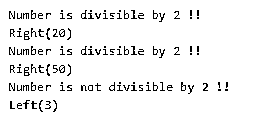
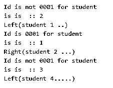

# Scala 也是

> 原文：<https://www.educba.com/scala-either/>


## Scala 简介

Scala 要么用来表示两个可能变量中的一个。它有两个参数，或者我们可以说它有两个孩子。这两个孩子被描述为左和右。此外，scala 也是 scala 选项的替代方案。此外，它还用于处理缺失值。为了更好的理解，我们可以说右边代表成功，左边代表失败。这里的 left 表示失败，也就是说，如果 scala 中的任何一个错误发生在 left 的子元素中，我们可以使用它返回错误。

**语法:**

<small>网页开发、编程语言、软件测试&其他</small>

```
Either[data_type, data_type]
```

为了在我们的程序中使用它，我们有一个非常简单的语法。我们使用带有两个可能值的任一关键字作为成功和失败的左和右子。在 scala 中，我们可以将任何类型的数据类型作为左右两边传递。为了更好地理解语法，我们来看一个练习语法。

```
Either[String, String]
```

用这种简单的方式，我们可以定义它。

### 二者在 Scala 中是如何工作的？

我们可以说 scala 是 Scala 选项的替代品。它有左右两个孩子，分别代表失败和成功。这存在于 scala.util 包中。还有，任一个的左右实例都可以是 scala.util.Right 或者 scala.util.Left 的实例，但是这两个实例已经取代了两个东西。斯卡拉。有的被 scala.util.Right 和 scala 取代。None 被 scala.util.Left 替换，通过使用这个我们可以确定实例在 scala 中是 Left 还是 right 类型。这个 scala 也可以与 For 循环和 yield 结合使用。

现在我们可以拥有它的扩展类、超类型和一些已知的子类:

**1。**Scala 中可用的扩展类:

*   结果
*   可序列化

**2。**Scala 中可用的超类型:

*   可序列化
*   io。可序列化
*   结果
*   等于
*   AnyRef
*   任何的

**3。**Scala 中可用的已知子类:

*   左边的
*   对吧

现在举一个例子让初学者理解如何使用程序:

```
object Main extends App{
// Your code here
defDemo(name: String): Either[String, String] =
{
if (!name.isEmpty)
Right(name)
else
Left("Empty String not passed!! ")
}
println(Demo(" "))
println(Demo("Some string we are passing here"))
println("")
}
```

在这个例子中，我们创建了一个演示函数，通过在 scala 中使用左右两边来验证传递的参数是否为空。如果传递的参数不为空，我们将返回已经传递的值，这意味着成功。如果传递的参数不包含任何值，这意味着它是空的，那么我们将返回一个错误消息，表示在任何一个 scala 中失败。

这包含抽象和具体成员，如下所示:

*   isLeft: 这个方法返回一个布尔值 true 或 false。如果实例被留下，那么它返回 true，否则返回 false。
*   isRight: 这个方法返回一个布尔值 true 或 false。如果实例是正确的，那么它返回真，否则返回假。
*   **productArity:** 这个方法返回一个整数值。基本上它返回产品的尺寸。

### 实现 Scala 的例子

下面是一些例子:

#### 示例#1

在这个例子中，我们简单地使用任一个来检查 scala 中使用其子节点 left 和 right 传递的值。

**代码:**

```
object Main extends App{
// Your code here!
//creating function using either
defDemo(name: String): Either[String, String] =
{
// right instance here
if (!name.isEmpty)
Right(name)
else
// left instance here
Left("Empty String passed!! ")
}
//calling method to check the output.
println(Demo(" "))
println(Demo("Some string we are passing here"))
println(Demo(""))
}
```

**输出:**


#### 实施例 2

在这个例子中，我们正在检查数字是否能被 2 整除。仅将两个实例作为一个整数。

**代码:**

```
object Main extends App{
// Your code here!
//creating function using either
defCheckNumber(num: Int): Either[Int, Int] =
{
// right instance here
if (num % 2 == 0 ) {
println("Number is divisible by 2 !!")
Right(num)
}
else{
// left instance here
println("Number is not divisible by 2 !!")
Left(num)
}
}
//calling method to check the output.
println(CheckNumber(20))
println(CheckNumber(50))
println(CheckNumber(3))
}
```

**输出:**




#### 实施例 3

在这个例子中，我们通过在 scala 中使用左右两个子节点来检查是否找到了学生记录。

**代码:**

```
object Main extends App{
// Your code here!
//creating function using either
defCheckRecord(num: Int, name: String): Either[String, String] =
{
// right instance here
if (num == 001 ) {
println("Id is 0001 for student")
println("is is :: "+ num)
Right(name)
}
else{
// left instance here
println("Id is not 0001 for student")
println("is is :: "+ num)
Left(name)
}
}
//calling method to check the output.
println(CheckRecord(002, "student 1 .."))
println(CheckRecord( 001, "student 2 ..."))
println(CheckRecord(003, "student 4....."))
}
```

**输出:**




### 要记住的事情

在 scala 中使用任何一个都需要记住以下几点:

**1。**左右各有两个孩子

**2。**右代表成功，左代表失败

**3。**假设如果你传递任一个[String，String],那么你必须从右边和左边返回相同的实例。我们不能使用 right 和 left 传递另一个实例，例如:

*   右(“右”)
*   左(“左”)

**4。这两个都是对的，但是我们不能这样返回:Right(20)或 Left9(20)。这是错误的，会导致类型不匹配错误。**

**5。**所有这些，无论是右还是左，都存在于同一个 scala 包 Scala.util 中。

**6。**它还包含混凝土阀门构件。

### 结论

因此，如果我们想要处理两个实例并在它们之间进行检查，scala 也是最佳选择。它非常类似于 scala 中可用的选项。我们可以通过在 scala 中使用要么返回两个东西。一个是使用 Right()实例成功，另一个是使用 Left()实例失败。它应该与我们传递的实例相匹配，否则会在 scala 中产生类型不匹配的错误。

### 推荐文章

这也是 Scala 的指南。在这里，我们讨论 Scala 及其语法的简要概述，以及不同的例子和代码实现。您也可以浏览我们推荐的其他文章，了解更多信息——

1.  [科特林 vs Scala |十大对比](https://www.educba.com/kotlin-vs-scala/)
2.  [Scala 数据类型概述](https://www.educba.com/scala-data-types/)
3.  [Scala for 循环|前 6 个例子](https://www.educba.com/scala-for-loop/)
4.  [Scala 高阶函数](https://www.educba.com/scala-high-order-functions/)


