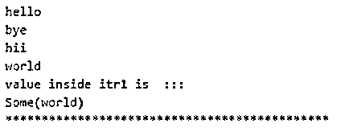
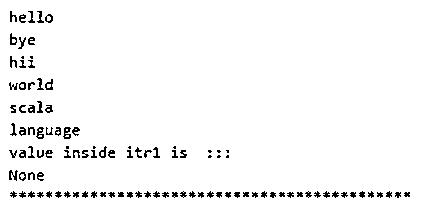
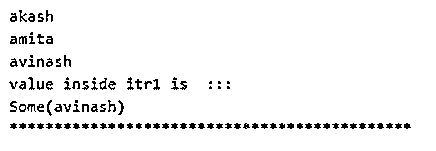

# Scala 发现

> 原文：<https://www.educba.com/scala-finds/>

## Scala Finds 简介

find 函数用于查找集合中的元素。这个 find 函数可以应用于任何类型的集合数据结构。此外，该函数适用于 scala 中的不可变对象和可变对象，即不能改变它的对象和经常改变自己的对象。scala 中的 Find 函数属于抽象迭代器，作为一个具体的方法，这意味着方法包含一个主体。

### 语法和参数

Find 方法将集合中满足给定传递条件的第一个值作为谓词。如果条件不匹配，它将开始迭代整个集合，并且对于无限集合，它将不停地运行。下面请看 scala 定义的语法；

<small>网络开发、编程语言、软件测试&其他</small>

`find(p: (A) ⇒ Boolean): Option[A]`

在上面的 find 语法中，我将采用一个我们想要测试的条件，它的返回类型也是 Option，这意味着如果集合中不存在该值，它将返回 none，否则它将从集合中返回结果值。

`find(obj => {obj % 5 == 0}): Option[A]`

在上面的语法中，我们传递一个条件，它将返回一个除以 5 的值。

### Scala 中的 Find 函数是如何工作的？

Find 函数用于迭代集合元素，它需要一个谓词来匹配值。它的返回类型是 Option，这意味着它在 Java 中的工作方式是可选的。现在谈谈 scala 中定义和实现它的类和超类。这个方法是 AbstartIterator 的一个成员，它扩展了 scala 中的迭代器类。

可用的扩展类:

*   可旅行的
*   可重复的

一些可用的超类型类:

*   可重复的
*   IterableLike[A，Iterable[A]]
*   等于
*   可遗传的
*   可生成的像[A，可迭代的[A]]
*   可穿越的，可穿越的
*   可旅行的
*   GenericTraversableTemplate[A，Iterable]
*   TraversableLike[A，Iterable[A]]
*   GenTraversableLike[A，Iterable[A]]
*   可并行化[A，可变[A]]
*   travelable once[a]
*   gentravelebleonce[a]
*   FilterMonadic[A，Iterable[A]]
*   HasNewBuilder[A，Iterable[A]@ Scala . annotation . unchecked . unchecked variance]
*   AnyRef
*   任何的

一些可用的 knows 子类如下:

*   值集
*   抽象地图
*   抽象序列
*   抽象集
*   默认情况下
*   DefaultKeySet
*   DefaultValuesIterable
*   过滤键
*   MappedValues
*   DefaultKeySortedSet
*   ::
*   抽象地图
*   结束了
*   位元 1
*   结束了 2
*   比特集
*   散列表
*   HashMap1
*   哈希表
*   HashSet
*   哈希表集
*   冲动
*   位图
*   目录
*   列表映射
*   结节
*   ListSet
*   结节
*   长图
*   地图 1
*   地图 2
*   地图 3
*   地图 4
*   默认情况下
*   ImmutableDefaultKeySet
*   无
*   数字范围
*   独家的
*   包括的
*   长队
*   范围
*   包括的
*   集合 1
*   集合 2
*   集合 3
*   集合 4
*   DefaultKeySortedSet
*   溪流
*   骗局
*   空的
*   矢量
*   缠绕字符串
*   抽象缓冲区
*   可抽象的
*   抽象地图
*   抽象集
*   抽象集
*   AbstractSortedMap
*   抽象分类集
*   AnyRefMap
*   ArrayBuffer
*   ArraySeq
*   ArrayStack(阵列堆栈)
*   结束了
*   散列表
*   HashSet
*   历史
*   LinkedHashMap
*   DefaultKeySet
*   过滤键
*   MappedValues
*   LinkedHashSet
*   列表缓冲区
*   列表映射
*   长图
*   默认情况下
*   可变列表
*   OpenHashMap
*   优先级队列
*   长队
*   追溯历史
*   StringBuilder
*   树图
*   树集
*   展开缓冲器
*   WrappedArray
*   布尔的
*   字节数
*   翁查尔
*   双倍的
*   离岸
*   我是个军官
*   奥夫龙
*   奥夫里夫
*   ofShort
*   单位的
*   系统属性
*   PagedSeq
*   堆
*   双重链接列表
*   不变的适应者
*   不变的适应者
*   链接列表
*   优先级队列代理
*   队列代理
*   堆
*   堆栈代理
*   SynchronizedPriorityQueue
*   同步队列
*   同步堆栈
*   脚本

现在我们可以看一个初学者的练习例子，我们将看到它的工作；

`object Main extends App{
// Your code here!
// first creating iterator
val itr1 = Iterator(2, 10, 4, 55, 15, 120)
// now find function
valfindResult= itr1.find(obj => {obj % 5 == 0})
// now the output printing;
println(findResult)
}`

在这个例子中，首先，我们必须创建一个包含一些值的迭代器对象。之后，我们在迭代器上应用查找函数。为此，我们必须指定新创建的迭代器变量，后跟 find 函数。这里你可以看到在 find 函数中我们写了一个条件，即对象应该被 5 整除，余数必须等于 0。正如你在上面的迭代器值中看到的，我们有很多值可以被“5”整除，但是它会打印出集合中的第一个值。

请记住:在使用 scala find 函数时，我们可以使用任何类型的可迭代对象，例如迭代器、列表、集合等。

### Scala 查找的例子

在这个例子中，我们提供了一个整数迭代器，并使用 find()对其应用条件。

**代码:**

`object Main extends App{
// Your code here!
// first creating iterator
val itr1 = Iterator(2, 10, 4, 55, 15, 120)
val itr2 = Iterator(34, 67, 35, 55, 12, 100)
// now find function
val findResult1= itr1.find(obj => {obj % 5 == 0})
val findResult2= itr2.find(obj => {obj % 2 == 0})
// Displays output
println("value inside itr1 is  :::")
println(findResult1)
println("*********************************************")
println("value inside itr2 is  :::")
println(findResult2)
}`

**输出:**

#### 实施例 2

在本例中，我们传递一个不满足的条件，并且不打印任何内容。

**代码:**

`object Main extends App{
// Your code here!
// first creating iterator
val itr1 = Iterator(22, 67, 49, 10, 200,500)
// now find function
val findResult1= itr1.find(obj => {obj % 3 == 0})
// Displays output
println("value inside itr1 is  :::")
println(findResult1)
println("*********************************************")
}`

**输出:**

#### 实施例 3

在这个例子中，我们用 find()处理迭代器中的字符串值。

**代码:**

`object Main extends App{
// Your code here!
// first creating iterator
val itr1 = Iterator("hello","bye", "hii", "world", "scala", "language")
// now find function
val findResult1= itr1.find(obj => {
println(obj)
obj.equals("world")
})
// Displays output
println("value inside itr1 is  :::")
println(findResult1)
println("*********************************************")
}`

**输出:**

#### 实施例 4

在这个例子中，我们使用一个列表来创建一个可移植的对象。

**代码:**

`object Main extends App{
// Your code here!
// first creating iterator
val itr1 = List("hello","bye", "hii", "world", "scala", "language")
// now find function
val findResult1= itr1.find(obj => {
println(obj)
obj.equals("abcxyz")
})
// Displays output
println("value inside itr1 is  :::")
println(findResult1)
println("*********************************************")
}`

**输出:**

#### 实施例 5

在这个例子中，我们使用 set 创建一个 iterable 对象，并对其应用 find 函数。

**代码:**

`object Main extends App{
// Your code here!
// first creating iterator
val itr1 = Set("amit","amita", "ajay", "akash", "atul", "avinash")
// now find function
val findResult1= itr1.find(obj => {
println(obj)
obj.equals("avinash")
})
// Displays output
println("value inside itr1 is  :::")
println(findResult1)
println("*********************************************")
}`

**输出:**

### 结论

Scala find 函数用于查找集合中元素的值。我们可以为此创建一个迭代器对象。它可以处理可变类型和不可变类型的集合。我们必须记住的一点是，我们必须在 find 函数中传递条件，否则它将不起作用并产生错误。

### 推荐文章

这是一个 Scala 查找指南。这里我们也讨论了 scala 中 find 函数的定义和工作原理。以及不同的示例及其代码实现。您也可以看看以下文章，了解更多信息–

1.  笔画比例
2.  [Scala 平面图](https://www.educba.com/scala-flatmap/)
3.  [Scala if else](https://www.educba.com/scala-if-else/)
4.  [Scala 抽象类](https://www.educba.com/scala-abstract-class/)

