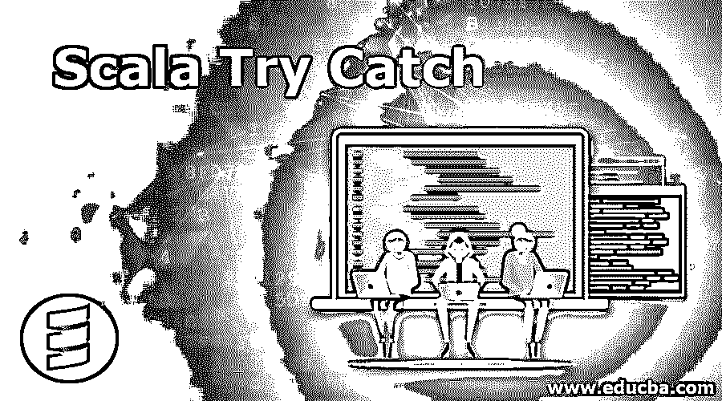
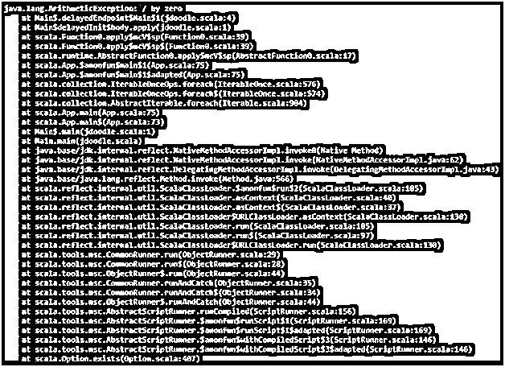

# Scala 尝试捕捉

> 原文：<https://www.educba.com/scala-try-catch/>




## Scala Try Catch 简介

在编程语言中，try catch 用于处理代码中的异常。异常是在程序执行时发生的意外事件，程序将在程序中存在的整行代码未完成的情况下意外终止。因此，为了处理这个事件，我们使用 try catch 块来正常处理我们的程序流。异常导致程序的异常流程。因此，通过使用 try and catch，我们可以处理这个事件并促进正常的流程。

**语法:**

<small>网页开发、编程语言、软件测试&其他</small>

```
try {
// suspected code goes here
}catch {
// to catch exception. We can write multiple case statements here. That is a series of case / /statement.
}
```

在上面的语法中，我们编写了可能导致 try 块中任何异常的可疑代码，catch 语句负责处理发生的异常。

因此，任何可能导致异常的敏感代码部分都可以放在 try 块中，并被 catch 块包围。永远记住 try 块后面总是跟着 catch 块。

### 如何在 Scala 中尝试 Catch 块工作？

scala 中的 try catch 块不同于 java 中的 try catch 块。不同之处在于，在 Scala 中，我们需要以 case 语句的形式在单个 catch 块中提供一系列异常，但在 java 中，我们可以有多个 catch 块。

*   **Try Block:** 在 Scala 的 try lock 中，我们编写了可能抛出异常的危险代码。
*   **Catch 块:**在 Scala 中，Catch 块是一系列 case 语句形式的异常语句。catch 块负责处理异常。try 和 catch 块都为我们提供了程序的正常执行。

假设我们有；

*   开始
*   第一行..
*   lin2 2..
*   第 3 行..
*   留置权 5..这一行有些例外
*   第 6 行..
*   第 7 行..
*   结束

在上面的场景中，我们有 7 行试图执行的代码。但是在第 5 行我们得到了一个异常，所以如果没有 try 和 catch 块，程序会在第 5 行终止，只有剩余的代码不会被执行。

但是我们用 try 和 catch 包围了第 5 行代码，程序不会在第 5 行终止，而是由 catch 块处理异常，其余的代码将执行所需的操作。所以这就是使用 try catch 块的主要好处。

我们可以有一个程序，让初学者更好地理解 try catch 块的正常实现；

没有尝试捕捉我们在执行和处理我们的程序时所面临的问题，让我们看看下面的场景:

**代码:**

```
object Main extends App{
//our code goes here
var number = 10;
var value = number/0;
println("rest of the code.")
}
```

**输出:**




**解释:**在这个例子中，我们试图将一个数除以零。但是 Scala 编译器会抛出一个异常，说“/ by zero”属于运行时异常的范畴。因此，在这种情况下，不会执行其余的行。现在我们将使用 try catch 块对此进行检查。

使用 try catch，我们现在可以正常执行整个程序，而不会遇到任何问题:

**代码:**

```
object Main extends App{
//cod
var number = 10;
try
{
var value = number/0;
}
catch
{
//case statements goes here (single or multiple)
case a: ArithmeticException =>
{
println("ArithmeticException : number is not divisiable by 0." )
}
}
println("rest of the code.")
}
```

**输出:**


在这个例子中，我们用 try catch 包围了我们的代码，所以程序的其余部分工作正常。这就是它在 Scala 中的工作方式。

### 实现 Scala Try Catch 的例子

下面是 Scala Try Catch 的例子:

#### 示例#1

在本例中，我们尝试创建一个文件并从该文件中读取数据。如果这个文件不存在，它将抛出 FileNotFoundException，如果找到了，程序将按预期工作。

**代码:**

```
import java.io.FileReader
import java.io.FileNotFoundException
import java.io.IOException
object Main extends App{
try
{
//risky code
val t = new FileReader("sample.txt")
}
catch
{
case x: FileNotFoundException =>
{
//will print if exception occur.
println("FileNotFoundException: cannot find file specified.")
}
}
}
```

**输出:**


#### 实施例 2

在这个例子中，我们使用多个 case 语句来处理我们的异常。我们正在处理算术和文件找不到。无论哪个异常首先出现，它都将执行 catch 语句，程序的其余部分将正常执行。

**代码:**

```
import java.io.FileReader
import java.io.FileNotFoundException
import java.io.IOException
object Main extends App{
// your code
try
{
//risky code goes here
val value = 10/0;
val t = new FileReader("sample.txt")
}
catch
{
case x: FileNotFoundException =>
{
//will print if exception occure.
println("FileNotFoundException: cananot find file sepcified.")
}
case x: ArithmeticException  =>
{
// Displays this if the file is
// missing
println("ArithmeticException : cannot divide by zero exception.")
}
}
}
```

**输出:**


#### 实施例 3

在这个例子中，我们没有指定确切的异常，而是使用“Throwable”来处理它。因此，如果我们不想指定确切的异常，我们可以使用 throwable 包围这些异常。In 可以处理 Scala 中所有类型的异常。在这里，我们试图重新初始化数组，这样当它达到数组的长度时，它会给我们 ArrayIndexOutOfBoundsException。

**代码:**

```
import java.io.FileReader
import java.io.FileNotFoundException
import java.io.IOException
import java.lang.Throwable
object Main extends App{
try{
varinitilizingArr = Array(500, 300, 200, 800, 1000, 30, 50)
initilizingArr(90)
}
//catch
catch{
//statement 1
case e: Throwable =>println("Throwable :: we have found one unknown exception :  :"+ e)
}
println("rest of the code.")
}
```

**输出:**


### 结论

因此，我们应该始终用 try and catch 包围可疑或有风险的代码，以便继续程序的正常流程。如果我们不包围或者不使用 try catch，我们的整个程序将不会被执行，这将导致一些严重的问题。try 块后面总是跟着 catch 块来处理异常。

### 推荐文章

这是一个 Scala Try Catch 的指南。在这里，我们讨论 Scala Try Catch 的一个简要概述，以及它的不同例子和代码实现。您也可以浏览我们推荐的其他文章，了解更多信息——

1.  [科特林 vs Scala |十大对比](https://www.educba.com/kotlin-vs-scala/)
2.  [Scala 数据类型概述](https://www.educba.com/scala-data-types/)
3.  [Scala for 循环|前 6 个例子](https://www.educba.com/scala-for-loop/)
4.  [Scala 高阶函数](https://www.educba.com/scala-high-order-functions/)


