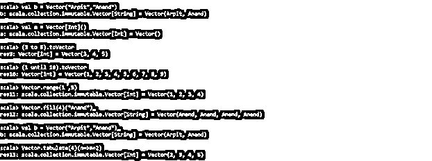
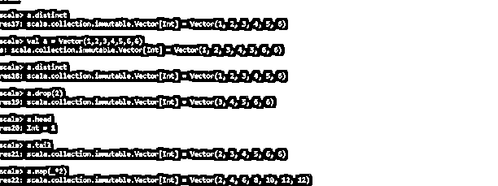

# 标量向量

> 原文：<https://www.educba.com/scala-vector/>

## Scala Vector 简介

Scala Vector 是 Scala 2.8 中引入的一种新的集合类型，用于处理列表中的随机访问。它是一种不可变的数据结构，提供对元素的随机访问。Vector 解决了列表中随机访问的低效问题。它允许在固定时间内访问元素，我们可以访问元素，并在向量的帮助下很容易地修改它们。

扩展 abstract 类，Abstract Seq 和 Indexed Seq trait Vectors 对于大量的元素集合是很好的。它有一个基于索引的不可变序列，我们可以很容易地访问其中的元素。Scala Vector 中的更新和选择相对更快。

<small>网页开发、编程语言、软件测试&其他</small>

### 句法

Scala Vector 的定义是这样的，用 IndexedSeq[A]扩展 AbstractSeq[A]等等，如下所示。:-

`final classVector[+A] extends AbstractSeq[A] with IndexedSeq[A] with GenericTraversableTemplate[A, Vector] with IndexedSeqLike[A, Vector[A]] with VectorPointer[A] with Serializable with CustomParallelizable[A, ParVector[A]]`

#### 创建向量

`scala> val a = Vector(1,2,3,4,5)`

**a:**Scala . collection . immutable . Vector[Int]= Vector(1，2，3，4，5)

`scala> val b = Vector("Arpit","Anand")`

**b:**Scala . collection . immutable . Vector[String]= Vector(Arpit，Anand)

#### 空向量

我们也可以通过不传递任何值并定义向量的数据类型来创建一个空向量，如下所示。

`scala> val a = Vector[Int]()`

**a:**Scala . collection . immutable . Vector[Int]= Vector()

### 通过填充其值来创建新的向量

我们可以通过使用各种方法将值填充到中来创建一个新的向量。

#### 1.To 和 Until 方法

`scala> (3 to 5).toVector
res0: Vector[Int] = Vector(3, 4, 5)
scala> (1 until 10).toVector
res1: Vector[Int] = Vector(1, 2, 3, 4, 5, 6, 7, 8, 9)`

#### 2.射程法

`scala> Vector.range(1 ,5)
res3: scala.collection.immutable.Vector[Int] = Vector(1, 2, 3, 4)`

这些是创建标量向量的各种方法。还有一些其他的方法，我们可以用来创建一个向量。填充和制表，让我们看看它是如何工作的

#### 3.填充和制表方法

`scala> Vector.fill(4)("Anand")
Vector(Anand, Anand, Anand, Anand)
scala> Vector.tabulate(4)(n=>n+2 )
Vector(2, 3, 4, 5)`

向量创建的代码片段:

### 向量函数是如何工作的？

Vector 使用的数据结构是 Trie。Trie 基本上是一个 32-树，第 1 层是一个大小为 32 的数组，第 2 层是一个 32 个第 1 层的数组，这种情况会持续下去。它独立于它想要的数据类型。

每个 32 路节点使用数组[32]可以存储 0-32 个子节点的引用或 0-32 条数据。

*   该数据结构在树中的位置定义了与其相关联的键，并且根与空字符串相关联。
*   树的结构是这样的，如果树的深度是 n 级，那么 1 到 n-1 不包含数据，数据将只包含在 n 级。

#### 向量方法

我们可以在 Scala Vector 中使用几种方法。让我们详细了解一下这些方法。

**1。追加和前置**

我们可以在向量中附加或预先考虑值，从而方便编程模型添加数据值。

`scala> val a = Vector(1,2,3,4,5,6)
Vector(1, 2, 3, 4, 5, 6)
scala> val b = a :+7
Vector(1, 2, 3, 4, 5, 6, 7)
scala> val b = a ++ Seq(7,8)
Vector(1, 2, 3, 4, 5, 6, 7, 8)
scala> val c = 3 +: a
Vector(3, 1, 2, 3, 4, 5, 6)`

代码片段:

**2。独特的方法**

这将返回一个没有重复值的新序列。

`scala> val a = Vector(1,2,3,4,5,6,6)
Vector(1, 2, 3, 4, 5, 6, 6)
scala> a.distinct
Vector(1, 2, 3, 4, 5, 6)`

代码片段:

**3。下降方法**

删除 Vector 中给出的前 n 个元素。

`scala> a.drop(2)
Vector(3, 4, 5, 6, 6)`

**4。头法**

返回头，向量的第一个值。

`scala> a.head
res20: Int = 1`

**5。尾巴法**

返回除向量第一个值之外的尾部。

`scala> a.tail
Vector(2, 3, 4, 5, 6, 6)`

**6。矢量地图**

此方法通过将函数应用于每个元素来帮助返回新的序列。

`scala> a.map(_*2)
Vector(2, 4, 6, 8, 10, 12, 12)`

代码片段:

**7。反向方法**

它反转向量值并产生一个新值。

`scala> a.reverse
Vector(6, 6, 5, 4, 3, 2, 1)`

**8。联合方法**

它将一个向量的值与另一个向量的值合并，产生一个新的向量。

`scala> val a = Vector(1,2,3,4,5,6,6)
Vector(1, 2, 3, 4, 5, 6, 6)
scala> val b = Vector(2,3,4)
Vector(2, 3, 4)
scala> a.union(b)
Vector(1, 2, 3, 4, 5, 6, 6, 2, 3, 4)`

**9。空方法**

这将检查向量是否为空。

`scala> a.isEmpty
res25: Boolean = false`

10。尺寸方法

这将返回向量的大小。

`scala> a.size
res29: Int = 7`

这里我们看到了 Scala Vector 使用的一些方法，使得传统的 Scala 编程变得简单。

### 结论

从上面的文章中，我们了解了集合类型 Vector 以及它相对于函数式编程的优势。我们看到了一些我们可以使用的方法，以及向量方法背后使用的数据结构。所以这种层次方法对于 Scala 中的函数式编程来说是很好的。

### 推荐文章

这是一个 Scala Vector 的指南。在这里，我们讨论它是如何工作的，如何用适当的语法和相应的例子创建一个向量。您也可以浏览我们的其他相关文章，了解更多信息——

1.  [Scala 集合](https://www.educba.com/scala-collections/)
2.  [Scala 中断](https://www.educba.com/break-in-scala/?source=leftnav)
3.  [Scala For 循环](https://www.educba.com/scala-for-loop/?source=leftnav)
4.  [Scala Foreach](https://www.educba.com/scala-foreach/?source=leftnav)

