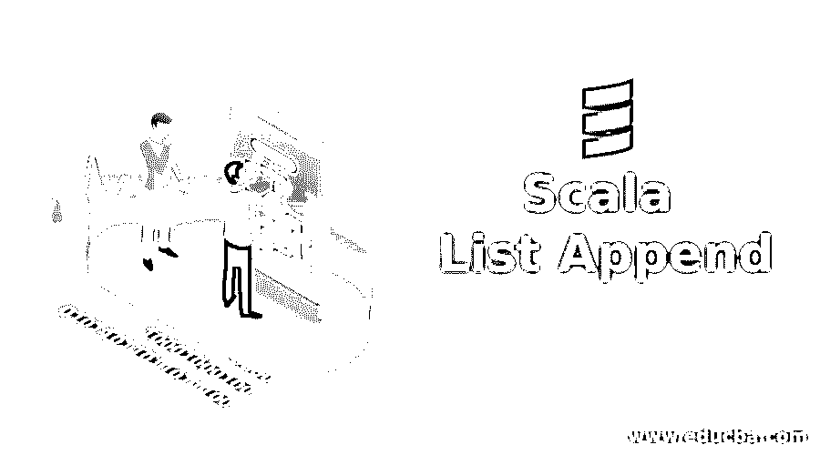
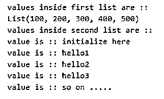

# Scala 列表追加

> 原文：<https://www.educba.com/scala-list-append/>

## Scala 列表追加简介

下面的文章提供了 Scala 列表追加的概要。Scala 列表是不可变的，这意味着一旦赋值对象就不能改变它自己。列表也是集合的一部分，用于存储和检索元素。scala 中列表类似于数组，只存储相同类型的元素。Scala list 内部使用链表，我们知道链表更适合于操作。要在 list 对象中直接追加或添加任何元素，我们不能这样做，因为 list 是不可变的。所以我们可以在创建列表对象时分配元素。

**语法:**

<small>网页开发、编程语言、软件测试&其他</small>

我们可以将值添加到 list 和 listBuffer 中。

1.要在列表对象中追加值，我们有两种方法，如下所示:

`val variable_name = List(value1, value2, value3 , soon..)`

`val variable_name: List[data_type] = List(value)`

2.为了给 ListBuffer 赋值，我们使用+=操作符随时给它赋值，因为 ListBuffer 本质上是可变的。

`var variable_name = new ListBuffer[data_type]()
variable_name += value1
variable_name += value1
variable_name += value1`

### **如何在 Scala 中追加列表？**

列表用于存储元素。这些元素只能是同一类型。在 Scala 中 list 代表链表数据结构。在一个单链表结构中，我们有一个节点，它包含两个东西:数据和下一个节点的地址。我们可以通过我们的逻辑以编程方式修改 scala list 中的值。列表中还可以包含重复元素，并保持插入顺序。Scala list 是在 scala.collection.immutable 包内定义的。我们可以看看它的超类型和子类。

我们知道 list 是不可变的，所以我们只能给 list 赋值或追加一次值，为此我们将创建一个 list 对象并给它赋值。

现在我们可以有一个练习语法:

`var list1 = List("a", "b", "c", "d", "e", "f")`

通过这种方式，我们可以在不提及数据类型的情况下为列表对象赋值。我们只需要给出括号内的值。另一种方法是在创建对象时提到数据类型。

**增值税列表:List[Int] = List(100，200，300，400，500)**

通过这种方式，我们可以为列表对象赋值或追加值。但是在这个方法中，我们也给了列表变量数据类型。这意味着我们不能给它另一种类型的变量，否则它会给我们错误。

在我们的例子中，我们将 Int 类型的值添加到列表中，所以我们不允许添加任何其他数据类型的值，如 string、float 等。

**举例:**

**代码:**

`import scala.collection.immutable._
object Main extends App{
// Your code here!
val list1: List[Int] = List(100, 200, 300, 400 , 500)
val list2 = List("initialize here", "hello1", "hello2", "hello3", "so on .....")
println("values inside first list are :: ")
println(list1)
println(list2)
}`

使用 list append 需要记住的一点是，我们必须将这个包导入到我们的程序 import Scala . collection . immutable . _ 现在我们已经在 main 方法中创建了两个 list，一个是整数列表，另一个是字符串类型列表。此外，我们只在创建时附加了值，现在我们只是打印元素。

### Scala 列表追加示例

下面是提到的例子:

#### 示例#1

在这个例子中，我们试图在列表中添加元素，并在创建列表对象后打印出值。

**代码:**

`import scala.collection.immutable._
object Main extends App{
// Your code here!
val list1: List[Int] = List(100, 200, 300, 400 , 500)
val list2 = List("initialize here", "hello1", "hello2", "hello3", "so on .....")
println("values inside first list are :: ")
println(list1)
// output
println("values inside second list are :: ")
for(value<-list2)
{
println("value is :: " +value)
}
}`

**输出:**

#### 实施例 2

在这个例子中，我们创建了一个可变列表对象。在可变列表对象中，我们使用+=操作符将元素添加到列表对象中。为了让它工作，我们需要在程序中包含导入 Scala . collection . mutable . list buffer 包。

**代码:**

`import scala.collection.mutable.ListBuffer
object Main extends App{
// Your code here!
// here we are creating the ListBuffer object
var list = ListBuffer[String]()
// assigning values
list += "Hello"
list += "byr"
list += "to all"
list += "to all 1"
list += "to all 2"
list += "to all 3"
println(list)
}`

**输出:**

#### 实施例 3

在这个例子中，我们使用 append()方法在 list 对象中添加对象，它也将是一个可变对象。为了证明这一点，我们使用了 ListBuffer，因为这是我们在 scala 中创建可变列表对象的方法。

**代码:**

`import scala.collection.mutable.ListBuffer
object Main extends App{
// Your code here!
// here we are creating the ListBuffer object
var list = ListBuffer[String]()
// assigning values
list += "Hello"
list += "byr"
list += "to all"
list += "to all 1"
list += "to all 2"
list += "to all 3"
println("values inside list before " + list)
// using method
list.append("new value append")
println("List after append method called :::: " + list)
}`

**输出:**

#### 实施例 4

在这个例子中，我们将使用+=操作符在对象创建后追加值。

**代码:**

`import scala.collection.mutable.ListBuffer
object Main extends App{
// Your code here!
// here we are creating the ListBuffer object
var list = ListBuffer[String]()
// assigning values
list += "Hello"
list += "byr"
list += "to all"
list += "to all 1"
list += "to all 2"
list += "to all 3"
println("values inside list before " + list)
// using method
list += "new value append"
println("List after append operator called :::: " + list)
}`

**输出:**

### 结论

在 scala 中，我们只能以一种方式向列表对象添加元素，那就是在对象初始化的时候。这是因为列表对象在 scala 中是不可变的，所以一旦我们指定了对象，就不能改变它的值。但是我们有 ListBuffer 实现的 List 和这么多类。这个类本质上是可变的，所以我们有+=操作符在任何时候给 listBuffer 赋值。

### 推荐文章

这是一个 Scala 列表追加的指南。这里我们分别讨论 Scala 列表追加的介绍，如何追加列表以及例子。您也可以看看以下文章，了解更多信息–

1.  笔画比例
2.  [Scala 平面图](https://www.educba.com/scala-flatmap/)
3.  [Scala 抽象类](https://www.educba.com/scala-abstract-class/)
4.  [Scala if else](https://www.educba.com/scala-if-else/)

