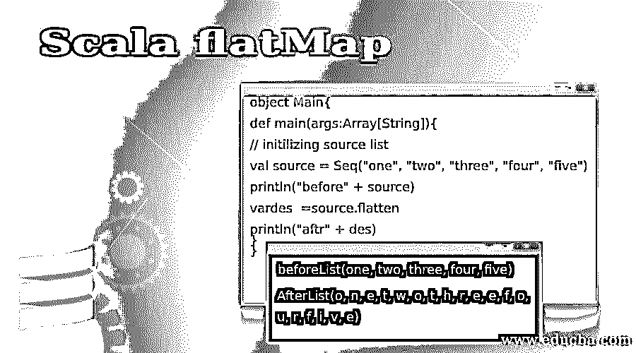

# Scala 平面图

> 原文：<https://www.educba.com/scala-flatmap/>




## Scala 平面图简介

在 Scala 中，flatmap 方法用于 scale 的集合和数据结构，顾名思义，它是两种方法的结合，即 map 和 Flatten 方法。如果我们在任何集合上使用平面映射，那么它将在给定的集合上应用这个方法映射和 flatten 方法。我们可以对 Scala 的不可变和可变集合使用这种平面映射方法。可变的是可以改变的，不可变的一旦赋值就不能改变。

**语法:**

<small>网页开发、编程语言、软件测试&其他</small>

```
defflatMap[B](f: (A) =>IterableOnce[B]): List[B]
```

在上面的语法中，它将迭代列表中的所有元素，并将函数应用于列表中的所有元素，并准备一个包含已修改元素的新列表。

### Scala 中的 flatMap 是如何工作的？

flatMap 是 Scala 中 Map 和 flatten 两种方法的结合。Scala flatmap 方法生成一个序列，它将打破输入的分组。我们不能说它是贴图和展平的结合，但实际上它依次运行两种方法，首先是贴图，然后是展平方法。

平面图类似于 map，只是它们的移植是由 collection 提供的，是最新的版本，但是它们也存在于其他一些类中，如果需要，我们可以在我们的类中实现它们，一些已经实现了它的类的名称如下:

*   尝试
*   [计]选项
*   将来的

为了理解 Scala 中的平面映射方法，让我们通过它们来详细了解它们是如何工作的。

#### 1.地图()

该方法将函数作为参数，并将函数应用于列表的每个元素，而不修改源列表。它也适用于不可变和可变的 Scala 集合。

下面是例子:

**代码:**

```
//Example for begineers
object Main{
def main(args:Array[String])
{
// original collection or we can say source collection
val collection = List(100, 400, 500)
// modified collection
valnewly_formed_coll = collection.map(some_function)
println(newly_formed_coll)
}
}
```

在上面的例子中，我们给出了源集合，并试图通过使用 map 和传递一些函数作为参数来修改它，但是 map 返回新的集合。

#### 2.展平()

GenricTraversableTemplate 特征成员的 Scala flatten 方法。

定义:定义展平[A]:可穿越[A]

初学者的示例:

**代码:**

```
object Main{
def main(args:Array[String]){
// initilizing source list
val source = Seq("one", "two", "three", "four", "five")
println("before" + source)
vardes =source.flatten
println("aftr" + des)
}
}
```

**输出:**


现在，在 flaMap 中，当您有这样一个场景时，您可以同时使用这两种方法:

1.  您创建了一个源列表，并希望使用 map()修改其元素，然后创建一个新列表。
2.  按来源列表新建的列表。
3.  在 map 方法()之后调用 flatten 方法。

所以在上面的例子中，你可以使用 scala 的 flatmap 方法。它完成了上面提到的所有三个步骤。我们可以举一个例子来理解它是如何工作的:

**代码:**

```
object Main extends App{
// create a colletion
val collection = List("hi", "bye")
println(collection.flatMap(x => x + "hello"))
}
```

**输出:**


**解释:**在上面的示例中，我们使用平面映射方法来详细了解功能，首先我们创建一个包含字符串对象列表的集合，然后在创建后立即调用该特定集合上的平面映射方法，该平面映射方法将为我们提供新创建的列表。但是这里列表的元素将被修改，并将是一个单独的字符串序列而不是一个组。

平面地图是一种可遍历的方法

Scala 文档中的 FlatMap 的类定义:classFlatMap[A，B]扩展了 AbstractView[B]

它扩展了各种类，例如:

*   抽象观点
*   视图[B]
*   抽象的
*   可迭代的
*   IterableOnce
*   IterableFactory

此外，flatMap 还有一个层次结构:

AbstractView =>FlatMap [A，B]= > IterableOnceExtensionMethod

### Scala flatMap 的优势

**1。** **并行处理:**我们也可以在 Scala 中使用平面图来实现并行处理。通过使用并行集合，我们可以很容易地使我们新创建的集合并行，然后通过简单地调用函数 n，新创建的并行集合将并行处理元素，这也将加速元素的处理。

将两种方法合二为一:这里的 flatMap 结合了两种方法的功能，即 Map 和 Examples。

**2。扁平化方法:**通过这种方法，我们可以减少或优化我们的代码行，使其更有效。

### 实现 Scala 平面图的例子

下面是 Scala flatMap 的例子:

#### 示例#1

使用两种方法显示地图和展平以演示相同输出的示例。这个例子将展示它在内部是如何工作的，以及如何替换两个方法和优化代码来做同样的事情。

**代码:**

```
object Main extends App{
// Your code here!
val source = Seq("Bhaaa", "Amit", "Shah", "OPPOPOPOP", "ASHERERERE")
// here we are applying map method
val list1 = source.map(_.toLowerCase)
println("Here is the list1 with map() and befor flatten() " + list1)
// now flatten to seperate the string;
val list2 = list1.flatten
println("Here is the list2 with after flatten() " + list2)
}
```

**输出:**


#### 实施例 2

这个例子使用 flatMap()方法来分离给定的输入。

**代码:**

```
object Main extends App{
// Your code here!
val source = Seq("Bhaaa", "Amit", "Shah", "OPPOPOPOP", "ASHERERERE")
println("list beforflatmap call ::" + source)
// we are directly calling flatmap here;
var list1 = source.flatMap(_.toLowerCase)
println("list after flatmap call ::" + list1)
}
```

**输出:**


#### 实施例 3

在这个例子中，我们试图通过调用 flatMap 中的一个函数将元素列表转换成大写。

**代码:**

```
object Main{
def main(args:Array[String]){
// initilizing source list
val source = Seq("hnjik", "school" ,"new string", "old string", "learn")
println("elements before " + source)
// applying flatmap to modify list elemnts
var result = source.flatMap(_.toUpperCase)
println("elements aftre " + result)
}
}
```

**输出:**


### 结论

Scala 中的 flatMap 用于生成一组独立的序列，它用于集合数据结构，我们也可以将它们用于可变和不可变的集合对象。通过使集合元素并行，它还有助于更快地处理集合元素。减少代码行。同样，如果我们愿意，我们可以给出我们自己的实现。

### 推荐文章

这是 Scala flatMap 的指南。在这里，我们讨论 Scala flatMap 的简要概述及其优势，以及不同的示例和代码实现。您也可以浏览我们推荐的其他文章，了解更多信息——

1.  [科特林 vs Scala |十大对比](https://www.educba.com/kotlin-vs-scala/)
2.  [Scala 数据类型概述](https://www.educba.com/scala-data-types/)
3.  [Scala for 循环|前 6 个例子](https://www.educba.com/scala-for-loop/)
4.  [Scala 高阶函数](https://www.educba.com/scala-high-order-functions/)


