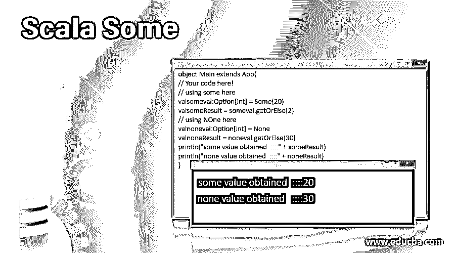

# Scala Some

> 原文：<https://www.educba.com/scala-some/>

## Scala Some 简介

Scala Scala 中有些类与 Option 类密切相关。当 object 的值可以为空时，我们在 scala 中使用 Option class。为了解决这个问题，我们在 scala 中有两个子类 Option class，分别是 Some 和 None。每当我们从选项中返回任何值时，它可以是某个实例，也可以是没有实例。我们知道这两个类都是 Option 的子类，所以在使用它时，我们的方法将只返回 Option 的实例。如果我们得到了 object 的值，那么这个选项将返回某个类的实例，如果我们没有得到 object 的值，那么这个选项类将返回 scala 中 None 类的值。

**语法:**

<small>网页开发、编程语言、软件测试&其他</small>

`defmethod_name(in: Data_type): Option[Data_type] = {
try {
Some() /// logic goes here ...
} catch {
// logic here
}
}`

我们总是可以使用一些 with Option，因为它们都相关。我们可以看一个练习语法来更好地理解它，见下文；

`defdemofun(a: Int): Option[String] = {
try {
Some(a == 0)
} catch {
case x: Exception => None
}
}`

在这个语法中，我们定义了一个名为 demofun 的函数，它接受一个整数并返回选项实例，这个实例可以是 scala 中某个类的实例，也可以是 None 类的实例。定义好这个之后，我们就可以根据需求编写自己的逻辑了。

### Scala 中的一些类是如何工作的？

Scala some 类返回某个值，如果对象不为空，它就是 option 的子类。基本上，该选项是一个数据结构，这意味着它可以返回一些值或不返回任何值。该选项有两种情况，无和一些。我们可以用它来收集。在 scala 中，我们可以在方法签名和 case 语句中使用它。如果我们用某个类写了一些东西，那么我们肯定它会返回一些值给我们，所以我们肯定也可以避免 null 和空检查，这将节省一些代码行。这个类是在 scala 下定义的。一些包裹。我们可以看看一些扩展类、spertypes 和一些已知的可用类，见下文；

1.scala 中可用的扩展类；

*   可选择的
*   结果
*   可序列化

2.scala 中的一些超类型类；

*   可选择的
*   io。可序列化
*   结果
*   等于
*   IterableOnce
*   AnyRef
*   AnyRef

3.某些类可用的构造函数；

某些类构造函数将一个参数作为值，该值可以是任何类型的语法(见下文);

*   根据 scaladocs，语法可用；*新的一些(价值:A)

在这里，我们通过使用 new 关键字创建一些实例，并在其中传递值，这些值可以是任何类型。

4.scala 中某些类可用的一些方法如下:

*   **nonEmpty:** 这个方法也返回布尔值。如果对象不为空，它将返回 true，否则返回 false。
*   **isEmpty:** 该方法用于检查对象 id 是否为空，返回一个布尔值。如果对象为空，它将返回 true，否则返回 false。
*   **isDefined:** 此方法返回布尔值。如果对象不为空，则返回 true，否则返回 false。
*   **get:** 这个方法将返回值，如果值不存在那么它将返回一个异常。
*   **包含:**该方法用于检查输入通道中是否存在该值。此方法返回布尔值 true 或 false。如果值存在，它将返回 true，否则返回 false。
*   **exists:** 如果值存在，此方法返回 true，否则返回 false，此方法对可选值使用谓词。
*   **过滤:**用于过滤对象。它使用与谓词值匹配的值。
*   **filterNot:** 用于过滤对象。它使用与谓词值不匹配的值。

5.现在我们将看到一个非常简单的例子，让初学者使用 scala 中的一些类，见下文；

`object Main extends App{
// Your code here!
// using some here
valsomeVal:Option[String] = Some("Hello world !!")
//just printing value
println(someVal)
}`

在这个例子中，我们通过将返回类型称为 Option，将数据类型称为 String，后跟 some 实例来定义 Some 值。之后，我们只是打印一些持有的价值。我们也可以用上面的方法定义一些。

### Scala 的一些例子

下面是一些例子:

#### 示例#1

在这个例子中，我们打印一些值。

**代码:**

`object Main extends App{
// Your code here!
// using some here
valsomeVal:Option[String] = Some("Hello world !!")
//just printing value
println(someVal)
}`

**输出:**

#### 实施例 2

在这个例子中，我们使用 isEmpty 方法来检查获得的一些值。

**代码:**

`object Main extends App{
// Your code here!
// using some here
valsomeVal:Option[String] = Some("Hello world !!")
//using method here ..
val result = someVal.isEmpty
//just printing value
println("result obtained is  :: " + result)
println(someVal)
}`

**输出:**

#### 实施例 3

在这个例子中，我们使用 isDefined 方法来检查 some 对象。

**代码:**

`object Main extends App{
// Your code here!
// using some here
valsomeVal:Option[String] = Some("Hello world !!")
//using method here ..
val result = someVal.isDefined
//just printing value
println("result obtained is  :: " + result)
println(someVal)
}`

**输出:**

#### 实施例 4

在这个例子中，我们使用了带有一些和没有的 getOrElse 方法。

**代码:**

`object Main extends App{
// Your code here!
// using some here
valsomeval:Option[Int] = Some(20)
valsomeResult = someval.getOrElse(2)
// using NOne here
valnoneval:Option[Int] = None
valnoneResult = noneval.getOrElse(30)
println("some value obtained  ::::" + someResult)
println("none value obtained  ::::" + noneResult)
}`

**输出:**

### 优势

一些优点是:

*   我们可以很容易地处理程序中的空值。
*   不需要写空检查，这也减少了不必要的检查。

### 结论

这些都是处理对象的好方法，在 scala 中它们总是可以与 option class 一起使用。在使用它时，它要么返回 None 的实例，要么返回 some 的实例。也为我们提供了许多处理集合对象的方法。

### 推荐文章

这是一个 Scala Some 的指南。在这里，我们也讨论了 scala 中一些类的定义和工作原理。以及不同的示例及其代码实现。您也可以看看以下文章，了解更多信息–

1.  [Scala 类构造函数](https://www.educba.com/scala-class-constructor/)
2.  [Scala 集合](https://www.educba.com/scala-set/)
3.  秤尾
4.  [Scala 平面图](https://www.educba.com/scala-flatmap/)

