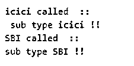
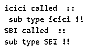

# Scala 泛型

> 原文：<https://www.educba.com/scala-generic/>

## Scala 泛型的定义

Scala 泛型类不同于 Java 中的泛型类。泛型类是那些将变量的类型作为参数的类。我们不确定变量的类型，我们只是在方括号[]中指定它。编译器将在运行时验证该类型。在 scala 中，泛型类主要用于集合。我们通常使用参数名来定义一般的类类型，但这不是强制性的，我们可以使用任何字符来定义它。

**语法:**

<small>网页开发、编程语言、软件测试&其他</small>

`class class_name[A] {
private varvaribale_name: List[A] }`

在上面的语法中，我们使用 A 作为我们定义的列表的类型。这可以包含任何数据类型，如 Int、Float、String 或任何其他用户定义的对象。我们也可以使用任何其他字符名称来代替 A，这是我们遵循的标准。

`class Demo[A] {
private varmyList: List[A] = {20, 30, 40, 50)
}`

### Scala 中泛型类是如何工作的？

当我们的列表或集合中有相同类型的数据时，集合非常有用。这有助于我们对元素进行类型转换，从而减少代码行。例如，我们将这种类型定义到[]括号中；

`using collection :val list = new List[Int] : we are specifying the type at the time of creation only. Now take a look at generic in scala;
using generic : class MyDemo[A] {}
val list = new MyDemo[String] val list = new MyDemo[Double] val list = new MyDemo[Float] val list = new MyDemo[Student]`

在上面的例子中，我们已经创建了一个具有泛型类型的类，使用方括号[]中的指定它。现在，在为列表创建对象时，我们将它的类型称为 String，或者它可以是我们想要的任何类型。如果我们遵循 scala 给出的标准，那么泛型参数应该只有一个字符。同样，我们也可以有多个参数，如下所示；

*   **: class MyClass[Key1，Value1]:** 在这里，我们传递两个参数。此外，我们可以在 scala 中将这些参数与 traits 一起使用，这也将使它们变得通用。有关如何使它们通用的语法，请参见下面的内容；
*   在 scala 中使用泛型时，我们遇到了泛型中的方差类型，让我们一个一个地详细讨论它们，并考虑下面的一个例子；
    班花
    班玫瑰延花
    班茉莉延花

假设我们有花类，这里玫瑰和茉莉是花的子类。我们有不同类型的方差。

*   问题是:如果 Rose 扩展了 Flower，那么上面例子中的 Rose 列表是否也扩展了 Flower 列表？

#### 1.不变性

如果我们选择回答“否”,那么我们将需要分别创建玫瑰和花朵的列表，在这种情况下，我们将对此使用不变性。

`class InvariantList[A] valinvariantAnimalList: InvariantList[Flower] = new InvariantList[Rose]`

在这里，我们可以在 scala 中定义它们。

#### 2.协方差

如果我们选择对上面的问题回答是，那么我们应该选择协方差。我们可以在 scala 中使用加号(+)来定义这个协方差。像这样:类协变列表[+A]

`This + simplify that it is a covariance class.
val f: FLower = new Rose
valfList: CovariantList[Flower] = new CovariantList[Rose]`

在这个例子中，我们将 rose 的实例分配给它的父类，因为它是 flower 的子类，并为它们创建列表。

#### 3.逆变

如果我们选择不回答以上任何一个问题，那么我们可以在 scala 中寻找 Contravariance。在这里，我们使用一个减号(-)在代码中使用它。下面是在 scala 中使用这种类型的语法:

`class ContravariantList[-A]`

### Scala 泛型类的例子

下面是一些例子:

#### 1.单参数泛型类

在这种类型中，我们只传递一个字符，使它在 scala 中通用。请参见下面的示例，以便更好地理解；

**代码:**

`object Main extends App{
// Your code here!
// here we are defining the generic type  ::::
defaddValues[A](a: A, b: A)(implicit x: Numeric[A]):
//holding value in generic type ::
A = x.plus(a, b)
//printing the output ::
println("Sum of the values are  ::::  ")
println(addValues(100, 300))
}`

**输出:**

#### 2.逆变

为了定义和使用它，我们使用了负运算符(-)。

**代码:**

`object Main extends App{
// Your code here!
// here we are defining the generic type  ::::
valic = new ICICI
valsb = new SBI
valBankType = new BankType
BankType.show(ic)
BankType.show(sb)
}
abstract class Bank [-T]{
defrate : Unit
}
class ICICI extends Bank[Int]{
override def rate: Unit = {
println("icici called  ::")
println(" sub type icici !!")
}
}
class SBI extends Bank[Int]{
override def rate: Unit = {
println("SBI called  ::")
println("sub type SBI !!")
}
}
class BankType{
defshow(x: Bank[Int]){
x.rate
}
}`

**输出:**

#### 3.协变

为了定义这种类型，我们使用加号(+)运算符。

**代码:**

`object Main extends App{
// Your code here!
// here we are defining the generic type  ::::
valic = new ICICI
valsb = new SBI
valBankType = new BankType
BankType.show(ic)
BankType.show(sb)
}
abstract class Bank [+T]{
defrate : Unit
}
class ICICI extends Bank[Int]{
override def rate: Unit = {
println("icici called  ::")
println(" sub type icici !!")
}
}
class SBI extends Bank[Int]{
override def rate: Unit = {
println("SBI called  ::")
println("sub type SBI !!")
}
}
class BankType{
defshow(x: Bank[Int]){
x.rate
}
}`

**输出:**

### 结论

泛型对于为我们应用程序编写高效的代码非常重要。这使得代码更易读、更容易、更清晰，也减少了程序中重复的逻辑和代码行。我们讨论了它的各种类型，也根据不同的情况我们有更多更好的了解。在 scala 中，它们通常与集合一起使用。

### 推荐文章

这是一个 Scala 泛型的指南。这里我们也讨论了泛型类的定义以及它在 scala 中是如何工作的？并附有示例。您也可以看看以下文章，了解更多信息–

1.  [火花功能](https://www.educba.com/spark-functions/)
2.  秤尾
3.  [Scala 中的构造函数](https://www.educba.com/constructors-in-scala/)
4.  [Scala 集合](https://www.educba.com/scala-collections/)

