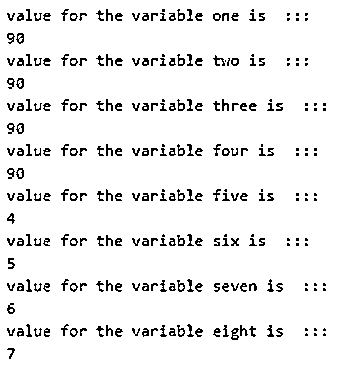

# getorelse 比例

> 原文：<https://www.educba.com/scala-getorelse/>

## Scala getOrElse 的定义

这个方法是 scala 中 option 类的一部分。此外，scala 中的一些类和没有类都有这个方法。它主要做的是计算变量的值，如果值为空，就返回给我们另一个值。这个方法对两件事有效，成功和失败。它将根据我们得到的响应返回实际值或默认值。此方法用于返回可选值。

**语法**

<small>网页开发、编程语言、软件测试&其他</small>

下面是 scala 文档中 getOrElse 方法的语法。如果值为空，这个方法将返回可选值，否则它将给出评估值或实际值。为了更好地理解语法，我们还将看到一个练习示例:

`final defgetOrElse[B >: A](default: => B): B`

**举例:**

`val myVar = toInt("200").getOrElse(10)`

在上面的语法行中，我们声明了我们的变量，这里我们尝试将字符串的大小写转换为整数，如果值为空，则向 getOrElse 传递一个默认值。

### getOrElse 函数在 Scala 中是如何工作的？

我们知道 getOrElse 方法是 scala 中 Option 类的成员函数。此方法用于返回可选值。在 scala 中，这个选项可以包含两个对象，一个是 Some，另一个是 None。一些类表示一些值，而没有一个类表示未定义值。所有这些类都可以在 scala 中找到。选项包。

一些扩展类，syper 类型的选项值如下见下文；

1.scala 中可用于 getOrElse 方法的 Exteded 类；

*   IterableOnce
*   结果
*   可序列化

2.scala 中的线性类型可用于 getOrElse 方法；

*   AnyRef
*   任何的
*   io。可序列化
*   结果
*   平等的

3.scala 中一些已知的子类可用于 getOrElse 方法；

`None
Some`

现在我们将看到一个实际的例子，并了解它的内部工作原理；

`object Main extends App{
// Your code here!
valx:Option[Int] = Some(100)
println("value for x is :: " + x.getOrElse(0) )
}`

在这个例子中，我们创建了一个选项变量，并使用 scala 中的某个类为它赋值 100。在这之后我们使用 getOrElse 方法获取变量的值。但是这里我们已经初始化了变量的一些值，所以这里的输出将是 100。如果我们没有初始化这个值，输出将是我们分配给 getOrElse 方法的默认值。为了使用这个方法，这里的变量应该是 Option 的实例，因为我们可以使用这个方法作为 scala 中变量的可选值。

使用 getOrElsemethod 时请记住以下几点:

*   如果输入为空，这个方法在 scala 中用作可选的值提供者。
*   通过使用这种方法，我们可以提供任何替代值。
*   这个方法首先计算值，然后返回实际值，或者我们可以说是计算值。
*   当使用选项类时，我们必须记住的一件事是我们有两个对象，一些和没有。有些取值，无表示未定义的值。
*   该方法遵循成功和失败方法，即值存在则成功，值不存在则失败。

### Scala getOrElse 的例子

下面是一些例子:

#### 示例#1

在这个例子中，我们使用 scala 中的 option 类来利用 getOrElse 方法。我们为此创建了两个整型变量来测试。

**代码:**

`object Main extends App{
// Your code here!
// defining the variable using Option
valy:Option[Int] = None
valx:Option[Int] = Some(100)
// using method getOrElse here for result on variable.
val result1 =   x.getOrElse(0)
val result2 =   y.getOrElse(0)
// printing out the output here .
println("value for the variable one is  :::")
println(result1)
println("value for the variable two is  :::")
println(result2)
}`

**输出:**

#### 实施例 2

在这个例子中，我们正在创建字符串对象，并在这里使用 getOrElse 方法。

**代码:**

`object Main extends App{
// Your code here!
// define variable
valy:Option[String] = None
valx:Option[String] = Some("Hello some value here!!")
// call method here
val result1 =   x.getOrElse("No value provided !!")
val result2 =   y.getOrElse("No value provided !!")
// printing the result here
println("value for the variable one is  :::")
println(result1)
println("value for the variable two is  :::")
println(result2)
}`

**输出:**

#### 实施例 3

在这个例子中，我们在 scala 的 getOrElse 方法中使用了多个变量。使用 some 和 none 两个类，因为我们不能在普通变量上直接调用它们，这不是它们的函数。

**代码:**

`object Main extends App{
// Your code here!
// below we are using some class to define the variable
val variable1:Option[Int] = Some(90)
val variable2:Option[Int] = Some(90)
val variable3:Option[Int] = Some(90)
val variable4:Option[Int] = Some(90)
// Using None class
val variable5:Option[Int] = None
val variable6:Option[Int] = None
val variable7:Option[Int] = None
val variable8:Option[Int] = None
// Applying getOrElse method
val result1 = variable1.getOrElse(0)
val result2 = variable2.getOrElse(1)
val result3 = variable3.getOrElse(2)
val result4 = variable4.getOrElse(3)
val result5 = variable5.getOrElse(4)
val result6 = variable6.getOrElse(5)
val result7 = variable7.getOrElse(6)
val result8 = variable8.getOrElse(7)
println("value for the variable one is  :::")
println(result1)
println("value for the variable two is  :::")
println(result2)
println("value for the variable three is  :::")
println(result3)
println("value for the variable four is  :::")
println(result4)
println("value for the variable five is  :::")
println(result5)
println("value for the variable six is  :::")
println(result6)
println("value for the variable seven is  :::")
println(result7)
println("value for the variable eight is  :::")
println(result8)
}`

**输出:**

### 结论

因此，如果提供的输入为空，getOrElse 方法可以用作可选值或默认值。我们可以在必须为空输入提供一些默认值的场景中使用它。此外，它非常易于使用，可读性强，对开发人员来说不够稳定，而且它对 scala 中的一些选项类和没有选项类都可用。

### 推荐文章

这是一个 Scala getOrElse 的指南。这里我们也讨论一下 getOrElse 函数在 scala 中的定义和工作原理？以及不同的示例及其代码实现。您也可以看看以下文章，了解更多信息–

1.  [火花功能](https://www.educba.com/spark-functions/)
2.  秤尾
3.  [Scala 中的构造函数](https://www.educba.com/constructors-in-scala/)
4.  [Scala 集合](https://www.educba.com/scala-collections/)

