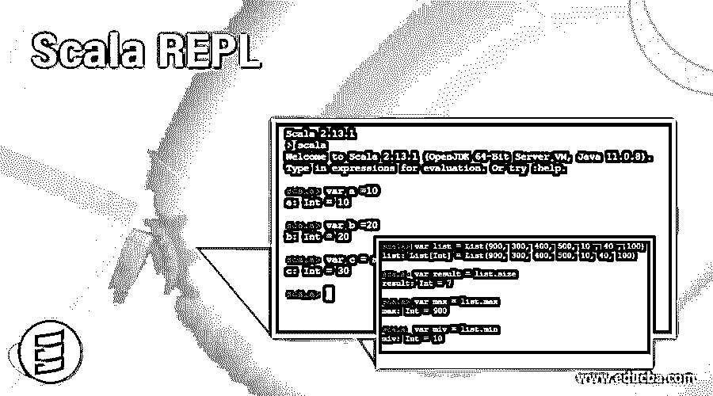
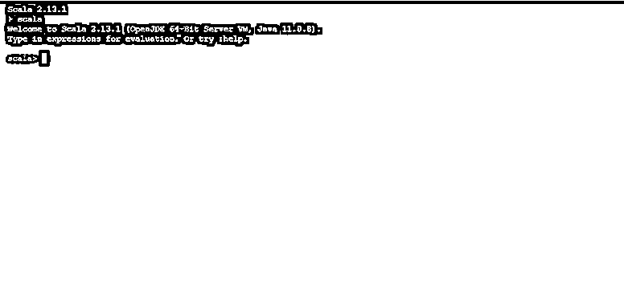
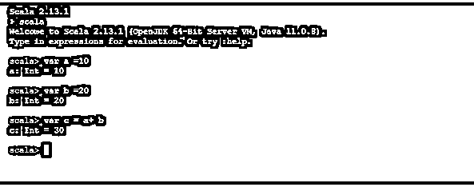

# 斯卡拉 REPL

> 原文：<https://www.educba.com/scala-repl/>

## Scala REPL 简介

scalarepl 为我们提供了一种在 Scala 中计算表达式的方法。在 scala 中我们可以说是命令行解释器。如果你想看到它，我们必须在你的命令外壳上运行 scala 命令。这个 repl 代表 scala 中的读取-评估-打印循环。我们在命令行界面上提供一些输入，这些统计数据从界面上读取这些输入。仔细阅读后，它开始根据我们的输入计算这些表达式，然后在屏幕上打印输出，这个过程继续进行，repl 再次准备好读取我们的输入，如此循环。

**语法:**

<small>网页开发、编程语言、软件测试&其他</small>

`$scala`

这是我们在 scala 中使用 repl 时必须运行的命令。只需打开您的命令行界面，在那里运行这个命令。你会自动打印出一些代码行。

### Scala 中的 REPL 命令是如何工作的？

众所周知，repl 是一个交互式解释器外壳。这是用来读取表达式的，或者我们可以说在 scala 中对表达式求值。

让我们看看它的工作步骤，见下文:

*   **Read:** 当我们在 shell 上键入任何输入时，它会立即开始读取这些输入。所以它执行的第一步是从命令行 shell 读取输入。
*   **评估:**它执行的第二个操作评估。在读取输入后，它立即执行下一步，即正确地评估它们。
*   **打印:**第三个操作是打印输出。在从命令行解释器中读取和评估表达式后，它只在 shell 中打印输出。它是我们表达的结果。
*   **循环:**当所有这一过程成功执行后，它再次开始执行相同的步骤。这意味着它再次准备好接受输入并读取它们，然后计算表达式并在 shell 上打印输出，这个过程一直循环下去。

当 repl 对一个表达式求值时，它会将这些表达式绑定到可执行模板中。在这一步之后，它编译可执行模板并打印结果，或者我们可以说是屏幕上的输出。我们在 scala 中有这么多命令来处理 repl，或者说这些是它们提供的特性来处理 scala 中的表达式。

让我们详细讨论每个命令:

*   **power:** 这个命令将导入所有的编译器组件。此外，该命令用于进入电源模式。
*   **paste -raw:** 该命令用于禁用包中定义的一些代码。
*   **help:** 该命令将显示所有存在且我们可以使用的命令列表。
*   **加载:**该命令用于加载文件，该文件将包含 REPL 输入。
*   **设置:**使用该命令，我们可以修改编译器的设置。
*   **replay:** 该命令用于使用修改后的设置对会话进行重放。
*   **javap:** 该命令用于对类工件的检查。
*   **粘贴:**该命令帮助我们输入对象和类。
*   **-Yrepl-outdir:** 这个命令帮助我们在一些外部工具的帮助下检查我们的工件。

当我们在命令行解释器外壳上输入任何一行时，这些行将被单独编译，而不是同时编译。假设我们对命令行上的前面几行有一些依赖，那么这种依赖将在生成的导入的帮助下自动导入。我们在 shell 中键入的代码将被绑定为一个对象或一个类。

让我们从一个简单的例子开始。打开你的命令行，试着输入下面一行代码；

`val a = 1
val b = a + 1`

我们在这里给两个变量 a 和 b 赋值，但是 b 依赖于变量 a。当我们在 shell 上输入代码时，这些代码行将被单独编译。此外，依赖代码将被自动导入。在这两行代码之后，我们将得到这里的输出 2。只要自由地打开命令行，在那里输入你的代码。

### 斯卡拉 REPL 的例子

首先尝试在 shell 上键入 scala，按 enter 键检查一切是否正常，您将会看到一些行打印在那里。像这样的格式见下文；

#### 示例#1

在这个例子中，我们使用 scala 中的 repl 打印出变量的总和。

**代码:**

`var a =10
a: Int = 10
var b =20
b: Int = 20
var c = a+ b`

**输出:**

#### 实施例 2

在这个例子中，我们试图使用 relp 工具在 scala 中连接两个字符串。

**代码:**

`var a = "hello to all !"
a: String = hello to all !
var b = "this is example for repl in scala !!!"
b: String = this is example for repl in scala !!!
var c = a + b`

**输出:**

#### 实施例 3

在这个例子中，我们使用集合数据结构中的列表，并使用 scala 中可用的 min、max 和 size 方法打印 length、max 和 min value-form 列表。

**代码:**

`var list = List(900, 300, 400, 500, 10 , 40 , 100)
list: List[Int] = List(900, 300, 400, 500, 10, 40, 100)
var result = list.size
result: Int = 7
var max = list.max
max: Int = 900
var miv = list.min
miv: Int = 10`

**输出:**

### 结论

这是一个强大的工具，可以评估 scala 中的表达式，它有很多特性，比如类和对象之间的切换等等。它就像它所代表的那样运作。(阅读、评估、打印和循环)。它也很容易使用，因为我们只是在命令行界面上使用 scala 命令开始我们的工作。所以对于程序员来说，用它来计算 scala 中的复杂表达式是非常方便的。

### 推荐文章

这是一个 Scala REPL 的指南。在这里，我们也讨论了 Scala REPL 的介绍，REPL 命令是如何工作的，以及不同的例子。您也可以看看以下文章，了解更多信息–

1.  [Scala 散列表](https://www.educba.com/scala-hashmap/)
2.  [Scala 列表](https://www.educba.com/scala-list/)
3.  [Scala Singleton](https://www.educba.com/scala-singleton/)
4.  [Scala 试抓](https://www.educba.com/scala-try-catch/)

