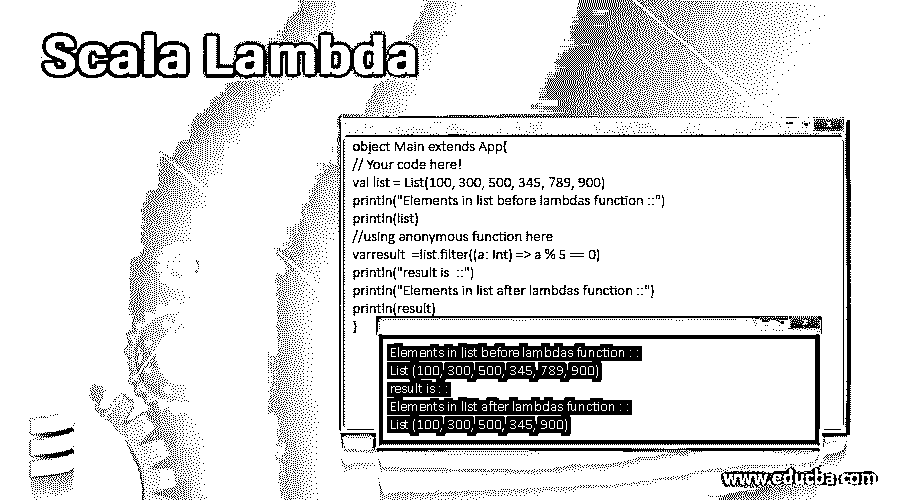
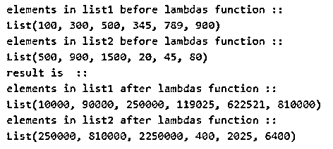

# 斯卡拉拉姆达

> 原文：<https://www.educba.com/scala-lambda/>

## Scala Lambda 简介

Scala lambda 函数是匿名函数。它们减少了代码行，使函数更易读、更便于定义。我们也可以重复使用它们。我们可以使用这个 lambda 函数来迭代我们的集合数据结构，并对它们执行任何类型的操作。此外，lambdas 函数在语法上是非常轻量级的，因此使得代码更加不稳定。

**语法:**

<small>网页开发、编程语言、软件测试&其他</small>

下面是 scala 文档给出的 scala 中 lambda 表达式的语法。为了更好地理解，我们还可以有一个语法练习示例。

`val name = (name_variable:Dat_Type) =>Transformation_Expression`

**举例:**

`val result = (a:Int) => a + 10`

在上面的例子中，我们在这里给 a 的值加 10。但是正如你所看到的，代码行更少，可读性更好。

### Lambda 表达式在 Scala 中是如何工作的？

Lambda 函数在 scala 中也被称为字面函数。这意味着我们可以把它传递给任何方法，这些函数文字对象叫做函数值。它们总是返回一个新值而不修改当前值。我们可以在 scala 的集合数据结构中非常有效地使用它们。为此，我们将看到一个例子来更好地理解这一点；

**例子**

`var list = List(100, 200, 345, 67, 267, 195)
var result = list.filter((a: Int) => a % 5 == 0)`

在上面几行代码中，我们创建了一个整数列表。之后，我们应用过滤方法，并在其中传递一个匿名函数。因此，列表中能被 5 整除的每个元素都将被保留，并作为新列表返回到结果变量中。这样，我们就可以使用它们，并在任何函数内部传递它们。假设我们想对集合元素进行某种转换，我们有一个名为 map()的方法。通过使用这种方法，我们可以在 scala 中转换集合数据结构的每个元素。这将为我们返回带有修改值的新元素列表。

让我们看一个例子，让初学者更好地理解，见下文；

**举例:**

`val list = List(100, 200, 345, 67, 267, 195)
valresult  =list.map( (a:Int) => a + 10 )`

在上面几行代码中，我们创建了一个整数列表，后面跟着 scala 中的 map 函数。通过使用 map()方法，我们正在转换集合数据结构的元素，并将列表中的每个元素增加 10。这将为我们返回一个包含修改后的元素的新列表。我们还可以定义匿名函数，并将该函数传递给映射函数，这并不是强制性的，我们必须只在映射内部定义。让我们用一个简单的语法来说明这一点，见下文；

**举例:**

`object Main extends App{
// Your code here!
val list = List(100, 300, 500, 345, 789, 900)
valmyFun = (a:Int) => a + 10
valresult  =list.map( myFun )
println("result is  ::")
println(result)
}`

在上面的例子中，我们创建了一个列表，并在下一行定义了一个 lambda 函数。现在我们可以对不同的列表对象反复使用这个 lambda 函数。但是现在，我们只对一个我们定义的对象使用它，这个对象是一个整数列表，并将一个元素的值增加 10。在下一行，我们只是打印出结果。所以 lambda 函数也为我们提供了重用它们的能力。

### Scala Lambda 示例

下面是一些例子:

#### 示例#1

在这个例子中，我们通过定义 lambda 函数来修改列表。

**代码:**

`object Main extends App{
// Your code here!
val list = List(100, 300, 500, 345, 789, 900)
println("Elements in list before lambdas function ::")
println(list)
//defining lambdas function here ...
valmyFun = (a:Int) => a + 10
// calling the function here ///
valresult  =list.map( myFun )
println("result is  ::")
println("Elements in list after lambdas function ::")
println(result)
}`

**输出:**

#### 实施例 2

在这个例子中，我们试图修改字符串元素的列表，并使用 lambda 函数向列表中的每个元素添加一个新值。

**代码:**

`object Main extends App{
// Your code here!
val list = List("amit", "sumit", "amita", "vinita", "sourabh", "megha")
println("Elements in list before lambdas function ::")
println(list)
//defining lambdas function here ...
valmyFun = (a:String) => a + "*** *** >>"
// calling the function here ///
valresult  =list.map( myFun )
println("result is  ::")
println("Elements in list after lambdas function ::")
println(result)
}`

**输出:**

#### 实施例 3

在这个例子中，我们使用一个过滤方法来过滤掉元素列表。但是我们在 filter()方法中定义了自己的 lambda 函数，它将返回一个列表，其中包含只能被 5 整除的元素。

**代码:**

`object Main extends App{
// Your code here!
val list = List(100, 300, 500, 345, 789, 900)
println("Elements in list before lambdas function ::")
println(list)
//using anonymous function here
varresult  =list.filter((a: Int) => a % 5 == 0)
println("result is  ::")
println("Elements in list after lambdas function ::")
println(result)
}`

**输出:**

#### 实施例 4

在这个例子中，我们使用 Scala 中的 map()函数修改多个列表对象。

**代码:**

`object Main extends App{
// Your code here!
val list1 = List(100, 300, 500, 345, 789, 900)
val list2 = List(500, 900, 1500, 20, 45,80)
println("elements in list1 before lambdas function ::")
println(list1)
println("elements in list2 before lambdas function ::")
println(list2)
//using anonymous function here
var result1  = list1.map((a: Int)=> a * a)
var result2  = list2.map((a: Int)=> a * a)
println("result is  ::")
println("elements in list1 after lambdas function ::")
println(result1)
println("elements in list2 after lambdas function ::")
println(result2)
}`

**输出:**

### 结论

Lambda 函数是可重用的，它们还减少了代码行，使得语法非常轻量级。这使得代码非常可读、稳定，并且便于开发人员编写和理解。它们被称为匿名函数，lambda 函数与 java lambda 函数非常相似。

### 推荐文章

这是一个 Scala Lambda 的指南。在这里，我们还讨论了 Scala Lambda 的介绍，Lambda 表达式是如何工作的，以及不同的例子。您也可以看看以下文章，了解更多信息–

1.  [Scala 平面图](https://www.educba.com/scala-flatmap/)
2.  秤尾
3.  [Scala Singleton](https://www.educba.com/scala-singleton/)
4.  [Scala 试抓](https://www.educba.com/scala-try-catch/)

