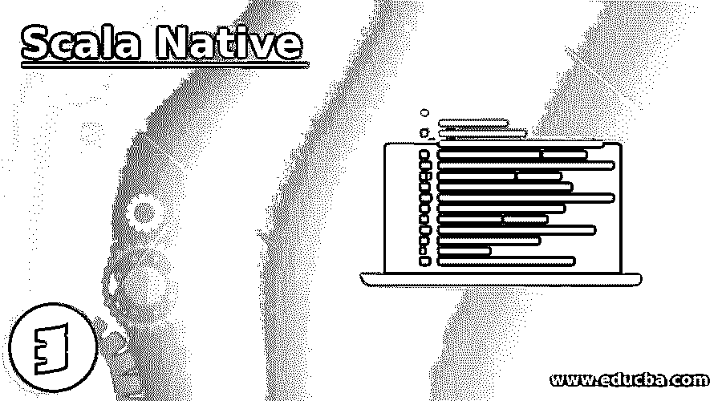

# Scala 原生

> 原文：<https://www.educba.com/scala-native/>

## Scala Native 简介

Scala Native 充当了一个层，这个层帮助我们，使与本地语言的交互变得非常容易。在 scala 中，我们有@native 方法可用。如果我们用这个注释定义了任何方法，即@native，这意味着它应该出现在类中，trait 不能包含 scala 中的@native 方法。此外，如果我们定义了标记为@native 的方法体，那么应该按照 scala 文档的要求在 scala 中对其进行类型检查。这可以在 Scala . Scala tive . native 包下找到。

### Scala 原生如何工作？

根据 scala doc，scala 原生类扩展了一些类，也有一些 liner 类型。它包含一个不带任何参数的构造函数，我们在任何方法上使用@native 注释将它们定义为 scala 中的原生方法。Scala Scala . Scala ative . native 这个包包含了整个 API。scala native 也使我们能够与包括其他语言和 C 等的原生代码进行交互。通过使用 scala active，我们还可以处理正则表达式，并很好地处理大多数情况，因为 scala native 实现了 Java . util . regx。Scala native 还为我们提供了一个注释，通过使用它，我们可以将第三方库与注释链接起来。

<small>网页开发、编程语言、软件测试&其他</small>

**绑定它们的语法如下:**

`@native.link("your_lib_name")`

在上面的语法中，我们使用@native.link 将我们的库与注释绑定在一起，为此我们只需要在括号内传递我们的库名。要在我们的 scala 程序中使用这些代码或注释，我们必须在程序中包含一些代码，比如 import Scala . Scala tive . native . _ 在这个包中，我们可以找到相应的注释，否则它会给我们一个错误。

这个 scala 本机也抛出了一些未定义的异常。

#### 1.ClassCastException

这是我们在用任何语言编写代码时，如果犯了任何错误，都会遇到的常见异常。假设我们有一个整数变量，但是我们把它赋值为一个字符串。那么在这种情况下我们可以得到一个类 case 异常。所以我们最好只在编译时处理它们。

#### 2 .算术异常

这是我们在编写代码时面临的另一个常见异常。假设我们有一个数字类型的变量，我们试图将这个变量除以零。那么在这种情况下我们可以得到这个异常。

#### 3.OutOfMemoryError 错误

这个异常并不经常出现，但是当我们的应用程序中有一些内存泄漏时，它就会出现。那么在这种情况下，我们可能需要通过给定最大值和最小值来增加文件中的内存变量。

#### 4.IndexOutOfBoundsException

当我们处理数组和集合并试图访问超过数组或集合长度的索引时，这个异常尤其容易出现。在这种情况下，我们可以在任何语言中得到这个异常。

#### 5.stack over flower error

这个异常是非常意外的，来自递归调用的程序，或者别的什么。

#### 6.NullPointerException

如果我们不小心处理我们的对象，这是我们在编程时最常见的异常。当我们试图访问一个空对象时，就会出现这种情况，空对象意味着一个没有值或为空的对象。

Scala native 也为我们提供了处理指针的方法。但是它遵循一些语法来定义它们。

*   指向字段指针-指针，_N
*   存储已归档的 ptr。_ N =值
*   在索引处存储-ptr(I)=值
*   储值-！ptr =值
*   指向索引的指针- ptr+ i
*   加载一个字段-！ptr。_N
*   - ptr1 之间的元素
*   加载值-！光电带读数机(photoelectric tape reader)
*   索引处的负载- prt(i)

Scala native 还为我们提供了一些链接模式，如下所示:

*   **release-fast:** 这种模式为我们提供了快速的编译时间，这有助于我们在 scala 中实现优化的或者我们可以说降低的运行时性能。
*   **调试:**这种模式为我们提供了更好的开发流程。在 scala 中，这是默认的原生模式。
*   **发布:**该模式与应用的完全发布相关。
*   **release-full:** 这种模式为我们提供了最佳的运行时性能，甚至优于 release-fast。

scala native 的一些扩展类如下，scala 中可用的扩展类:

*   注释
*   静态注释

scala 中可用的 Liner 类型类:

*   任何的
*   注释
*   静态注释
*   AnyRef

它只包含一个构造函数，描述如下:

*   **new native():** 这是默认设置，或者我们可以说没有可用的参数构造函数。

### Scala 原生特性

Scala native 为我们提供了许多特性，如下所示:

1.**原生代码层:** Scala native 为我们提供了一种处理和使用原生语言代码的高效方式。为此，我们可以在 scala 中使用 extern 对象。Extern 对象只不过是包装器对象，我们可以简单地使用@natve.extern 将任何本地语言代码应用到程序中。

**举例:**

`@native.extern`

我们必须在我们想使用其他语言的任何方法之前提到上面的代码行。

2.提供低级原语:这样，我们还可以在程序中使用指针，使程序更高效，除此之外，结构也在那里。通过使用这些低级原语，我们可以按照我们想要的方式控制我们的应用程序。

3.**启动:**通过这个特性，我们可以非常快速地编译和运行我们的代码。

4.它还实现了 Java 正则表达式库，通过使用它我们可以很容易地处理正则表达式。

5.Scala native 还为我们提供了使用无符号整数的支持，如下所示:

*   未签名。乌龙
*   未签名。UByte
*   未签名。UInt
*   未签名。UShort

### 例子

下面是提到的例子:

在这个例子中，我们在程序中使用 c 语言的本地代码来打印我们的第一条消息。这是一个非常简单的初学者程序。但是请记住，我们必须使用本机应用程序运行它，并且不要忘记包括软件包，否则它将无法工作。

**代码:**

`import scalanative.native._, stdlib._
object Main {
def main(args: Array[String]): Unit = {
print("print the message by using the c language method.!!")
// using c code here to print .
fprintf(__stdoutp, c"This is the example from scala native !!")
// it will print the output
}
}`

**输出:**

### 结论

Scala Native 不仅仅是一个东西，而是它有能力减少许多东西，如本地语言支持，提高应用程序的运行时性能，利用负责快速编译的 just in time 编译器也有助于加快开发过程。它提供了对各种 java 库的支持，并实现了其中的许多库。

### 推荐文章

这是一本 Scala 原生的指南。这里我们讨论 Scala 的原生、工作、特性和相应的例子。您也可以看看以下文章，了解更多信息–

1.  [Scala Singleton](https://www.educba.com/scala-singleton/)
2.  秤尾
3.  [Scala 平面图](https://www.educba.com/scala-flatmap/)
4.  [Scala 试抓](https://www.educba.com/scala-try-catch/)

