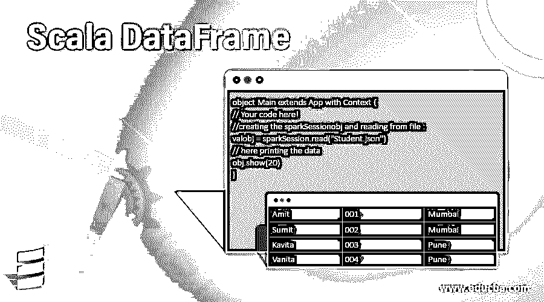

# Scala DataFrame

> 原文：<https://www.educba.com/scala-dataframe/>

## Scala 数据框架的定义

数据帧是数据集集合，或者我们可以说它是有组织的数据集。数据集是数据的集合，它的 api 在 scala 和 java 中都有。DataFrame 相当于关系数据库 B7，但它提出了更多的优化技术。DataFrame 概念是由 spark 引入的。DataFrameapi 可用于包括 Java 在内的许多语言。Scala、R 和 python。数据框可以从不同来源创建，包括 RDDS、配置单元、数据文件等等。

**语法:**

<small>网页开发、编程语言、软件测试&其他</small>

`valvariale_name = sqlContext.read.json("file_name")`

在这个语法中，我们试图从 json 文件中读取值。为此，我们需要将文件名作为一个参数，并为变量赋予任何有效的名称。DataFrame 为我们提供了对文件执行操作的各种方法。这里我们使用 read 方法从文件中读取数据。现在我们可以有一个实际的例子来显示语法，以便更好地理解，见下文；

`valmyObj = sqlContext.read.json("file.json")`

这样，我们可以使用 read 方法读取文件数据。我们需要将文件放入 scala 目录中进行读取。

### DataFrame 在 Scala 中是如何工作的？

DataFrame 用于处理大量数据。在 scala 中，我们使用 spark session 来读取文件。Spark 为 scala 提供 Api 来处理 DataFrame。这个 API 是为基于数据科学的应用程序和大数据而创建的。现在我们将看到如何在 scalausing sparksession 中创建数据框并从文件中读取数据。我们将看到一个例子来更好地理解它；

#### 1.读取文件

如果我们想读一个文件，我们已经读了这里的方法。在这个 read 方法中，我们需要提到我们要从中读取数据的文件名。

**举例:**

`valobj = sparksession.read(file_name)`

#### 2.提到的文件类型

如果我们想特别提到文件的类型，那么我们有方法。假设一个 CSV 文件，那么我们将调用。csv()方法，并在那里提到了您的文件路径。为了更好地理解，请看下面的例子；

**举例:**

`valobj = sparksession.read().csv(mentioned file path here)`

#### 3.打印文件数据

这个 spark API 为我们提供了多种方法来处理 scala 中的数据帧。假设我们已经从 read 方法获得了文件数据，现在我们想打印数据。为此，我们在 scala 中提供了 show()方法。我们可以在通过执行许多操作而准备好的 spark session 对象上调用这个方法。为了更好地理解，让我们看一个例子。

**举例:**

`valobj = sparksession.read(file_name)
obj.show(5)`

这样，我们可以显示我们的数据，也可以限制我们想要打印的数据的数量。这里我们提到 limit 为 5，所以它将只打印文件中的五个对象。

#### 4.要打印模式

我们还可以通过使用这个 API 来查看模式定义。有些情况下，我们希望看到我们的模式定义。为此，spark session object 在 scala 中为我们提供了一个名为 printSchema()的方法。通过使用这种方法，我们可以看到数据框的模式。为了更好地理解，让我们看一个例子。

**举例:**

`valobj = sparksession.read(file_name)
obj.printSchema()`

#### 5.查看数据框架中的列

这个 API 还为我们提供了从 dataframe 文件中选择特定列的工具。它为此提供了一个方法，在 scala 中称为 select()。通过使用这个，我们可以选择我们想要打印的列，并通过使用 scala 中已经可用的 show()方法来限制它们的行数，但这取决于我们的需求。

**举例:**

`obj.select("name", "address", "city").show(30)`

这样我们就可以使用 scala 数据框 API 中的 select 选项。为了访问它们，我们只需要在这里提到列名。

#### 6.基于条件的搜索

通过使用这个 Scala API，我们可以在文件列中应用过滤器。为此，他们提出了 filter()方法。假设我们有一个例子，我们只想要城市是孟买的学生，那么在这种情况下，这个过滤方法非常有用。我们将只提到列名和值，我们希望通过它们来过滤我们的数据。这个过滤器更多的是我们可以说的一个条件。为了更好地理解，请参见下面的示例；

**举例:**

`obj.filter("city == 'Mumbai'").show(20)`

#### 7.记录数计数

还提供了对数据帧中存在的行数进行计数的功能。对于这些，我们可以使用 scala 中的 count()方法。这些方法将向我们返回当前记录的数量。

**举例:**

`obj.filter("city == 'Mumbai'").count()`

通过这种方式，我们可以计算孟买所在城市的记录数量，我们使用了一个过滤器，但我们也可以单独使用。

在 scala 中使用数据框时需要记住的几点:

*   这些 APi 可用于不同的语言，如 java、python、scala 和 r。
*   它可以非常容易地处理从千字节到千兆字节的大数据。
*   DataFrame 是数据集的集合，DataSet 是 scala 中的数据集合。
*   在 scala 中，它为 dataframe 创建了 DataSet[Row]类型对象。

### Scala 数据帧示例

下面是一些例子:

在本例中，我们为此创建了一个 spark 会话，我们需要在 scala 中使用带有 App 的上下文类，我们从文件中读取学生数据，并使用 show()方法打印它们。

**举例:**

`object Main extends App with Context {
// Your code here!
//creating the sparkSessionobj and reading from file :
valobj = sparkSession.read("Student.json")
// here printing the data
obj.show(20)
}`

**输出:**

### 结论

Scala 数据框架 API 由 spark 提供。它类似于或者我们可以说等同于我们拥有的关系数据库。但是在这里，我们从文件中读取记录。这些文件可以是 json 文件或 CSV 文件。数据帧为我们提供了不同的方法来处理不同的情况，通过使用这个 API 我们可以执行不同的操作。

### 推荐文章

这是一个 Scala DataFrame 的指南。这里我们也讨论 dataframe 在 scala 中的定义和工作原理？以及一个例子。您也可以看看以下文章，了解更多信息–

1.  [Scala 伴随对象](https://www.educba.com/scala-companion-object/)
2.  [Scala 列表](https://www.educba.com/scala-list/)
3.  [Scala 类构造函数](https://www.educba.com/scala-class-constructor/)
4.  [Scala Singleton](https://www.educba.com/scala-singleton/)

