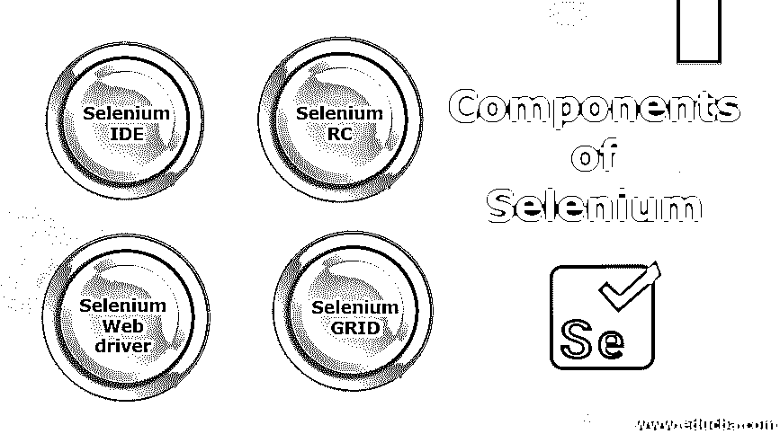

# 硒的成分

> 原文：<https://www.educba.com/components-of-selenium/>

## 硒的成分介绍

Selenium 的四个组件是 Selenium Grid、Selenium RC、Selenium Web Driver 和 Selenium IDE。简单地说，Selenium IDE 是一个简单的框架，用作 Mozilla Firefox 浏览器插件。Selenium RC 被称为 Selenium 1 工具，用于基于 JavaScript 的自动化。Selenium Driver 被称为 Selenium 2，用于特定于浏览器的自动化编程。Selenium Grid 与 Selenium RC 一起用于同时并行处理多个自动化测试脚本

### 硒的成分

如前所述，这四个组成部分如下:

<small>网页开发、编程语言、软件测试&其他</small>

*   硒 IDE
*   硒 RC
*   selenium webdriver
*   硒栅

让我们详细看看这些。

#### 1.硒 IDE

*   这是 Selenium 套件中最简单的套件。Selenium IDE 允许记录和回放脚本。它是使用 Firefox 扩展实现的。通过使用 Selenium，您可以记录、编辑和调试不同的测试。通过在不同的套件中使用不同的测试，可以很容易地组织所创建的测试。记录和回放功能有助于制作工具的原型，并且便于学习。它充当开发和维护不同套件的整体解决方案。
*   掌握 HTML、JavaScript 和 DOM 的基础知识可以帮助测试人员充分利用 Selenium IDE。当测试人员创建测试用例时，它提供了自动完成这些的特性。这有助于快速输入命令并节省时间。它还减少了输入无效命令的机会。

除此之外，硒还有以下一些特性:

*   它有一个简单的记录和回放机制。
*   它可以选择自动断言每个页面的标题。
*   它为所有常用的命令提供了自动完成的功能。
*   它提供了带有设置断点的调试选项。
*   Selenium 支持像。js 文件。
*   它利用智能字段选择，根据需要使用 id、名称或 XPath。

如果用户了解 HTML、DOMs、JavaScript 的基础知识，那么就可以更容易地创建大量的脚本来简化测试过程。

#### 2.硒 RC

*   Selenium Remote Control 是一个测试工具，它可以帮助用任何编程语言为基于 web 的应用程序编写测试脚本。它有两个部分。首先是启动和杀死浏览器的那个。该服务器充当不同 web 请求的 HTTP 代理服务器。它还支持不同的客户端库。Selenium RC 是第一个支持 Java、Ruby、Perl、PHP 等不同编程语言的工具。在 Selenium 中，需要在测试人员开始执行之前启动 Selenium 服务器。Selenium 服务器杀死浏览器并运行 Selenese 命令，这些命令充当 HTTP 代理并拦截消息。
*   该服务器充当代码和浏览器之间的中介。这些命令被发送到服务器，它们解释这些命令，这些命令又被[转换成 JavaScript](https://www.educba.com/what-javascript-can-do/) ，然后这个 JavaScript 被注入到浏览器中。一旦完成，浏览器就可以执行 JavaScript 并向服务器发送响应。浏览器现在解释该命令，并以转换后的相应语言返回代码。Selenium RC 还支持不同测试用例的并行执行，因为它支持 Selenium Grid。

#### 3.Selenium Web 驱动程序

*   Web 驱动是 Selenium RC 的扩展。它支持所有最新的浏览器和不同的平台。在开始执行不同的测试脚本之前，不需要启动 Selenium 服务器。 [Selenium Web 驱动](https://www.educba.com/what-is-selenium-web-driver/)不需要 JavaScripts。它是为了支持动态网页而开发的，在动态网页中，页面上出现的任何元素都可以改变，而无需重新加载页面。它提供了一个适当设计的 API，为现代 web 测试应用程序提供了改进的支持。Web 驱动程序是通过使用对自动化的本机支持来直接调用浏览器的方式创建的。
*   Selenium 服务器取决于使用 Web 驱动程序的意图。如果浏览器和测试用例在同一台机器上运行，那么就没有必要运行 Selenium 服务器。Web 驱动程序将直接运行。您可以使用 Selenium Grid 在多台机器和虚拟机上隔离测试。当测试人员远程连接或者通过特定的浏览器连接时，将需要 Selenium 服务器。
*   web 驱动程序接口声明了可用于端到端测试的不同方法。创建的测试类应该在特定于浏览器的实现中使用。这个测试类可以控制 web 浏览器，也可以选择不同的元素，这些元素可以从 HTML 页面中[加载。web 浏览器提供 API，帮助远程控制用户界面测试 web 应用程序。](https://www.educba.com/what-is-html/)

#### 4.硒栅

*   Selenium GRID 是一个专门并行运行多个测试用例的套件。这些可以是并行的不同浏览器、操作系统和机器。它使用了中枢节点的概念。这意味着只在一台机器上运行测试，但是在不同的节点上执行。这有助于并行执行，并使网格平台独立。此外，它不是特定于浏览器的，支持所有浏览器。
*   Grid 有两个版本。它们是网格 1 和网格 2。Hub 是加载所有测试用例的中心点。网格中应该只有一个集线器。网格中可以有任意数量的节点。此外，节点可以在不同的平台和浏览器上启动。

### 结论

在快速变化的世界中，快速执行所有任务非常重要。自动化在实现这一点上扮演着重要的角色。Selenium 是一个开源工具，它提供了一个自动化不同 web 应用程序的快捷工具。它的四个组件有助于录制和播放，运行多个测试用例，并提供使用不同浏览器和语言进行自动化的工具。作为开源软件，它是免费的，每个人都可以在需要的时候下载和使用。

### 推荐文章

这是关于硒的成分的指南。这里我们详细讨论硒的不同成分。您也可以浏览我们推荐的其他文章，了解更多信息——

1.  [硒工具](https://www.educba.com/selenium-tools/)
2.  [硒架构](https://www.educba.com/selenium-architecture/)
3.  [硒框架](https://www.educba.com/selenium-framework/)

