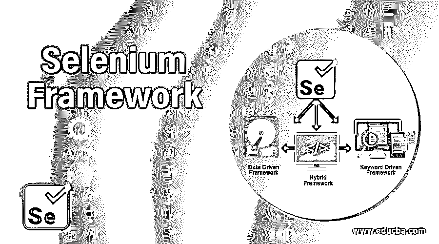
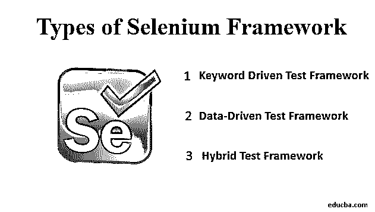

# 硒框架

> 原文：<https://www.educba.com/selenium-framework/>

## Selenium 框架简介

Selenium Framework 可以定义为一个工作空间，用于构建为自动化网站或 web 应用程序的测试过程而创建的代码。通过使用一个框架，而不是一个工具，使得代码组织更有效，维护工作更容易，并允许多个用户舒适地工作在程序的同一个部分。Selenium 有一系列自动化测试框架；一些常用的框架是关键字驱动框架、数据驱动框架和混合框架。

### 了解 Selenium 框架

Selenium 最大的优点是它是开放的，这意味着它可以完全免费下载和使用。它提供了一个叫做 WebDriver 的 API。它使测试人员能够用许多编程语言(如 Java、Python 和 C#)来设计他们的测试。尽管这个框架主要用于测试 web 浏览器，但它也可以用于自动化 Android 和 iOS 等移动设备。Selenium WebDriver 支持主要的浏览器，包括 Chrome、Mozilla 和 Internet Explorer。

<small>网页开发、编程语言、软件测试&其他</small>

### 为什么我们需要 Selenium 框架？

Selenium Framework 的代码结构有助于简化代码维护。使用框架的积极结果是高度的可移植性。降低脚本维护成本，增加代码重用，提高代码可读性。

*   减少测试的执行时间和所需的人力资源。
*   完全控制测试结果。
*   改变测试的预参数和给定的数据，并以动态方式用其他数据集再次测试。

上述是运行这个自动化框架的其他好处。

### Selenium 中有多少类型的框架？

基本上有三种类型的框架已经被 [Selenium WebDriver](https://www.educba.com/what-is-selenium-web-driver/) 创建，它们可以自动化手动测试用例。

*   **关键字驱动测试框架:**这里所有的操作和指令都写在某个外部文件 Excel 工作表中。
*   **数据驱动的测试框架:**在这个框架中，所有的测试数据都是从 CSV、XML 或 Excel 等外部文件中生成的。
*   混合测试框架:这种测试框架利用了关键字和数据驱动框架的优点。在这个测试中，excel 文件被用作维护测试用例的关键字。此外，测试框架的数据提供者用于测试数据。

### 详细的框架

要理解以上，首先要从框架的定义说起。该框架可以定义为一组规则或最佳实践，遵循这些规则或实践可以实现预期的结果。

下面提到的是框架的组件或工具:

*   **编程语言:** Java + Selenium。
*   **IDE: Eclipse:** 是 Java 的集成开发环境(IDE)。这个 Eclipse IDE 是 Eclipse 开源项目中最受欢迎的产品。
*   **测试框架:** TestNG [受 JUnit](https://www.educba.com/junit-annotations/) 和 NUnit 的启发，TestNG 是一个测试框架。与其他[测试框架](https://www.educba.com/testing-frameworks-for-java/)相比，TestNG 新的扩展功能使其更加强大和简单。它还支持 ReportNG，这是一个简单的 HTML 报告插件和 XLST 插件。这是为了定制或扩展默认的 TestNG 报告风格。此外，它还提供了实现“IReporter”的能力，这是一个可以用来生成定制的 TestNG 报告的接口。“generateReport()”方法在所有其他套件完成执行后运行，并将报告发送到指定的输出目录。
*   AutoIT: 这是一种免费的脚本语言或基本脚本语言，专为 Windows GUI 和其他脚本的自动化而设计。当通过其他框架而不是 Selenium 实现自动化时，它使用模拟键、窗口控制键和鼠标移动的组合。
*   **持续整合:**詹金斯。

框架中使用的文件格式:

*   **属性文件:**属性文件用于存储和检索应用或网站的 UI 元素和数据集文件路径。它还包含元素的 id、名称、XPath 或 CSS 选择器。
*   **Excel 文件:**这些文件用于向应用程序传递多组数据。
*   **Xml 文件:**这个文件用于执行测试脚本。 [Xml 文件](https://www.educba.com/what-is-xml/)根据其中提到的包或类或测试执行这些脚本。

### 如何搭建一个框架？

在开发 Selenium 框架时，有必要考虑以下几点:

*   **选择编程语言:**这些语言包括 Java、C#、Ruby、Python 等。此外，行为驱动开发(BDD)可以用于执行小型或短期项目。
*   选择一个单元测试框架:你必须选择一个像 TestNG 一样作为基础的单元测试框架，TestNG 是著名的单元测试框架之一。它消除了传统框架的大部分限制，并为开发人员提供了编写更加灵活和强大的测试的能力。
*   **设计框架的架构:**这包括构建“Selenium Core”组件以及构建“Selenium Test”组件。
*   **选择报告机制:**有效的报告机制可以将测试结果转化为有助于产生即时纠正措施的输入。
*   **决定如何构建、版本控制和实现 CI/CD:** 这包括框架使用的构建工具和依赖管理器。自动化应该关注于彼此之间的协作和共享源代码。实施知名 CI 系统，如杰金斯、竹子、TFS 等。
*   **将框架与其他工具集成:**在 AutoIT、TestRail、吉拉等工具的帮助下集成框架。

### 结论

框架基本上是用来自动化测试工作的。这些测试包括像烟雾测试和其他测试方法。测试可以在 web 应用程序、移动应用程序甚至桌面上进行。很明显，Selenium 框架是一种有助于简化代码维护的代码结构。简而言之，Selenium 是一个程序或代码，它被构造成能够容易地、自动地执行各种测试程序。使用 selenium 框架的最大优点是测试的灵活性。

### 推荐文章

这是关于 Selenium 框架的指南。这里我们讨论 selenium 框架的类型以及如何构建框架。您也可以阅读以下文章，了解更多信息——

1.  [硒命令](https://www.educba.com/selenium-commands/)
2.  [安装硒](https://www.educba.com/install-selenium/)
3.  [硒是什么？](https://www.educba.com/what-is-selenium/)
4.  [硒替代品](https://www.educba.com/selenium-alternatives/)

