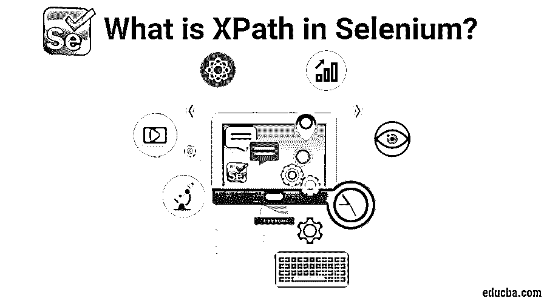

# Selenium 中的 XPath 是什么？

> 原文：<https://www.educba.com/what-is-xpath-in-selenium/>

## Selenium 中的 XPath 是什么？

Xpath 或 XML Path 是一个 XML 表达式标记，用于在 Selenium Automation Tool 中编写测试脚本时查找 web 页面中的元素。它可以用来查找位置元素的标签，如元素名称、元素 ID、链接文本、使用 Xpath 的动态元素、CSS 路径、元素的类名等。在使用 selenium automation 测试的应用程序的 web 页面上。使用的 Xpath 有两种类型，即绝对 Xpath 和相对 Xpath。

### Selenium 中 XPath 的语法

下面给出了 selenium 中 XPath 的语法:

<small>网页开发、编程语言、软件测试&其他</small>

`Xpath = //Tagname[@Atrribute=value]`

在哪里，

*   **//:** 用于选择当前节点。
*   **Tagname:** 指定特定节点的标记名，如 img、div、input 等。
*   **@:** 选择属性。
*   **属性:**指定节点的属性名。
*   **Value:** 指定节点的属性值。

Xpath 中使用各种定位器来定位 web 元素:

*   **Id:** 根据元素的 Id 查找 web 元素。(Id 对于每个 web 元素都是唯一的)。
*   **名称:**根据 web 元素的名称查找该元素。
*   **类名:**根据元素的类名查找 web 元素。
*   **链接文本:**通过写在元素链接上的文本找到 web 元素。
*   **CSS 路径:**通过测试人员/开发人员创建的 CSS 路径找到没有名称、id 和类名的元素。

### Selenium 中 XPath 的类型

Selenium 中基本上有两种类型的 XPath，如下所述:

#### 1.绝对 XPath

这是在文档中定位 web 元素最简单直接的方法之一。它从根节点选择一个元素路径，并采用该路径直到该元素覆盖文档中的所有部分，包括 div、section、li 等。它以一个正斜杠“/”开始，指定根级别。在 Selenium 中使用绝对路径的唯一缺点是，如果在网站或文档中进行了任何更改，那么该元素的整个 XPath 都会更改，因此前面的路径将不起作用，整个程序将失败。

**举例:**

**代码:**

`html/body/div[1]/section/div/div/div/div[2]/div`

如果 HTML 文档和 div 元素的位置发生了变化，那么前面的 XPath 就会失败。

#### 2.相对 XPath

除了修改之外，绝对 XPath 的一个缺点是路径太长；在这种情况下，相对路径是救世主。相对路径用于从 HTML DOM 结构的中间定义元素的路径。与绝对 XPath 不同，不需要从根级别定义路径，这反过来减少了 XPath 的总长度。它以双正斜杠“//”开始，即从文档中的任意位置选择 web 元素。

**举例:**

**代码:**

`//input[@id = ‘email’]/div/li/a`

### Selenium 中的 XPath 函数

下面给出了 Selenium 中使用的 XPath 的一些函数:

**1。Contains():** 这是一种在 XPath 表达式中使用的方法，用于在要搜索的文本太长的情况下定位带有部分文本的元素，并且在重载时属性值会动态变化。

**举例:**

**代码:**

`Xpath = //*[contains(@name=’inputButton’)]`

**2。如下:**该方法选择 HTML DOM 结构中当前所有的节点元素。

**举例:**

**代码:**

`Xpath=//*[@type='password']//following::input[1]`

**3。Ancestor:** 这个方法用于从当前节点中选择所有的祖先元素。祖先可以是祖父母，HTML 文档中当前节点的父节点。

**举例:**

**代码:**

`Xpath=//*[text()='Introduction']//ancestor::div`

它会发现当前 web 元素的所有祖先都与带有 div 标签的文本标准()=“简介”相匹配。

**4。Child:** 这个方法用在我们想要选择 HTML 文档中当前节点的子元素的场景中。

**举例:**

**代码:**

`Xpath=//*[@id='email']/child::div`

**5。Proceeding:** 该方法用于选择当前节点之前的所有节点或当前节点之前的节点。

**举例:**

**代码:**

`Xpath=//*[@type=button]//preceding::div`

**6。Following-sibling:** 该方法用于定位与当前节点同级的兄弟节点。

**举例:**

**代码:**

`Xpath=//*[@type=button]//following-sibling::div`

**7。Parent:** 这个方法用于在 HTML 文档中定位当前节点的父节点。

**举例:**

**代码:**

`Xpath=//*[@id=’password’]//parent::li`

**8。Self:** 这个方法用于在 HTML 文档中定位自己。Self 仅表示当前节点。

**举例:**

**代码:**

`Xpath=//*[@id=’email’]//self::input`

**9。Descendant:** 这个方法用于在 HTML 文档中查找当前节点的后代。

**举例:**

**代码:**

`Xpath=//*[@id=’email’]//descendant::a`

10。Start-with: 这个方法用在这样的场景中，当我们想要匹配属性的起始文本，当属性在刷新和重新加载网页时动态改变时，我们需要定位 web 元素。

**举例:**

**代码:**

`Xpath=//label[starts-with(@name, ‘mess_avg’)]`

### 结论

上面提到了一些 XPath 类型和 Selenium for XPath 中使用的各种函数。这些函数使得使用 XPath 变得容易，这是通过 XPath 自动定位 web 元素的第一步。XPath 中使用各种定位符(如 id、名称、CSS 路径、链接文本)来定位 web 页面中的 web 元素。当[使用 Selenium 或任何其他工具进行自动化测试](https://www.educba.com/automation-testing-interview-questions/)时，知识和寻找 XPath 的不同方法非常重要。

### 推荐文章

这是一本关于什么是 Selenium 中的 XPath 的指南？在这里，我们将通过示例讨论 selenium 中 XPath 的基本概念、语法、类型和功能。您也可以阅读以下文章，了解更多信息——

1.  [硒的十大用途](https://www.educba.com/uses-of-selenium/)
2.  [安装硒](https://www.educba.com/install-selenium/)
3.  [硒替代品](https://www.educba.com/selenium-alternatives/)
4.  [什么是 Selenium Web 驱动？](https://www.educba.com/what-is-selenium-web-driver/)

