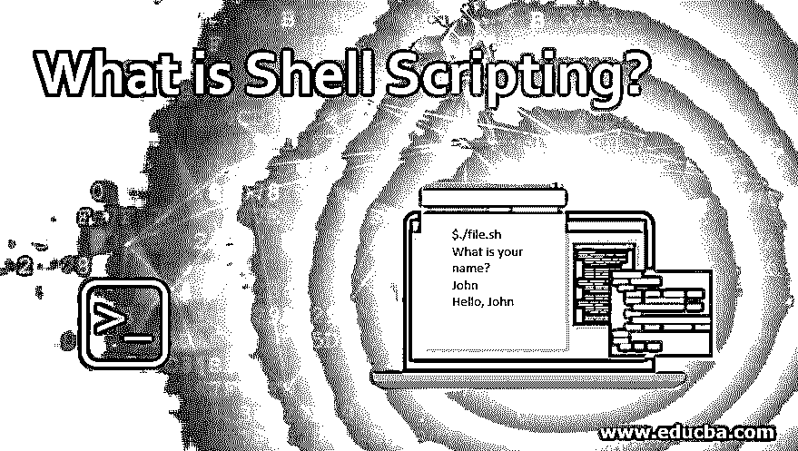

# 什么是 Shell 脚本？

> 原文：<https://www.educba.com/what-is-shell-scripting/>

## Shell 脚本简介

一个计算机程序可以在 UNIX shell 命令行解释程序中运行，用于文件操作、程序执行和打印文本，称为 shell 脚本。大多数系统管理任务都是使用 Shell 脚本执行的，如磁盘备份、评估系统日志，也用作复杂编程的安装脚本。它有一组命令，后跟 shell，Shell 有一些参数指示 Shell 执行某些操作。单个命令遵循一个序列并执行操作，因此它被称为 Shell 脚本。这对于系统管理中的重复性任务非常有用。

一个操作由一些组件组成，但两个主要组件是:

<small>网页开发、编程语言、软件测试&其他</small>

1.  核心
2.  壳

如下图所示，操作系统有两个组件，内核和外壳。

内核是操作系统和硬件之间的媒介，因此它使得硬件和软件之间的通信成为可能。如图所示，内核是操作系统最里面的部分，外壳是操作系统最外面的部分。

运行命令的终端可以访问 shell。Shell 是操作系统和终端之间的中介，因此从终端接收输入并在操作系统上运行，操作系统通过使用命令提示符(符号为$)以命令的形式接收用户的输入，对其进行处理，然后在终端上显示输出。

### Linux 中的 Shell 类型

有以下两种类型

#### 1.伯恩·谢尔

Bourne Shell 称为 sh shell，这个 Shell 的提示符是$。Bourne Shell 的衍生物是 POSIX shell 和 Korn shell，也称为 sh，Bourne Again SHell 称为 [bash shell，是最常用的](https://www.educba.com/bash-shell-in-linux/)。

#### 2.c 壳

C shell 被称为 csh shell，这个 shell 的提示符是%。C 壳的衍生物是托普斯 C 壳，即众所周知的 tcsh。

由于 shell 脚本类似于任何其他编程语言，所以它的语法也类似于任何其他编程语言。如果我们对任何编程语言如 C、C++、Java、Python 等有任何经验。那么学习和编写 shell 脚本程序就非常容易了。外壳脚本程序可以包括如 if、while、break、else 等关键字，如 ls、cd、echo、move、pwd 等外壳命令，执行特定任务和构造或控制流的函数，如 if..然后..else，while 循环，case 等等。

### 为什么我们需要 Shell 脚本？

出于某些原因，我们需要编写 shell 脚本来避免重复工作和自动化，由系统管理员使用 shell 脚本来执行例行备份，还需要向 shell 添加新功能，以执行系统监控等等。

### Shell 脚本的优点和缺点

以下是优点和缺点:

#### 优势

以下是优点:

程序员无需切换到完全不同的语法，因为命令和语法与直接在命令行中输入的完全相同，可以快速编写和启动 shell 脚本、交互式调试等。

#### 不足之处

以下是缺点:

shell 脚本的缺点是执行速度慢，与其他脚本语言不同的最小数据结构，很难记住所有的命令，复杂的缺陷设计

### 使用 Shell 脚本

外壳脚本程序包含一系列命令供外壳执行。

**创建 Shell 脚本的步骤**

1.  使用 vi 编辑器或任何其他编辑器创建一个 shell 脚本文件。给出带扩展名的文件名。嘘
2.  以#开始脚本！/bin/sh
3.  编写所需的代码并保存文件。
4.  通过键入 bash file.sh 执行脚本文件

**如何编写 Shell 脚本程序？**

这里我们将讨论它的一些编程组件，如变量、控制结构等等。

“#”是一个操作符，它将脚本定向到称为 shebang 的解释器位置。所以，#！/bin/sh 表示脚本被定向到 Bourne shell 执行。

让我们看一下使用 ls 命令的脚本示例。ls 命令用于获取当前目录中的文件和目录列表。让代码在 file.sh 文件中写成:

#!/bin/sh
ls

当我们执行脚本文件. sh 文件时，ls 命令也被执行。

注释是一个不可执行的代码，它在任何程序中都很重要。在 Shell 编程中，#符号用于添加注释。让我们看看例子

#评论行在此

外壳变量，变量用于存储数据或常量值，可以是字符和数字数据类型。让我们看一下变量的例子，这个变量使用 name 变量来存储“John”的名字，然后打印 name 变量的值。变量值可以通过前缀$来显示。echo 命令用于在标准输出或文件上显示一行文本/字符串。

`name ="John"
echo $name`

read 命令从标准输入中读取一行文本。下面给出了 reading 命令的例子，假设是写在 file.sh 文件中。

`#!/bin/sh
echo "what is your name?"
read name
echo "Hello, $name"`

然后 file.sh 运行为:

`$./file.sh
What is your name?
John
Hello, John`

这些是一些简单的示例脚本。Farther 可以开发包含条件语句、循环和函数的高级脚本。

### 谁是学习 Shell 脚本技术的合适受众？

目标受众是希望在 Linux 上使用 shell 脚本自动完成[任务的 Linux 用户和专业人士，其他受众可能是希望学习简单编程语言的人。](https://www.educba.com/introduction-to-linux/)

### 范围

在各种组织中，为 ETL、epsilon 和各种其他工具编写工作流以节省时间是非常有用的。如果你在一家公司工作，随着你擅长编写脚本，薪水也会增加。

### 结论

*   内核是操作系统和硬件之间的媒介。
*   外壳是操作系统和终端之间的媒介，所以从终端接收输入并在操作系统上运行。
*   Bourne shell 和 C shell 是 Linux 中使用最多的[shell。](https://www.educba.com/types-of-shells-in-linux/)
*   外壳脚本程序包含一系列命令供外壳执行。
*   它用于存储数据。
*   它可以帮助您创建包含条件语句、循环和函数的复杂程序。
*   学习这些技术的目标受众是希望使用任何 shell 脚本在 Linux 上自动执行任务的 Linux 用户和专业人员。
*   shell 脚本的范围，因为这些脚本在各种组织中非常有用，可以为 ETL、epsilon 和各种其他工具编写工作流以节省时间。

### 推荐文章

这是关于什么是 Shell 脚本的指南。这里我们讨论 shell 脚本的工作原理、类型、范围和优点。您也可以浏览我们推荐的其他文章，了解更多信息——

1.  [外壳脚本命令](https://www.educba.com/shell-scripting-commands/)
2.  [外壳脚本参数](https://www.educba.com/shell-script-parameters/)
3.  [外壳脚本的使用](https://www.educba.com/uses-of-shell-scripting/)
4.  [Linux 中的 Shell 是什么？](https://www.educba.com/what-is-shell-in-linux/)

