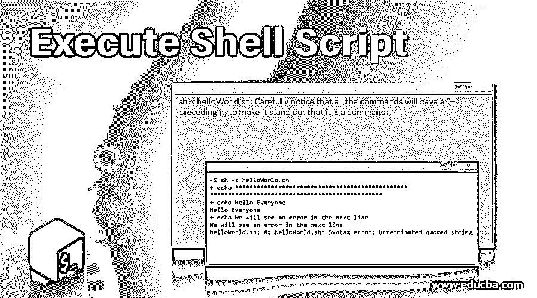

# 执行外壳脚本

> 原文：<https://www.educba.com/execute-shell-script/>

## 执行 Shell 脚本简介

继续详细了解 shell 脚本，在本文中，我们将了解 shell 脚本是如何执行的，以及在执行时需要记住的一些细节。我们已经学习了 shell 脚本的其他不同方面，比如 shell 脚本中的数组、shell 脚本中的参数，除非我们知道如何执行 shell 脚本，否则所有其他的技术细节在学习中是没有用的。如果一个用户不能执行一个 shell 脚本，就会有一种障碍，主要是一些需要记住的细节，我们将在本文中详细讨论。作为参考，在整篇文章中，我们将研究如何在 Linux 或 UNIX 操作系统中执行 shell 脚本。所以，事不宜迟，让我们开始吧！

### 什么是执行 Shell 脚本？

在我们开始执行 shell 脚本之前，让我们花点时间复习一下 shell 脚本的基础知识。Shell 脚本的扩展名为。sh 由 bash 和 Korn 结构组成，通过编程支持，最终保存为脚本。当在 Linux 或 UNIX 环境中执行时，这些脚本变成 shell 命令，然后在环境中执行。如果您是系统管理员之一，那么您必须具备脚本方面的知识，因为这将帮助您理解并弄清楚应用程序如何启动、升级、维护或删除的复杂细节。不仅如此，它还能让你理解用户环境构建的全部细节。

<small>网页开发、编程语言、软件测试&其他</small>

在 shell 脚本中，有许多主题使它能够使用 shell 脚本执行所需的任务。其中一些是循环、参数脚本、参数移位、getopts、case、eval 等。现在，让我们从一个基本问题开始，用户如何在 Linux 操作系统中运行 shell 脚本。下面提到的是使我们能够成功执行 shell 脚本的步骤。作为参考，我们将 shell 文件命名为 sampleShellScriptEduCBA.sh

**1。**第一步也是最重要的一步是启用脚本执行权限。文件只有很少的特殊权限，即读、写和执行。

要使脚本可执行，应该通过以下方式允许文件执行:

*   chmod+x sampleshellscripteducba . sh

**2。**一旦脚本被允许执行，下一步就是运行 shell 脚本。为此，有三种选择，我们没有选择使用哪一种的偏好。这完全取决于想要运行脚本的用户的使用舒适度。

这三种选择是:

*   ./sampleShellScriptEduCBA.sh
*   sh sampleShellScriptEduCBA.sh
*   bash sampleShellScriptEduCBA.sh

人们现在会认为运行一个 shell 脚本就这么简单吗？是的。绝对的。运行一个 shell 脚本并不需要什么高深的技术。但是在执行 shell 脚本的过程中，需要注意我们将在本节或示例部分中讨论的几个步骤，以便在运行 shell 脚本时遇到任何困难时，这些过目不忘的内容会再次将您带到本文。

首要的一点是作为根用户运行 shell 脚本。在某些情况下，以 root 用户身份运行 shell 脚本是非常必要的，因为如果没有 root 访问权限，仅从没有 root 访问权限的用户运行脚本可能无法在系统级别安装应用程序或进行修改。如果用户本身是根用户，此步骤可能无效。要以 root 用户身份运行 shell 脚本，需要在开始执行脚本之前使用 sudo。

例如:

`sudo bash sampleShellScriptEduCBA.sh`

执行上述命令后，您需要输入 root 用户的凭据，即密码，脚本将作为 root 用户从那里开始执行。

除了运行 shell 脚本的命令行功能之外，还提供了使用 GUI 运行 shell 脚本的功能。

为此，您需要:

*   右键单击 shell 脚本文件。
*   点击属性。
*   在权限选项卡中，单击复选框以启用执行
*   完成上述更改后，关闭窗口，然后单击文件并选择在终端中运行，以直接在终端中执行 shell 脚本。

有时使用调试选项来运行 shell 脚本是非常必要的。在可能使用 debug on 运行 shell 脚本的情况下，我们有三个选项，它们是:

*   sh -n sampleShellScriptEduCBA.sh
*   sh -v sampleShellScriptEduCBA.sh
*   sh -x sampleShellScriptEduCBA.sh

在上面的三个例子中，我们只看到一个参数发生了变化，这个参数被传递来理解需要打开哪种调试。对于-n，命令 shell 脚本不要运行脚本中的命令，但是，包含-n 的命令将检查语法。对于-v，代表 verbose，我们将在执行之前获得每个命令的详细信息。最后，对于-x 命令，这是最广泛使用的参数之一，因为它给出了 shell 脚本的执行轨迹，从而允许用户诊断错误。

因此，在下一节中，我们将查看前面运行 shell 脚本的命令行命令的示例以及所需的输出。

### 实现执行 Shell 脚本的示例

我们已经对命令理论有了深入的理解，但是 EduCBA 始终相信给出一个现实的视图，如果 shell 脚本被执行会发生什么。在本节中，我们将讨论这些命令及其输出。

#### 示例#1

将权限更改为包括执行权限:

**代码:**

`chmod +x sampleShellScriptEduCBA.sh`

**权限之前:**

**更改权限:**

左侧权限详细信息中的“x”表示 shell 脚本 sampleShellScriptEduCBA.sh 现在拥有执行权限。

#### 实施例 2

运行/执行脚本

**代码#1**

`/sampleShellScriptEduCBA.sh`

**输出:**

**代码#2**

`sh sampleShellScriptEduCBA.sh`

**输出:**

**代码#3**

`bash sampleShellScriptEduCBA.sh`

**输出:**

在上面的输出中，我们可以很容易地比较出运行 shell 脚本的 3 种方式没有明显的区别。重要的是开发者的偏好。

#### 实施例 3

以 root 用户身份执行脚本:

#### 实施例 4

排除故障

**代码#1**

`sh -n helloWorld.sh`

**输出:**

**代码#2**

`sh -v helloWorld.sh`

**输出:**

**代码#3**

`sh -x helloWorld.sh: Carefully notice that all the commands will have a “**+**” preceding it, to make it stand out that it is a command.`

**输出:**

### 结论

在本文中，我们能够深入了解在日常工作中如何使用命令行执行 shell 脚本的不同方面。使用 GUI 执行有许多限制，因此最优选的方式是通过命令行。还有许多其他的特性使得 shell 脚本在自动化和人工智能的世界中有了一席之地，并在交付所需的输出时保持一致！

### 推荐文章

这是一个执行 Shell 脚本的指南。在这里，我们讨论什么是执行 Shell 脚本，并通过相应的示例来实现，以便更好地理解。您也可以浏览我们的其他相关文章，了解更多信息——

1.  [外壳脚本参数](https://www.educba.com/shell-script-parameters/)
2.  [Linux 中的 Bash Shell](https://www.educba.com/bash-shell-in-linux/)
3.  [Shell 脚本中的函数](https://www.educba.com/function-in-shell-scripting/)
4.  [外壳脚本中的循环](https://www.educba.com/loops-in-shell-scripting/)

