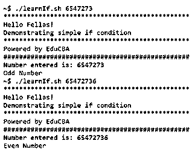
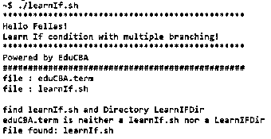

# 外壳脚本中的 if 条件

> 原文：<https://www.educba.com/if-condition-in-shell-script/>

## if 条件外壳脚本简介

假设在工作场所，你负责在生产层面实施的任何流程的决策。会有一些级别的检查，你会采取分支执行的下一步。类似地，if 条件也允许决定如果满足条件，需要执行的下一组命令是什么。这些条件本身可以是复杂脚本的一部分，或者可能与循环产生共鸣，以解决下一级复杂问题。if 条件强加了许多内置的检查和比较工具，这使得条件构建更加容易。在这些主题中，我们将学习 shell 脚本中的 if 条件。

### shell 脚本中 if 条件的类型

现在是时候了解 if 条件语句的类型了。

<small>网页开发、编程语言、软件测试&其他</small>

#### 1.简单的 if 语句

在这种类型的语句中，只使用 if 条件，这实质上意味着即使满足其中一个条件，也将一直测试 if 条件中的条件。当用户希望完成所有可能的检查，并且当其中一个条件为真时不结束检查时，最终会使用这种类型的条件。

**语法:**

`if <expression for checking>;
then
<set of commands to be executed>
fi`

#### 2.If-Else 条件

当程序需要检查一个条件并在条件满足时执行一个任务，或者在条件不满足时执行另一组任务时，使用这种类型的语句。

**语法:**

`if <expression for checking>;
then
<set of commands to be executed>
else
<set of other commands to be executed>
fi`

#### 3.If elif else fi 语句

从这里开始，以及下一种 if 条件语句，条件开始分支。这种类型的声明更像是一个梯子。如果条件不满足，一个人会想开始爬下梯子，只有满足一个条件才会停下来。

**语法:**

`if <expression 1 for checking>;
then
<set of commands to be executed>
.
.
elif <expression 2 for checking>
then
<set of other commands to be executed>
.
.
else
<set of else set of commands to be executed>
fi`

#### 4.如果那么，否则…如果那么…菲

这是一个嵌套的 else if 语句，其行为更像 if else 语句。这种类型的语句用于在 else 块中添加另一个 if 条件。

**语法:**

`if <expression 1 for checking>;
then
<set of commands to be executed>
.
.
else
if <expression 1 for checking>;
then
<set of commands to be executed>
.
.
fi
fi`

**解释**

我们必须警惕的一件事是缩进。缩进对于 shell 脚本来说并不重要，但是当涉及到最佳编码实践时，总是建议遵循正确的缩进。这是为了确保另一个人可以很容易地理解代码，在维护代码的情况下，缩进时非常容易。现在我们能够理解 if 条件所支持的不同运算符。下面列出了一些广泛使用的常见操作，因为它们是重要的组成部分，所以理解它们是必要的。

| **操作** | **这是什么意思？** |
| ! | 表情是假的 |
| -n | 字符串长度应该大于 0 |
| -z | 字符串长度为 0；或者换句话说，它是一个空字符串 |
| 字符串 A =字符串 B | 字符串 A 和字符串 B 相等 |
| 字符串 A！=字符串 B | 字符串 A 和 B 不相等 |
| 整数 1-eq 整数 2 | 整数 1 等于整数 2；数字上 |
| 整数 1-gt 整数 2 | 整数 1 小于整数 2；数字上 |
| 整数 1-lt 整数 2 | 整数 1 小于整数 2；数字上 |
| -d | 检查提到的<file>是否存在，以及它是否是一个目录</file> |
| -d | 检查<file>是否存在</file> |
| -d | 检查<file>是否存在，是否有读取权限</file> |
| -d | 如果<file>存在并且文件大小大于 0</file> |
| -d | 检查<file>是否存在以及是否被授予写权限</file> |
| -d | 检查<file>是否存在以及是否被授予执行权限</file> |

除了上述操作，if 条件还支持使用 AND (&&)和 OR (||)运算符。现在，利用上面的技术知识，让我们看看下一节中的一些例子。

### shell 脚本中 if 条件的示例

在这一节中，我们一定要包括类似实时情况的例子，同时也要让事情简单易懂。在这里，我们将首先看代码理解，然后看代码的输出。

#### 示例#1

**代码:**

`echo "************************************************"
echo "Hello Fellas!"
echo "Demonstrating simple if condition"
echo "************************************************"
echo "Powered by EduCBA"
echo "################################################"
echo "Number entered is: $1"
rem=$(( $1 % 2 ))
if [ $rem -eq 0 ] then
echo "Even Number"
else
echo "Odd Number"
fi`

在上面的代码中，通过命令行输入数字，然后使用模运算符检查余数，然后与 0 相等，以查看余数是否为 0。在余数为 0 的情况下，在模运算符的后运算中，输出被打印为偶数，否则在其他情况下被打印为奇数。

**输出:**

#### 实施例 2

**代码:**

`echo "************************************************"
echo "Hello Fellas!"
echo "Learn If condition with multiple branching!"
echo "************************************************"
echo "Powered by EduCBA"
echo "################################################"
for file in *;
do
if [ -f $f ] then
echo "file : $file"
else
echo "dir : $file"
fi
done
echo
echo 'find learnIf.sh and Directory LearnIFDir'
for each_file in *;
do
if [ -f $each_file -o -d $each_file ] then
if [ $each_file = 'learnIf.sh' ] then
echo "File found: $file"
elif [ $each_file = 'LearnIFDir' ] then
echo "Directory Found: $file"
else
echo " $each_file is neither a learIf.sh nor LearnIFDir”
fi
fi
done`

在上面的代码中，我们查找所有可能的文件并打印它们的名称，然后在下一步中，我们查找路径位置中的某个特定文件和目录，并打印出是否有任何文件与我们正在查找的文件相匹配。

**输出:**

### 结论

在本文中，我们已经能够给出 if 语句如何工作的完整视图，并以此为基线，鼓励您构建更多这样的脚本来测试您已经从这里获得的理解。即使在您的日常专业工作中，您也会遇到类似的任务，这些关于我们如何编写脚本来实现某个结果的见解将对设计您正在尝试解决的问题的解决方案大有帮助！

### 推荐文章

这是一个关于 shell 脚本中 if 条件的指南。这里我们讨论 shell 脚本中 if 条件的类型，并通过例子来更好地理解。您也可以阅读以下文章，了解更多信息——

1.  [如果在 Shell 脚本中为 Else](https://www.educba.com/if-else-in-shell-scripting/)
2.  [外壳脚本中的变量](https://www.educba.com/variables-in-shell-scripting/)
3.  [外壳脚本中的循环](https://www.educba.com/loops-in-shell-scripting/)
4.  PowerShell 中的[字符串](https://www.educba.com/string-in-powershell/)

