# 如果在 Shell 脚本中

> 原文：<https://www.educba.com/if-else-in-shell-scripting/>

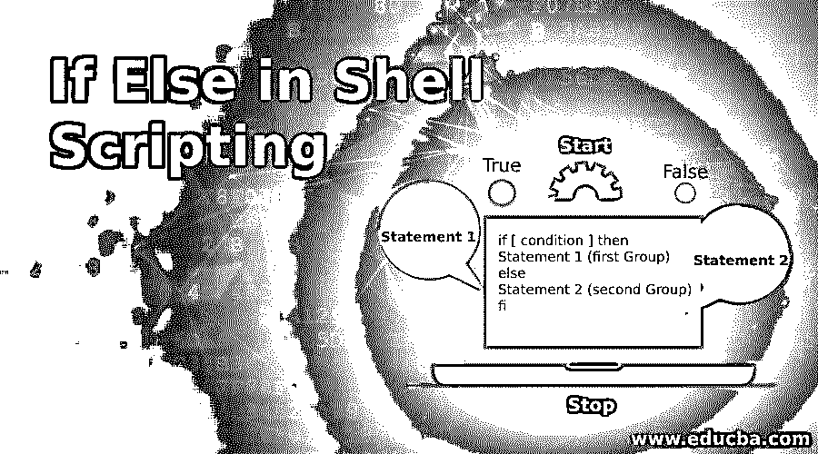


## Shell 脚本中的 If Else 简介

“If else”是编程语言中的条件或控制语句。这将根据条件是真还是假执行不同的操作或计算。它属于 ALGOL 60 家族(算法语言 1960)。

### Shell 脚本中 If Else 的类型

以下是 Shell 脚本中 If Else 的类型:

<small>网页开发、编程语言、软件测试&其他</small>

#### 1.if-else 语句

“if-else”处理执行的两个部分。如果“if-else”条件为“true ”,那么将执行第一组语句。如果条件为“假”，那么将执行第二组语句。

**Shell 脚本中 if-else 的语法:**

```
if [ condition ]
then
Statement 1 (first Group)
else
Statement 2 (second Group)
fi
```

**流程图:**

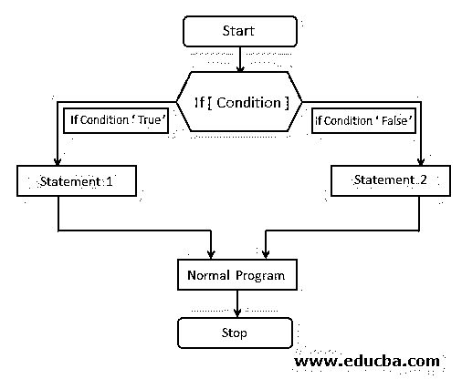


**shell 脚本中 if else 条件的工作:**

按照上面的流程，解释器将执行“if 条件”。如果条件为真。然后将执行“语句 1”。如果条件为假，那么将执行“语句 2”。在“if else 条件/控制语句”中，无论如何它将执行该条件。而且，条件是真还是假。

**举例:**

**代码:**

```
#!/usr/bin/bash
echo "Enter the value of A : "
read a
echo "Enter the value of B : "
read b
if [ "$a" == "$b" ]
then
echo "A is equal B"
else
echo "A is not equal to B"
fi
```

**说明:**

让我们考虑一下，我们有两个变量“a”和“b”。“a”和“b”的值将由用户提供。在“if_else”条件中，我们验证“a”和“b”变量。如果“a”和“b”的值相等，则条件为真。如果“a”和“b”的值不相等，则条件为假。如果条件为真，那么将执行第一组命令/语句。如果条件为假，那么将执行第二组命令/语句。

**真条件输出:**

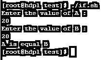


**错误条件输出:**

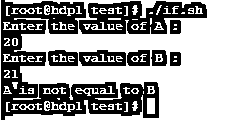


#### 2.if_elif_else_fi 语句

“if_elif_else_fi”也称为“阶梯 if”。当我们需要验证单个“if 块”中的多个条件时。那么就需要用“梯若”。从多个命令中，无论哪一个是正确的。相同的真条件将执行，否则块将执行。

**语法:**

```
if [ condition 1 ]
then
Statement 1
elif [ condition 2 ]
then
Statement 2
elif [ condition 3 ]
then
Statement 3
else
Statement 4
fi
```

**流程图:**

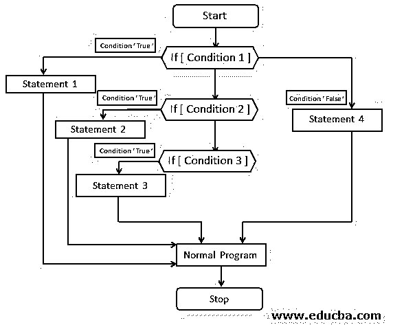


**在 Shell 脚本中使用 if_elif_else_fi 语句(梯形 If):**

根据上面的流程图，我们增加了三个条件 1、2 和 3。如果第一个条件为真，那么“语句 1”将执行，解释器将直接进入正常程序并执行下一个程序。但是解释器将验证所有的“f 条件”,无论哪个为真。将执行真条件。如果没有一个条件为真，那么将执行假语句(“语句 4”)。

**举例:**

**代码:**

```
#!/usr/bin/bash
echo "Enter the value of A : "
read a
echo "Enter the value of B : "
read b
if [ "$a" == "$b" ]
then
echo "A is equal to B"
elif [ "$a" -gt "$b" ]
then
echo "A is greater B"
elif [ "$a" -lt "$b" ]
then
echo "A is less than B"
els
echo "Invalid input"
fi
```

**说明:**

让我们考虑一下，我们有两个变量“a”和“b”。“a”和“b”的值将由用户端提供。在“梯形 if_else”条件中，我们验证 3 种不同的条件。根据用户输入的真实条件。将执行相同的有效代码行。如果这三个条件都无效，那么将执行代码的 else 部分。

**有效条件 1:**

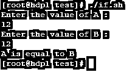


**有效条件 2:**

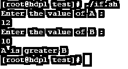


**有效条件 3:**

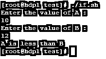


#### 3.if_then_else_if_then_fi_fi 语句

依次验证多个“if_else”条件是有用的。它也被称为嵌套 if 条件。如果条件为真，则进一步/嵌套的“if_else”条件将生效。如果条件为假，则进一步的“if_else”条件将不会生效。

**语法:**

```
if [condition 1 ]
then
Statement 1
if [ condition 2 ]
then
Statement 2
else
Statement 3
fi
else
Statement 4
fi
```

**流程图:**

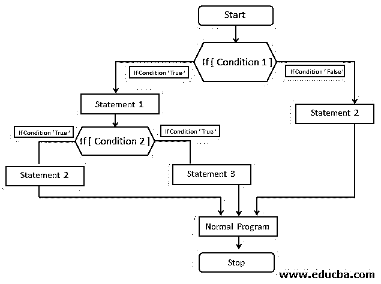


**在 Shell 脚本中使用 if_then_else_if_then_fi_fi(嵌套 if):**

在嵌套的 if 条件中，我们可以验证多个“if-else”条件。解释器将验证“if_else”的第一个条件。如果条件为真，则进一步的“if_else”条件将生效。

在验证条件时，如果第一个“if_else”条件可能为假，则解释器将退出循环并执行 else 命令组。而不验证嵌套的“if_else”条件。

**举例:**

**代码:**

```
#!/usr/bin/bash
echo "Enter the value of A : "
read a
echo "Enter the value of B : "
read b
if [ "$a" -gt 100 ]
then
echo "A is greater than 100"
if [ "$b" -gt 100 ]
then
echo "B is greater than 100"
else
echo "A is greater than 100 but B is less than 100"
fi
else
echo "A is less than 100"
fi
```

**说明:**

我们有两个变量 a 和 b。在“嵌套 if-else”中，我们验证了这两个条件。如果第一个“if_else”条件为真，则只有下一个“if_else”条件有效。如果第一个“if_else”条件可能为假，那么将执行“else”部分的第一个条件。控制器/解释器将不执行进一步的或嵌套的“if_else”条件。如果“if_else”的第一个条件可能为假。

**条件 1 有效，但条件 2 无效:**

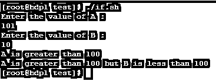


**有效条件:**

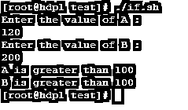


**条件 1 无效:**

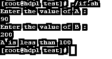


***Note:** In the above screenshot, if the first condition is not valid. The next condition will not validate even though the input “b=200” is correct.*

### 推荐文章

这是一个关于 Shell 脚本中 If Else 的指南。在这里，我们讨论 Shell 脚本中 If Else 的介绍及其示例和代码实现。您也可以浏览我们推荐的其他文章，了解更多信息——

1.  [外壳脚本中的变量](https://www.educba.com/variables-in-shell-scripting/)
2.  [Shell 脚本中的 While 循环](https://www.educba.com/while-loop-in-shell-scripting/)
3.  [外壳脚本中的循环](https://www.educba.com/loops-in-shell-scripting/)
4.  [外壳脚本的使用](https://www.educba.com/uses-of-shell-scripting/)


