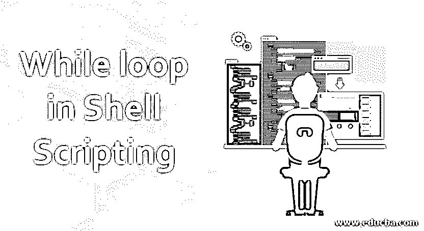
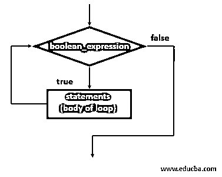
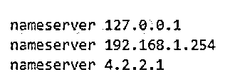

# Shell 脚本中的 While 循环

> 原文：<https://www.educba.com/while-loop-in-shell-scripting/>




## Shell 脚本中的 While 循环介绍

在本文中，我们将了解 Shell 脚本中的 While 循环。当我们需要做相同的任务或执行相同的操作时，我们需要编写一个程序，只做一次，然后重复相同的程序，重复我们想要执行的次数，或者我们可以一次又一次地调用相同的程序，直到重复的次数。这种调用可以通过多种方式完成，其中一种方式是循环。While 循环通过检查条件提供了一种执行相同程序的方法，当条件满足时，程序将执行，否则将不执行，并且重复该过程，直到条件不满足。

### While 循环的语法

shell 脚本中 while 循环的语法可以根据用途以不同的方式表示，如下所示:

<small>网页开发、编程语言、软件测试&其他</small>

#### 第一语法方法

**代码:**

```
while [ condition ]
do
command1
command2
done
```

**对上述语法的解释:**在上述语法中，对变量进行条件检查，如果满足条件，将执行命令。我们在 shell 脚本中有一些内置的关键字，while、do 和 done 就是其中之一。在上面的语法示例中，在条件评估为真之前，do 和 done 关键字之间的所有命令 command1、command2 将被执行，并且当条件不满足时， [while 循环将终止](https://www.educba.com/powershell-while-loop/)，并继续执行 done 关键字旁边的语句。

#### 第二语法方法

如果我们想检查文本文件中多行的条件，我们可以使用下面的语法。

**代码:**

```
while IFS = read  -r line
do
command on $line
command1 on $line
done < “file path”
```

**对上述语法的解释:**在上述语法中，while、do 和 done 是内置关键字，而 IFS 用于设置字段分隔符，默认为空格，-r 表示读取模式。上面的 while 循环将从指定路径的文本文件中逐行读取，并在当前行执行命令，直到读取了文本文件中的所有行并对它们执行了操作。一旦所有行都结束，while 循环将终止

#### 第三种语法方法

如果你想执行一些操作或者无限次执行一个函数，那么我们可以如下定义 while 循环:

**代码:**

```
while :
do
command
command1
done
```

**对上述语法的解释:**在上述 while 循环语法方法中，没有条件来检查并根据条件的结果执行运算。默认情况下，while 条件始终计算为 true，while 循环中的命令将执行无限次。

### While 循环的流程图

让我们考虑一个 while 循环的例子，并使用下面的例子讨论 while 循环的流程:

**代码:**

```
a=0
while [ $a  -lt 10 ]
do
echo $a
a = 'expr $a + 1'
done
```




**输出:**


**对上面代码的解释:**在上面的 while 循环程序中，首先我们用值 0 初始化变量 a，我们用条件 a 开始 while 循环< 10 其中-lt 小于所以它检查条件，当它评估为真时 while 循环的主体将执行 echo $a 的意思， 它显示 a 的值，下一条语句 a = ' expr $ a+1 '将 a 的值增加 1，condition 将再次检查并执行循环体，直到条件的计算结果为 false，程序执行到 while 循环末尾的下一条语句。 在上面的 while 循环示例中，它将从 0 到 9 总共执行 10 次，在这 11 次中，条件评估为 false，循环将在此处终止。

### While 循环在 Shell 脚本中是如何工作的？

虽然 shell 脚本中的 loop 以如下方式工作，但它是一个控制流语句，提供了一种将程序或代码片段运行一定次数的方法。在开始 while 循环之前，它检查条件，如果条件的值为 true，那么循环体将执行并继续相同的过程，直到条件的值为 false。对于正在检查的每个迭代条件，如果有必要，它会增加条件中的变量，操作也会在变量上执行。

**代码:**

```
n = 1
while [ $n -le 5 ]
do
echo "Welcome $n times"
n=$((n+1))
done
```

**对上述代码的解释:**在上面的 while 循环示例中，我们正在检查条件是否为< 5，当它评估为真时，循环体将执行并显示欢迎值乘以值为 n。它将继续，直到条件评估为假。

**输出:**


### Shell 脚本中在 While 循环中实现的示例

让我们用不同的例子来讨论 while 循环，并讨论这个 while 循环试图做什么，我们需要如何编写以及在编写时需要注意什么。

#### 示例#1

让我们编写一个 while 循环来逐行读取一个文本文件，while 循环程序如下:

**代码:**

```
file_path= /etc/resolv.config
while IFS = read  -r line
do
echo $line
done < "$file_path"
```

**对上述代码的解释:**在上面的 while 循环示例中，我们已经用文件的位置初始化了 file_path 变量，并且我们正在 while 循环条件中读取文件行，如果我们能够读取一行，则条件评估为 true，然后执行 while 循环的主体，这是该行的显示。因此，while 将继续执行，直到它从文件中读取所有行，然后终止循环，上述程序的输出将根据我们正在读取的文件的内容而改变。

**输出:**




#### 实施例 2

让我们看看我们如何使用 while 循环来运行一个程序或无限次显示一个程序可以看到如下:

**代码:**

```
while :
do
echo " hello, need to enter ctrl+c to stop"
done
```

**对上面代码的解释:**在上面的例子中，while 循环中没有条件，所以它总是计算为 true，循环体将继续执行，直到我们输入 ctrl+c 来停止 while 循环。echo 语句将显示无限次，直到我们按下 ctrl+c。

#### 实施例 3

让我们编写一个 while 循环来计算给定数字的阶乘，并在控制台上显示出来。

**代码:**

```
counter=$1
factorial=1
while [ $counter -gt 0 ]
do
factorial=$(( $factorial * $counter ))
counter=$(( $counter - 1 ))
done
echo $factorial
```

**输出:**


**对上面代码的解释:**在上面的程序中我们试图计算一个给定数字的阶乘。我们将参数 1 赋给计数器变量，将阶乘赋给值 1，并检查计数器是否大于 0，如果满足，则在循环体中执行操作，直到循环终止并最终显示阶乘结果。

### 结论

最后，概述了 shell 脚本中的 while 循环。到目前为止，我们已经讨论了什么是 while 循环，while 循环语法，while 循环的流程图，while 循环如何在 shell 脚本中工作，while 循环及其输出的示例。希望你看完这篇文章后对 while 循环有更好的理解。

### 推荐文章

这是一个 Shell 脚本中 While 循环的指南。这里我们讨论语法、流程图、while 循环如何工作以及用代码和输出实现的例子。您也可以浏览我们的其他相关文章，了解更多信息——

1.  [在 R 中循环时](https://www.educba.com/while-loop-in-r/)
2.  [Matlab 中的循环](https://www.educba.com/loops-in-matlab/)
3.  [用于 PowerShell 中的循环](https://www.educba.com/for-loop-in-powershell/)
4.  [PowerShell ForEach 循环](https://www.educba.com/powershell-foreach-loop/)


