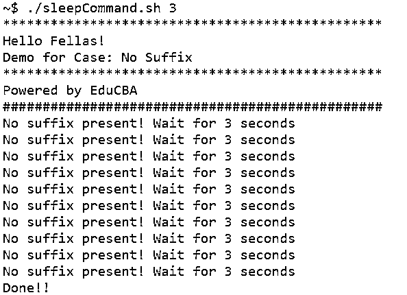

# 外壳脚本睡眠

> 原文：<https://www.educba.com/shell-script-sleep/>

## Shell 脚本睡眠简介

在我们设置我们的标志以了解该特征之前，只是一个小的类比，对于我们人类或任何其他生物来说，睡眠是身体有效运转的一个重要因素。类似地，在软件世界中，不仅在 shell 脚本中，甚至在其他编程语言中，我们都有“睡眠”的特性。想象一下这样一种情况，你没有睡觉，并且一直在做你喜欢做的事情。不间断的流入不仅会困扰你，也会困扰你身边的任何人。现在，让我们把同样的场景应用到一个有连续信息输出的地方，不给你时间去阅读前面的消息。会不会让你不知所措。

这是我们能够完全理解睡眠命令的真正含义的地方。该命令的主要目的在于为用户提供时间来消耗前面命令的输出。现在来看睡眠命令的正式定义。此命令是命令行中的一个实用程序，它在指定的时间内禁止执行下一个命令。这个指定的时间量作为命令的参数给出。

<small>网页开发、编程语言、软件测试&其他</small>

### 外壳脚本睡眠的语法

现在让我们看看睡眠命令的语法。内容如下:

`sleep <amount>[Suffix]`

这里，sleep 是表示要执行的睡眠动作的关键字，<amount>是睡眠命令将被激活的时间，后缀是识别时间量化所需的扩展名，即秒、分、小时或天。不同的后缀如下:</amount>

*   **s:** 表示秒
*   m: 表示分钟
*   **h:** 表示小时
*   **d:** 表示天数

默认情况下，如果没有指定任何内容，最终会将秒作为延迟的单位。向命令传递两个参数并不罕见。在这种情况下，两个参数的总和就是总暂停时间。例如，如果参数为 2m 30s，则暂停时间为 150 秒。现在，如果有人只看睡眠命令，首先会想到的是它根本没有多大用处，但当它与脚本混合使用时，它可以以一种你甚至想不到的方式创造奇迹。

睡眠可以变得美妙的一些方式是:

*   在网络重新连接的情况下，我们需要在重新连接之前等待一段指定的时间，否则连接会被认为不合法而被阻止。
*   再次执行命令之前暂停，如果它以前失败过一次。
*   如果一个脚本从一个从服务器下载文件的地方复制文件，我们不应该在它开始下载的时候就开始复制。在开始复制过程之前，我们需要等待指定的时间，否则，文件的副本将会损坏。
*   设计为在指定时间后运行的 cron 作业可能需要 sleep 命令来完成作业。同样，使用睡眠命令的最佳位置。

只有几个开关可用于睡眠命令。其中之一是–help，它指向 sleep 命令的帮助文件。另一个是版本，它给出了版本号、版权细节、作者和许可证等属性。

### Shell 脚本睡眠示例

在这个例子中，我们将查看代码、语法的用法，然后是输出。我们将确保在本文结束时，您将清楚地了解何时何地在 shell 脚本中应用 sleep！因此，让我们从一堆例子开始，以便更好地理解这个命令。

#### 示例#1

运行不带后缀的睡眠命令。

**代码:**

`echo "************************************************"
echo "Hello Fellas!"
echo "Demo for Case: No Suffix"
echo "************************************************"
echo "Powered by EduCBA"
echo "################################################"
#!/bin/bash
x=$(( $1 * 10 ))
while [ $x -gt 0 ] do
sleep $1
echo "No suffix present! Wait for $1 seconds"
x=$(( $x - $1 ))
done
echo "Done!!"`

**输出:**

在上面的代码中，我们将等待参数中指定的确切时间，然后打印“Waiting for…”行。这与您必须等待 **x** 秒，然后再次重新执行同一命令的场景非常相似，这种重新执行将会进行 10 次，然后才会放弃重新连接。输出如下所示。

#### 实施例 2

运行带后缀的脚本。

**代码:**

`echo "************************************************"
echo "Hello Fellas!"
echo " This script is to understand how to run the script with a suffix "
echo "************************************************"
echo "Powered by EduCBA"
echo "################################################"
#!/bin/bash
echo "Waiting for  $1 minutes..."
sleep $1
echo "Task Completed"`

**输出:**

当添加后缀时,“任务完成”命令将等待参数中指定的时间，然后回显所需的注释。在上面的代码中，代码将暂停 3 秒钟。输出如下所示:

### 结论

简而言之，sleep 命令是 bash 脚本中最强大的命令之一，单独执行时毫无意义，但在间隔一段时间后重试或调度作业的情况下，可以在自动化领域带来奇迹。我们鼓励您探索不同的方法，将在这里学到的概念应用到您日常处理的真实项目中。在这篇文章中，我们提出了睡眠命令的所有方面，上面的这些脚本是一个初学者包，供您使用，并开始构建您的神奇脚本创造奇迹！

### 推荐文章

这是一个 Shell 脚本睡眠指南。在这里，我们还将讨论 shell 脚本 sleep 的介绍和语法，以及不同的示例和代码实现。您也可以看看以下文章，了解更多信息–

1.  [Shell 脚本设置变量](https://www.educba.com/shell-script-set-variable/)
2.  [外壳脚本操作符](https://www.educba.com/shell-script-operators/)
3.  [如果在 Shell 脚本中为 Else](https://www.educba.com/if-else-in-shell-scripting/)
4.  [外壳脚本读取文件](https://www.educba.com/shell-script-read-file/)

