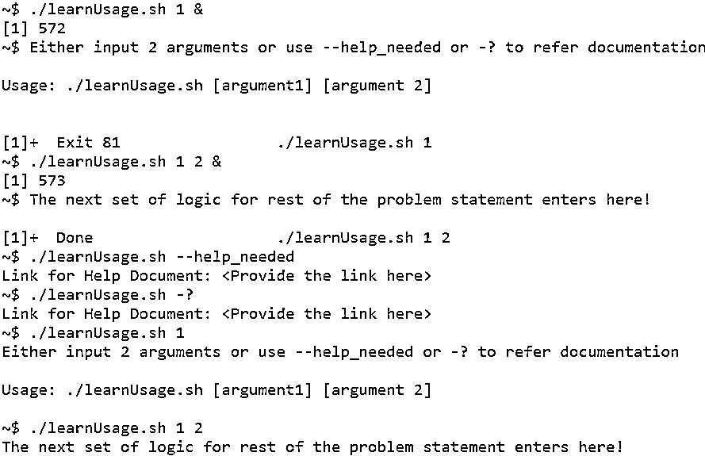

# 外壳脚本用法

> 原文：<https://www.educba.com/shell-script-usage/>

## Shell 脚本用法介绍

在开始理解使用功能主要是什么的时候，让我们看一个类似的情况来对这个主题有一个真实的感受。在任何其他编程语言中，如果我们在代码中使用内置函数，我们会浏览文档，查看我们需要合并的所有不同的强制参数，以成功运行该函数。在某些参数不可用的情况下，我们会收到一条消息，说明参数丢失。例如，在编程语言中，假设有一个将两个数相加的函数。现在，作为一个用户，如果我只发送一个操作数，那么函数将抛出一个错误，因为它将无法清楚地理解或解释另一个操作数的加法运算。这需要使用消息，上面解释的角色正是使用功能在 shell 脚本中提供的。

### 如何在 Shell 中实现使用脚本？

这里我们讨论如何在我们的程序中实现使用脚本。为此，我们需要完全理解其他一些功能，如 switch case 命令、if 条件和运算符，这些是我们已经详细讨论过的其他文章。如果需要设置使用功能，以下两个步骤至关重要，它们是:

<small>网页开发、编程语言、软件测试&其他</small>

*   我们需要验证需要传递给脚本的参数的数量。要求是，在第一次检查中，如果参数的数量少于强制要求的数量，我们可以在那个时刻显示使用消息。例如，在上面讨论的情况下，如果一个附加函数的操作数小于 2，我们可以立即发出一个使用消息。
*   如果实参的数量与强制要求的实参数量相匹配，但实参的类型与我们所要求的不匹配，函数可以立即再次发出一个用法消息。例如，除此之外，函数的两个操作数都应该是整数，万一其中一个失败了，就发出使用消息。

现在，我们最终想要了解使用该功能的途径。现在让我们详细研究一下。

*   我们看到的第一个可用性是拥有一个为公众使用而正确记录的脚本。如果有人第一次使用这个脚本，或者在很长时间后使用，人们可能会忘记事情，因此有一个使用信息将会有很大帮助。
*   我们看到的下一个可用性是在数据库中检查用户。在用户名不存在的情况下，可以发出使用消息，说明用户名不存在，或者如果没有传递用户名，可以分别引用需要传递用户名的消息。
*   如果有人输入参数以获得关于脚本的文档观点的帮助，用户可能会键入例如，“–help”，在这种情况下，我们将被期望为用户打开帮助文件，以便他们可以浏览脚本的文档。

在需求基础上甚至还有其他小地方，人们可以使用使用功能并利用使用功能的潜在意图。同样，与任何其他功能一样，一旦该功能也与 for 循环、if 条件等成对出现。会给你正在编写的代码带来奇迹。现在，我们将研究伪代码的使用功能，并在转向实际示例之前理解其潜在的方面。

#检查命令行
中提供的参数数量 If… Then… Else 循环以及适当的退出代码和用法消息

#检查传递的所有参数的数据类型是否匹配
If… Then… Else 循环以及适当的退出代码和用法消息

#检查运行脚本的用户的访问权限。

If… Then… Else 循环以及用法消息，表示用户是授权用户，或者使用适当的退出代码退出代码以进行未经授权的访问，或者在某些情况下，如果这部分代码是更大代码的一部分，甚至会一起阻止整个代码的执行。

### Shell 脚本使用示例

在下面的示例中，我们将尝试重新创建一个真实的编程场景，并尝试使用 shell 脚本中的所有功能。

`(learnUsage.sh)`

**代码:**

`#Check the number of arguments passed in the command line
usage_print() {
echo "Either input 2 arguments or use --help_needed or -? to refer documentation"
echo -e "\nUsage: ./learnUsage.sh [argument1] [argument 2]\n"
}
numArg=$#
if [  $numArg -le 1 ] then
#Check if the argument is --help_needed or -?
if [[ ( $# -eq 1 ) && ( $1 == "--help_needed") ||  $1 == "-?" ]] then
echo "Link for Help Document: <Provide the link here>"
exit 0
fi
usage_print
exit 81
fi
echo "The next set of logic for rest of the problem statement enters here!"`

在上面的代码中，代码的流程是判断参数的数量是否小于或等于 1，在这种情况下，我们将检查参数的数量是否为 1，并且它是–help 或-h，我们将回显所需的用法消息，如果不是，我们将提到需要如何使用该代码。如果所有的论点都存在，我们会附和说，我们可以继续下一步。您会注意到退出状态，当代码在后台运行并且代码存在时，会提到它。所有的输出都将在输出选项卡中被清除！

**输出:**

### 结论

在结尾的注释中，我们想提到使用功能的广泛使用带来了一个更生动的 shell 脚本，从长远来看，它将帮助其他用户！您还可以使用用户名和密码，将用户名保存在一个文件中，并检查用户名是否可用，您可以继续下一步，否则完全退出代码。做那个练习会很有趣！

### 推荐文章

这是一个 Shell 脚本使用指南。在这里，我们还将讨论 shell 脚本 sleep 的介绍和语法，以及不同的示例和代码实现。您也可以看看以下文章，了解更多信息–

1.  [外壳脚本操作符](https://www.educba.com/shell-script-operators/)
2.  [Shell 脚本设置变量](https://www.educba.com/shell-script-set-variable/)
3.  [外壳脚本读取文件](https://www.educba.com/shell-script-read-file/)
4.  [Shell 脚本中的评估](https://www.educba.com/eval-in-shell-script/)

