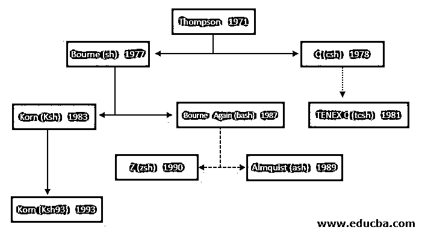

# 什么是 Bash？

> 原文：<https://www.educba.com/what-is-bash/>


## 什么是 Bash？

Bash 是一种被设计用来在不同程序之间轻松通信的程序。它类似于我们电脑上的其他程序。bash 和其他程序之间的基本和主要区别是，它被设计成接受用户的输入/命令，而其他程序有能力读取文件、进行数学计算、控制设备等等。由于一切都由编程语言控制，所以由“bash shell 语言”来处理。基本上，外壳程序是一个提供用户使用界面与其他程序交互的程序。有不同类型的外壳程序和它们各自的语言。流行的 shell 程序有 C shell(csh)、Z shell(zsh)、Bourne shell 和 Korn shell(ksh)。它代表伯恩再次壳，最近流行的外壳。尽管所有这些 shell 都使用相似的语法，但了解我们实际上是在为什么 shell 编写代码是很重要的。

### 巴什的历史

该图清楚地解释了 bash 是如何产生的:

<small>网页开发、编程语言、软件测试&其他</small>




### 基于 Linux 和 Window

下面是关于它是如何基于 Linux 和 Window 的细节:

#### 窗户

*   这个 bash 被称为“win-bash”，是 GNU bash 的一个窗口端口。像其他用于 Window 的 bash 端口(例如 Cygwin bash)一样，win-bash 不需要任何特殊类型的环境/dll，只需要一个二进制文件，仅此而已。
*   Win-bash 是在 nt_bash 上开发的，NT _ bash 是更早的 Window NT 的 bash 端口，几年前由 Mountain Math 软件发起，一直没有完成。
*   win-bash 研究的目的是为 Windows 提供端口，为 Windows NT 和另一个派生系统提供全功能的 bash.exe 二进制文件。
*   Win-bash 通常用作输入 shell，并用作解释器来运行 Linux shell 脚本。

#### Linux 操作系统

在 Linux 中，它是基于用户与界面交互的命令。让我们详细讨论一下 Linux 中的:

**语法:**

```
bash -option filename
```

命令语法是 Bourne shell 命令的超集。这支持大括号扩展、命令行、基本调试和信号处理。

##### 版本

**1。**我们可以通过启动命令来检查版本。

**代码:**

```
bash --version
```

**输出:**


从上面的命令输出中，我们看到系统版本号是 4.4.12(1)。

**2。**我们也可以通过内置的$BASH_VERSION 变量知道版本。

**代码:**

```
echo $BASH_VERSION
```

**输出:**


**3。**这个版本也可以从 shell 脚本中得知。让我们创建一个名为:

**代码:**

```
~/check_bash_version.sh
->  cd ~/check_bash_version.sh
add the below lines in the file and save:
-> #! /bin/bash
-> echo " Bash version for machine \n"
-> echo " Bash version :${BASH_VERSION }"
Run the script by giving the permission:
-> chmod 777 check_bash_version.sh
->  ./check_bash_version.sh
```

**输出:**


### 选项列表

让我们详细讨论每个选项:

*   **-c 选项:**当使用-c 选项时，该命令将从字符串中读取。字符串后的参数将被赋给从$0 开始的位置参数。
*   **-i 选项:**当使用-i 选项时，shell 将处于交互模式。
*   **-l 选项:**该选项代表登录 shell，并使其像登录 shell 一样被调用。
*   **-r 选项:**当使用-r 选项时，shell 将处于受限模式。
*   **-s 选项:**当选项后没有参数时，将使用-s 选项，处理完成后将从输入标准中读取命令。option 的这一特性使我们能够在调用交互式 shell 时设置位置参数。
*   **-D 选项:**当我们使用-D 选项时，所有以“$”开头的双引号字符串的列表将被打印在标准输出控制台上。如果当前的语言环境不是 C 或 POSIX，则这些类型的字符串需要进行语言转换。这表示-n 选项，不会执行任何命令。
*   **—选项:**“A”表示选项结束，停止进一步的选项处理。在-之后传递的任何参数都将被视为文件名和参数。–的参数类似于-。

### 使用

*   无论何时启动，它都会在各种点文件中执行命令，我们需要拥有#的执行权限！bin/bash 初始化
*   当它以交互模式启动时。这将读取并执行/etc/profile(如果存在),否则它将调用文件/etc/bash.bashrc
*   读取文件后，它会寻找~/。bash_login，~/。bash_profile 和~/。侧写。它将按照存在的顺序读取和执行。
*   ~/.bash_logout —当它被执行时，它将从 shell 中注销
*   当它作为交互式外壳而不是登录外壳启动时，
*   bash read & execute/etc/bash . bashrc & then ~/. bashrc。
*   此选项–RC file file 强制从文件而不是~/.bashrc 中读取和执行命令。

### 推荐文章

这是一本关于什么是 Bash 的指南？.在这里，我们学习了不同操作系统中的概念、历史、版本和用法。您也可以浏览我们的其他相关文章，了解更多信息——

1.  [外壳脚本的使用](https://www.educba.com/uses-of-shell-scripting/)
2.  [Linux 中的 CAT 命令](https://www.educba.com/cat-command-in-linux/)
3.  [Unix Shell 命令](https://www.educba.com/unix-shell-commands/)
4.  [Linux 中的 Bash Shell](https://www.educba.com/bash-shell-in-linux/)


