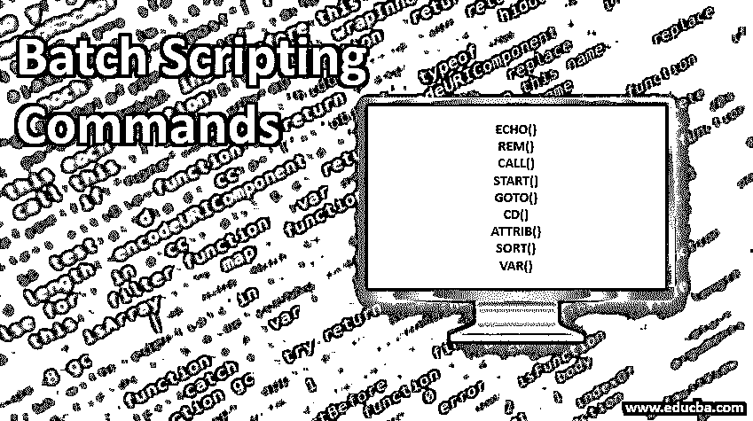

# 批处理脚本命令

> 原文：<https://www.educba.com/batch-scripting-commands/>




## 批处理脚本命令简介

用外行人的话来说，我们可以简单地说批处理文件是一个简单的文本文件。bat 扩展，一般用 sublime、notepad++和 UltraEdit 等文本编辑器编写。

.bat 扩展表明它是一个批处理文件，将在命令提示符下运行，这个文件包含几个命令，以特定的顺序使用命令提示符执行或自动执行一项任务。我们可以双击批处理文件来运行它。并且它会在命令提示符下一个一个的开始执行命令。

<small>网页开发、编程语言、软件测试&其他</small>

### 什么是批处理脚本？

批处理脚本是一个包含需要在 windows 命令提示符下执行的命令序列的文件，批处理脚本总是指在 windows 命令提示符下执行的一系列命令，在 [Windows 操作系统](https://www.educba.com/introduction-to-windows/)中称为批处理脚本，而在 Linux 中称为 shell 脚本。

当我们在命令提示符下执行批处理脚本文件时，所有的命令都会按照批处理文件中的顺序一个接一个地执行。每个命令都作为命令提示符的命令参数提供，批处理文件的输出可以被控制或记录到文件中，这有助于我们在执行命令时记录和识别错误。

### 批处理脚本命令列表

以下是批处理脚本命令列表:

*   **Echo:** 显示当前正在执行的命令的输出，默认情况下，所有批处理脚本文件的 Echo 都是打开的，这意味着当命令序列在命令提示符下被逐个执行时，相应的命令输出会显示在命令提示符上，如果我们需要，我们可以通过写@echo of 来关闭它。
    在 echo off / echo on 命令前使用@可防止其自身显示为输出中的 echo。
*   **Rem:** rem 用于对批处理文件中的行(命令)进行注释，以 Rem 开头的行被命令提示符忽略。不使用 rem，我们可以使用::(双冒号)操作来注释该行。
*   **call:** call 命令用于从一个批处理文件中调用另一个批处理文件，调用另一个批处理文件的批处理文件称为调用者，被调用的文件称为被调用者，Call 命令总是返回调用者批处理文件，即使被调用者批处理文件中存在错误，Call 命令总是在调用者/被调用者批处理文件之间共享变量引用， 如果有两个相互依赖的批处理文件，在这种情况下，调用命令用于从一个批处理文件中调用依赖的批处理文件，调用总是在同一个窗口中执行文件，并在命令之间共享变量上下文。
*   **Start:** start 命令用于从一个批处理文件内部调用另一个批处理文件，主要区别是，Start 命令总是打开一个新的窗口来执行一个命令文件，它从不在文件之间共享变量上下文，从一个批处理文件内部调用的文件将作为一个单独的进程运行，并打开新的命令控制台来运行这一系列命令。
*   **GOTO:** goto 命令跳转到批处理文件的特定标签，GOTO 命令与 label 一起使用，表示批处理文件中的特定标签名，label 总是以:(冒号)开头，标签名是在 GOTO(GOTO 命令在其上移动控件)执行命令后定义的，它从跳转到该标签的地方返回。
*   |:当我们需要使用一个命令的输出作为第二个命令的输入时，在命令之间使用“|”运算符，它是指将一个命令的输出作为第二个命令的输入。
*   **& :** 它将命令分成多行。
*   **& & :** 当且仅当前一条命令成功运行或其错误等级为零时，执行当前命令。
    *   **> :** 它用来将命令输出写入文件中。
*   **> > :** 将正在执行的当前命令的输出追加到文件中。

#### **某些重要的批量命令**

这里我们讨论一些重要的批处理脚本命令:

| **命令名** | **用途** |
| Taskill -f /pid 2035 | 终止给定进程 id 的进程 |
| ipconfig/全部 | 显示系统 IP 信息 |
| 属性 | 设置或显示文件属性 |
| 激光唱片 | 更改目录 |
| 关机 | 关闭计算机 |
| 分类 | 对文件内容进行排序 |
| Systeminfo | 显示所有系统配置 |
| Tasklist | 显示所有正在运行的任务列表 |
| 时间 | 设置或显示系统时间 |
| 标题 | 设置批处理脚本标题 |
| 类型 | 在控制台上显示文件内容 |
| 版本 | 显示 windows 版本 |
| 复制 | 从目录中复制单个文件或将单个文件复制到目录中 |
| Xcopy | 它复制文件及其子文件 |
| dos 命令:更改文件名 | 显示剩余的文件和目录 |
| 协会 | 显示文件扩展名的关联 |

### 例子

下面是批处理脚本命令的例子:

#### 示例#1

```
@echo off
echo 'Hello world from educba'
```

让我们将这个批处理文件保存为 test.bat，并通过双击它来运行这个文件，您将得到下面的输出。

**输出:**

来自 educba 的 Hello world

#### 实施例 2

```
@echo off
echo  'System ip information'
ipconfig
rem ipconfig /all
```

让我们将该批处理文件保存为 test.bat，并通过双击它来运行该文件，这将打印运行该批处理文件的系统的系统 IP 信息，以 rem 开头的行将被忽略，因此不会打印与 config /all 命令相关的信息。，我们也可以使用::(双冒号)运算符代替 ram，使 config /all 行成为注释。

[注释非常有用](https://www.educba.com/comments-in-php/)在包含任意数量命令和另一个批处理文件引用的大型批处理文件中编写命令描述；这使得批处理文件易于理解和修改。

#### 实施例 3

```
@echo off
echo  'System port information'
netstat -ano | findstr '8080'
```

这个批处理脚本打印在端口号 8080 上运行的进程信息。

#### 实施例 4

```
@echo off
echo  'run java jar file with name demo'
java -jar target/demo.jar > log.txt
```

这将运行 java 演示 jar 文件，只需导航到您的 java maven 基本目录并运行这个批处理文件。

#### 实施例 5

```
@echo off
echo  'Trace route for given host name'
@echo off
title trace the root to the host
Set /p host_name= enter hostname or ip for which you want to trace the route:
if defined host_name (
powershell -Command tracert -d %Host% >>tracert_result.txt
)
```

该批处理文件将获取目的主机的主机名或 IP 地址，并将该目的主机的 traceroute 结果附加到 tracert_result.txt 文件中，该文件将[在 Windows Powershell](https://www.educba.com/windows-powershell-commands/) 上运行。

#### 实施例 6

```
@echo off
echo  ''deploy project on server'
call package.bat
call integration-test.bat
call deploy.bat
```

#### 实施例 7

```
@echo off
echo  'start the project deployment assembly'
cd "\package\demo\"
start package.bat
cd "\test\demo\"
start test.bat
cd "\deploy\demo\"
start deploy.bat
```

这个批处理文件将运行分别属于包、测试和部署的每个文件；作为一个单独的可管理的过程，并将打开一个新的控制台来记录每个批处理文件的命令输出。

### 结论

当 DOS 曾经是一个非常流行的操作系统时，批处理文件是一个非常流行的逐个执行一系列命令的解决方案，现在批处理脚本在各种任务中也起着非常重要的作用，例如自动配置 windows 服务器或调度任务。

### 推荐文章

这是一个批处理脚本命令的指南。在这里，我们讨论介绍和例子以及一系列批处理脚本命令。您也可以浏览我们推荐的其他文章，了解更多信息——

1.  [火花外壳命令](https://www.educba.com/spark-shell-commands/)
2.  [什么是 Bash 脚本？](https://www.educba.com/what-is-bash-scripting/)
3.  [外壳脚本的使用](https://www.educba.com/uses-of-shell-scripting/)
4.  [Shell 脚本中的回显](https://www.educba.com/echo-in-shell-scripting/)


