# 什么是应用软件及其类型

> 原文：<https://www.educba.com/what-is-application-software-its-types/>

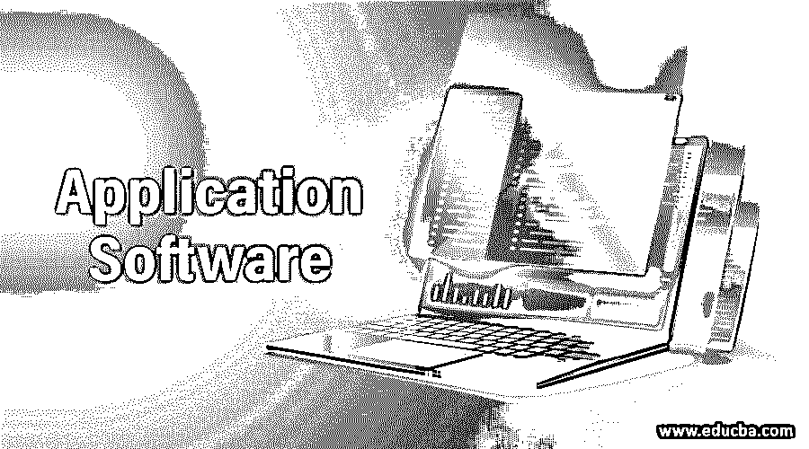

## 应用软件:面向任务

计算机软件基本上是用于在系统上执行特定任务的程序和过程。从最低级的汇编语言到高级语言，有不同类型的应用软件。计算机软件系统分为三大类，即系统软件、编程软件和应用软件。

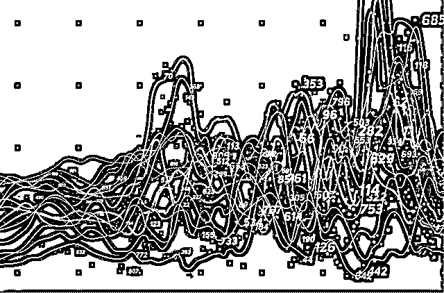

<small>网页开发、编程语言、软件测试&其他</small>

系统软件包括设备驱动程序、操作系统、[服务器](https://www.educba.com/courses/all/servers/ "50+ Servers")和软件组件，而编程软件通过编辑器、连接器、调试器、编译器/解释器等工具帮助编写程序。与这两者相反，应用软件用于完成特定的任务。

应用软件直接利用计算机的能力来完成特定的任务，用于处理文本、图形和数字。

### 应用软件的类型

不同类型的应用软件包括:

| **应用软件类型** | **例题** |
| --- | --- |
| 文字处理软件 | MS Word、写字板和记事本 |
| 数据库软件 | Oracle、MS Access 等 |
| 电子表格软件 | 苹果数字，微软 Excel |
| 多媒体软件 | 真正的播放器，媒体播放器 |
| 演示软件 | Microsoft PowerPoint，主题演讲 |
| 企业软件 | 客户关系管理系统 |
| 信息工作者软件 | 文档工具、资源管理工具 |
| 教育软件 | 字典:Encarta，Britannica 数学:MATLAB 其他:Google Earth，NASA World Wind |
| 仿真软件 | 飞行和科学模拟器 |
| 内容访问软件 | 通过媒体播放器、网络浏览器 |
| 应用程序套件 | OpenOffice，Microsoft Office |
| 工程和产品开发软件 | 集成开发环境 |

有各种各样的应用软件类型，如授权软件、销售软件、免费软件、共享软件和开放源码软件。

应用软件要么需要安装，要么可以在线运行。应用软件也可以根据用途分为以下几类:

*   实用程序
*   通用程序
*   综合计划
*   特定软件
*   定制软件
*   文字处理软件
*   桌面出版软件
*   电子表格软件
*   数据库软件
*   演示软件
*   互联网浏览器
*   电子邮件程序
*   图形程序(基于像素)
*   图形程序(基于矢量)
*   通信软件:通过音频、视频或基于聊天的方式进行通信

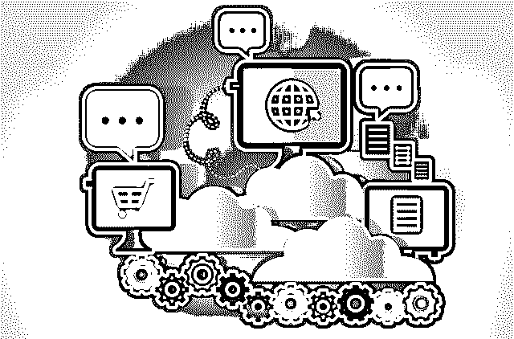

### 一、基本软件应用类型

以下是软件应用程序类型:

#### 文字处理软件:灵活的工具

如果笔比剑更有力量，文字处理器就更好了。文字处理器创建基于文本的文档。这套软件工具最灵活，应用最广泛。文字处理器用于创建备忘录、传真和信件。文字处理器也用于在网上创建报告和个性化页面。

前三名文字处理软件:微软 Word、Lotus Word Pro 和 Corel WordPerfect

文字处理器提供了许多功能，使输入、编辑和格式化书面文件变得快速而精确。

#### 基本功能:文字处理软件 **e**

*   文字处理程序有自动换行功能，当当前行结束时，自动换行功能会将插入点移到下一行。这样既省时又省力。
*   该软件还提供了编辑精度和效率。考虑一下同义词库，它提供了所选单词或短语的同义词、反义词和相关单词。查找和替换功能使用户能够扫描和替换选定的单词或短语。
*   有内置的拼写和语法检查，这使得很容易找到有拼写问题或大写，句子结构或标点符号问题的单词。
*   “自动更正”功能可用于在三分之一秒内进行更正。自动图文集将单词或句子插入到文档中您想要的确切位置。
*   自动完成甚至确保用户甚至不必键入完整的单词就可以将它包含在文档中。
*   如果长相很重要，你的文字处理器还会远吗？文字处理器中的许多功能可以在几秒钟内改进任何文档的格式或外观。这包括字体外观，字体大小，字符效果，如粗体，斜体，颜色和阴影，对齐和列表。
*   允许多个用户使用协作功能编辑同一文档是文字处理程序的另一个有益功能。
*   另一个功能是跟踪修改，这使您可以识别对其他人的原始文档的修改，从而可以看到他们的修改和注释。
*   文字处理软件包括创建基于文本的文档，这些文档可以方便地存储、编辑和格式化。
*   附加的文字处理功能包括艺术字，用于修改关键信息的标题、连字符、栏和文本框。
*   大多数文字处理软件还生成报告，并配备了工具来创建图标题，表格，页眉，页脚，尾注等。
*   对于网页，文字处理器包括预定义的模板、超文本链接和对网页的支持。

#### 网络应用:应用服务提供商的奇迹

应用程序最初由组织或个人拥有，而用户现在使用基于网络的应用程序来拥有和存储应用程序。

### 工作原理:阿司匹林的 USP

被称为应用服务提供商或 ASP 的特殊网站使用户能够访问他们的应用程序。通常象征性收费即可使用。

Web 应用程序提供了一组图形插图，包括剪贴画、图表和照片。用户还可以选择可以从一个项目移至另一个项目的项目或部分文档。从手写识别到拼写检查器和任务窗格、模板，以及用于特定任务和语音识别的向导，基于 web 的应用程序提供了使创建文档成为一个简单过程所需的一切。

通过拼写和语法检查，准确无误的内容是可能的。

ASP 将应用程序的副本或部分下载或发送到用户，并存储在他或她的硬盘驱动器中，以备运行。副本会保留一段时间，直到程序运行并退出。甚至还有免费的 ASP。

#### 基于网络的应用:让它更好地工作

免费的通用应用程序可以从地球上的任何地方访问。另一个额外的好处？您可以从任何位置访问数据文件。基于 We 的应用包括笔记、日历和个人信息管理器，以及众多的游戏。随着时间的推移，基于网络的应用程序甚至可能胜过传统的应用软件。唯一的缺点？存储在 ASP 中的个人数据的隐私和安全是一个问题。网络变化的速度也很快。但一个好处是，随着新版本的出现，用户不再需要升级硬盘上的软件。

#### 电子表格:在数字世界中组织数字

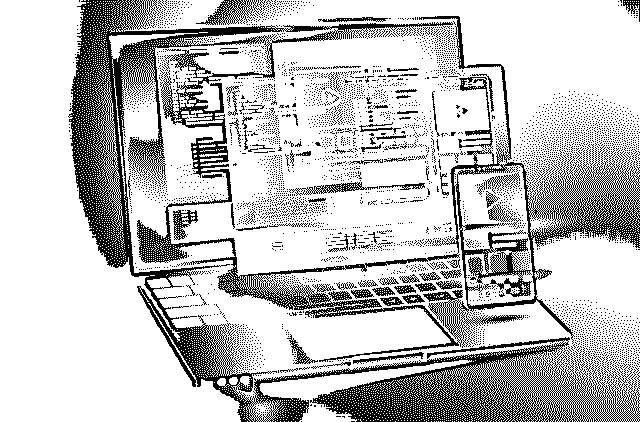

1.  电子表格用于创建文档和执行计算，例如，Excel、Lotus 1-2-3 等。
2.  电子表格最初只被会计师使用；现在，他们被营销专业人士、学生、教师和金融分析师所使用。
3.  最常用的电子表格程序包括 Lotus 1-2-3、 [Microsoft Excel](https://www.educba.com/excel/courses/excel-advanced-course/ "Advanced Excel 2016") 和 Corel Quattro Pro。

#### 电子表格:它表示

1.  电子表格组织、分析和[图表/图形](https://www.educba.com/graph-chart-formats/ "Graph and Chart Formats")数字数据，如财务报告和预算。
2.  电子表格程序负责操作数据和创建包含一个或多个相关工作表的工作簿文件。
3.  工作表或电子表格是由行和列交叉构成的矩形网格，用于创建单元格。
4.  文本条目或标签通过描述为工作表提供了一个结构。
5.  数字条目可以是用于计算和处理信息的数字或公式；函数是执行计算的预先编写的公式。
6.  电子表格包括范围、文本和数字条目、函数、公式、图表、计算和假设分析。有不同的图表类型，包括折线图、饼图、柱形图和条形图，它们构成了电子表格的一部分。它们还提供了其他好处，如标题、图例和数据标签。

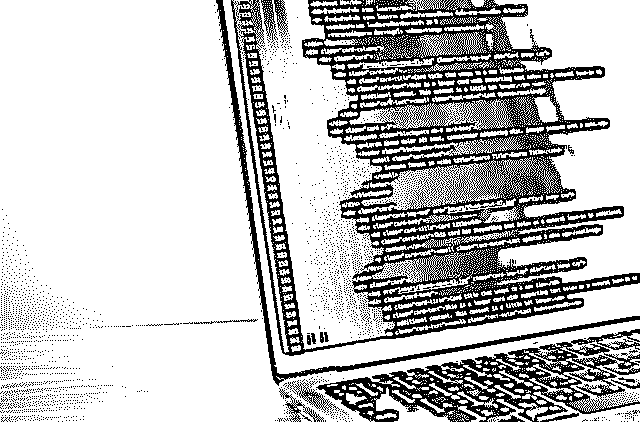

#### 数据库:关系数据

数据库是关系数据的集合，它相当于一个电子档案柜。

DBMS 或[数据库管理系统](https://www.educba.com/database-management-system-advantages/ "Types of Database Management Systems")是用于建立或构建数据库的程序。数据库用于办公室、教育机构和不同类型的组织。3 为微型计算机设计的最广泛使用的数据库管理系统包括 Corel Paradox、Microsoft Access 和 Lotus Approach。关系数据库是使用最广泛的数据库结构。数据库中的每个字段都分配有字段大小和数据类型。 [DBMS 提供了许多工具](https://www.educba.com/database-management-tools/ "Best Database Management Tools")来创建和使用数据库，如过滤器或标准。

[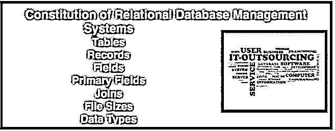

](https://cdn.educba.com/academy/wp-content/uploads/2015/12/image-6.jpg) 

功能包括用于排序、过滤、创建表单、定义标准和创作报告的工具。DBMS 能够通过查询、表单和报告将存储在不同表中的信息提取出来。

[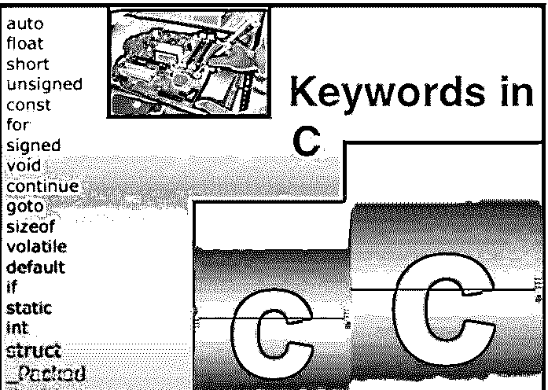

](https://cdn.educba.com/academy/wp-content/uploads/2015/12/image-7.jpg) 

查询是对数据库中某些数据的问题或请求，而查询用于以不同的方式查看数据，以分析和更改现有数据。数据库表单复制传统的打印表单。DBMS 主要用于列表报告，如销售汇总、邮件标签和电话列表。

DBMS 是通过设计系统基本结构的计划创建的，员工可以通过指定字段、数据类型和主键字段来创建表结构。

#### 演示:像素完美的图片

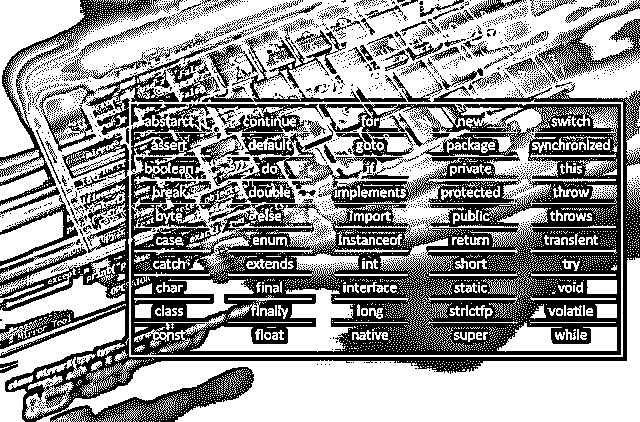

信息通过演示图形以可视方式呈现，这些图形组合了大量可视对象，用于创建有趣且[有吸引力的演示](https://www.educba.com/ms-powerpoint-presentation/ "8 Tips for Creating Amazing PowerPoint Presentations")。这些工具也用于[传达](https://www.educba.com/10-ways-of-communicating-ideas-effectively/ "10 ways of Communicating Ideas Effectively")有说服力的信息。

幻灯片用于电子演示，有版式视图、普通视图和幻灯片视图。您可以选择配色方案、幻灯片布局、特殊效果、动画、过渡和构建。

#### 集成软件包:全部在一个程序中

一个集成的软件包提供了文字处理器、数据库管理器、电子表格等功能。缺点是每个功能的功能不像单个程序那样广泛。一个集成包就是一个单独的程序，使用和功能切换都相当方便。最常见的集成软件包是微软和苹果的作品。

#### 软件套件:一组应用软件

1.  软件套件是一组应用程序，有 4 种不同的类型，分别是生产力型、专业型、实用型和个人型。
2.  软件套件是作为一个群体捆绑销售的独立应用程序的集合。

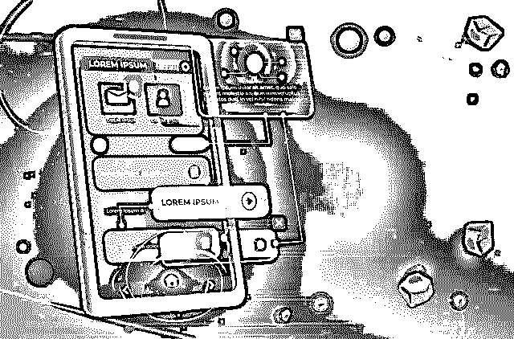

#### 业务事项:生产力套件

生产力或商业套件包含专业级应用程序，如电子表格、数据库管理系统、文字处理器等。最著名的生产力套件是 Lotus Smart 套件和 Corel WordPerfect 办公套件。

#### 专为家庭打造:个人套房

个人或家庭套房包含个人软件应用程序，即供家庭或个人使用的程序。一些最著名的家庭套件包括微软作品套件。

#### 专业套件:特定应用

这些套件专注于特定的应用，包括图形套件、财务规划套件等等。

#### 实用工具**套件:让计算更简单**

该套件旨在使计算更加安全。它包括诺顿防病毒系统和诺顿网络安全套装。

#### 多媒体软件:独一无二

多媒体软件允许用户创建图像、音频和视频。这些例子包括媒体播放器。

### 二。所有权和交付方式:区分应用软件的另一个标准

*   **商业软件:**这种软件已经由软件供应商安装在许多计算机上。唯一的许可证是购买使用它。软件通常安装在多台机器上。也可能存在软件的演示版本。
*   共享软件:要么免费，要么象征性收费。这种类型的软件可以从网上下载，例如 MP3 播放器。

### 三。许多不同的商品:应用软件是负面的

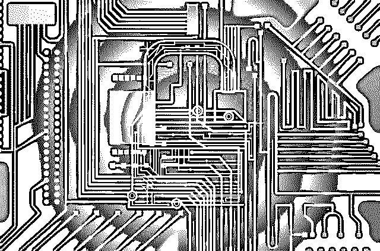

正如有积极的软件，也有消极形式的应用软件用于邪恶的目的。应用软件可能带有以下隐藏程序或实用程序:

*   **恶意软件**:这代表恶意软件。最常见的恶意软件形式是[木马、蠕虫和病毒](https://www.educba.com/viruses-function/ "Viruses and Trojans: We Live in Your Wires")。
*   **广告软件和间谍软件**:广告软件和间谍软件是其他常见的软件类型。广告软件包括注册时可获得的赞助免费软件。有时，广告软件会跟踪互联网冲浪习惯，从而变得具有侵入性并变成间谍软件。然后，它会记录下你浏览过的所有网站，并显示出它认为与你相关的广告。与广告软件不同，间谍软件有负面含义。
*   灰色软件(Greyware):这是一个术语，用于将所有软件分类为恶意软件和其他代码，包括跟踪软件和间谍软件。
*   Nagware:这是指以弹出窗口形式出现的软件，要求用户注册产品或购买应用程序
*   膨胀软件:拥有如此多不同功能的软件，需要相当大的磁盘空间和内存资源来运行
*   **Slime ware** :这是指通过改变主体设置来干扰用户体验的软件。
*   **废弃软件**:发行商不再出售或支持的软件。
*   **运球软件**:更新和补丁太多的软件。

### 结论

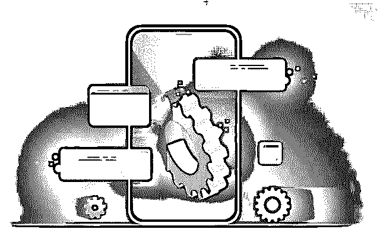

从数字到文字，这个软件的适用范围很广。面向动作的应用软件执行特定的任务，旨在将复杂的事情变得非常简单。应用软件有很多种类型，随着技术和用户的发展，这种类型还会继续增加。不同类型的应用软件反映了计算机技术和术语的巨大变化。随着技术的不断变化，应用软件也在不断改进。应用软件包括执行虚拟任务来解决现实世界中的问题。

### 推荐文章

这里有一些文章可以帮助你获得更多关于应用软件及其类型的细节，所以只要浏览一下链接就可以了。

