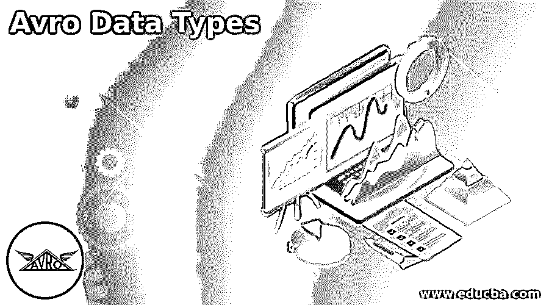
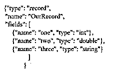
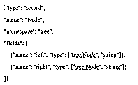
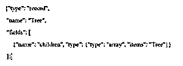

# Avro 数据类型

> 原文：<https://www.educba.com/avro-data-types/>

## Avro 数据类型介绍

Avro 数据类型被定义为 avro 是一种序列化格式，即使其值可以改变或不改变，也不会引起问题。已计划修改数据类型，因为它是一种数据集成服务，已被用于通过平台处理数据；许多类型化系统与其他类型化系统很接近，avro 可以利用 avro 序列化格式，而不是使用新的数据类型，数据类型利用 string 和 JSON 对象。它有布尔、整数、浮点、字符串原语、空类型、数组、记录、枚举集、字节序列、固定宽度字节序列和标记联合。

### Avro 数据类型列表

以下是 Avro 数据类型列表:

<small>网页开发、编程语言、软件测试&其他</small>

#### 1\. Null Type

这种类型作为引号中的字符串被称为“null ”;它有一个可实现的价值，但没有报价。可移植格式分析(PFA)不转换类型；它不返回任何值。

某些类型的联合意味着字符串和 null 构成如下:

上面指定了字符串值将会丢失，因为它不同于“字符串”

#### 2.布尔代数学体系的

这种数据类型可以表示为“布尔型”；它有真值和假值，但没有引号。

此类型不是 integer 的子类；因此，如果我们想将布尔变量 y 变为 0 或 1，那么表达式将为:

#### 3.整数类型

有两种整数类型，一种是代表 32 位有符号整数的“int”，另一种是代表“64 位”有符号整数的“long”，其中“int”格式是函数的默认格式，确切的整数将在 JSON 和 PFA 表达式中被翻译为“int”。

#### 4.浮点类型

有两个浮点，一个是 32 位的“float ”,第二个是 64 位的“double ”,因为“double”是各种函数的默认设置，确切的浮点数将以 JSON 格式获得，PFA 的外观已被翻译为“double”

#### 5.字符串类型

这种数据类型被写成“字符串”,它可以采用任何合理的 Unicode 序列；这些不是数组，因为它们可以被改变。它没有任何字符类型，因为字符可以由长度为 1 的字符串组成。例如，在 JSON 格式中，字符串值被构成为“hii”

PFA 表达式由字符串构成，如下所示:

“init”部分可以接受 JSON 形式的值。

#### 6.字节类型

这种类型可以用“字节”来表示，它可以允许任何字节序列；它没有任何子类型，所以我们可以称之为字符串的通用性。它不接受数组，也不能改变。

在 JSON 中，“string”的值就像是:“hi。”

在 PFA 表达式中，允许使用 base-64 或作为信封字符串，例如:

#### 7.排列

它是有序形式的项目的类似集合；如果我们有 y 型，那么这可以实现为:

字符串数组的示例如下所示:

如果数组包含混合类型的项，它们必须声明为一个联合；可为空的浮点数数组为:

如果我们试图从上面的数组中提取，那么该项已被分配给控制“null”和“double”

如果条目可能有任何类型，那么我们就能够在一个数组中建立一个二维数组，比如:

在 JSON 格式中，数组对象可以用方括号写成:

以 PFA 格式写成:

#### 8.地图

地图是类似的；如果数组有一个索引(键)作为字符串，最好是整数，那么带有键的无序键-值对就是字符串。
如果我们有一个 y 类型，那么我们就能够从字符串映射到‘y’，比如:

从字符串到浮点数的映射示例如下:

它与 array 具有相同的规则，因为它们是不可变的:

在 JSON 中，map 对象可以写成:

PFA 表达式:

#### 9.记录

这些类似于映射，因为它是一组固定设置的字段，例如:

JSON 中的记录被表示为:

例如，上述记录可以表示为:

特定的记录类型可以在每个 PFA 文档中定义一次，其中记录是完全合格的。

记录类型示例:以字符串为叶的二叉树:

提供数组或映射作为子字段的递归记录:

记录有 PFA 值。

#### 10.枚举集

枚举集被描述为“枚举”，它具有有限的字符串集，并且该字符串必须在 avro 名称中，如下所示:

有六个符号的例子:

“名称”字段是必需的，“命名空间”是可选的，并且只能根据 PFA 文档定义特定的枚举类型。在 JSON 中，枚举值可以用符号名来表示。

PFA 可以利用枚举集来描述固定的变量集；例如，上述六个符号被分类为:

不是因为，

#### 11.固定宽度字节序列

Avro 可以支持具有固定长度的原始字节序列的名称，其中 6 字节的 mac 地址被描述为:

因为我们有三个命名类型，所以“name”字段是必需的,“namespace”是可选的；首先，在 avro 的序列化中，这些不是为紧凑填充而精心设计的，并且在 PFA 中没有明确的帮助。

#### 12.标记的联合

Avro 和 PFA 已经标记了联合，所以特定类型的值是可用的；M、N 和 O 的联合被表示为列表:

例如，将变量“null”、“string”或“int”映射为:

至少需要两种类型，类型不重复，不直接嵌套。

### 结论

在本文中，我们得出结论，avro 可以定义可以使用 string 和 JSON 对象的数据类型，因为它可以使用不同形式和表达式的数据类型的上述集合，因此本文将有助于理解 avro 数据类型的概念。

### 推荐文章

这是 Avro 数据类型的指南。为了更好地理解，我们在这里讨论 avro 数据类型的介绍和列表。您也可以看看以下文章，了解更多信息–

1.  [视觉测试工具](https://www.educba.com/visual-testing-tools/)
2.  [应用监控工具](https://www.educba.com/application-monitoring-tools/)
3.  [网络监控工具](https://www.educba.com/network-monitoring-tools/)
4.  [Kali Linux 工具](https://www.educba.com/kali-linux-tools/)

