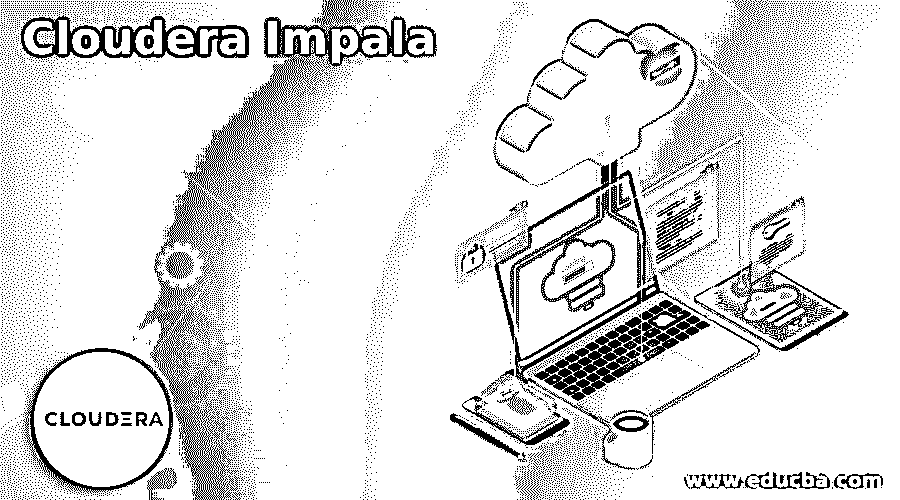
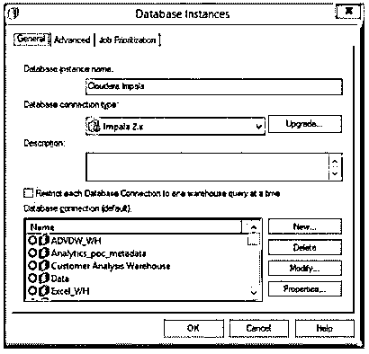
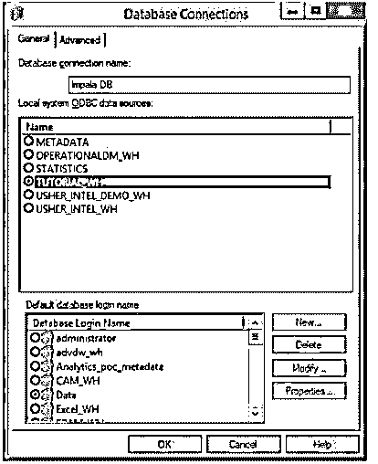
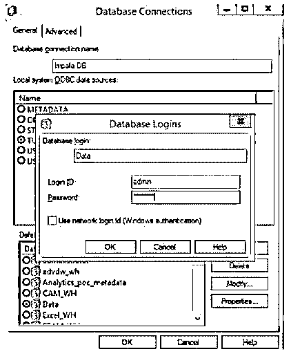
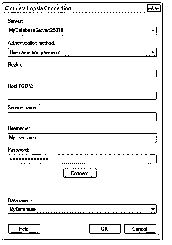

# Cloudera Impala

> 原文：<https://www.educba.com/cloudera-impala/>

## Cloudera Impala 简介

Cloudera Impala 是 Cloudera 的一个集成部分，由 Cloudera Enterprise 提供支持。它是 Apache 许可下的开源分析工具，用于 Hadoop 应用程序的数据库上的大规模并行处理。它使业务分析师能够通过 BI、探索性分析和交互式计算的高性能标准来洞察数据。它还使用户能够发出存储在 Hadoop HDFS 和 HBase 中的低延迟 SQL 查询，而无需任何数据移动或转换。它通过 Hive、MapReduce、Apache Pig 和其他 Hadoop 软件，使用相同的文件和数据格式、安全性、资源管理和元数据与 Hadoop 集成。

### 为什么选择 Cloudera Impala？

数百家 Cloudera 客户使用 Impala 来增强 BI 和分析工作负载，以实现更快的时间价值。过去需要通宵运行的 SQL 查询现在只需 3 秒钟即可完成。

<small>网页开发、编程语言、软件测试&其他</small>

这种快速响应支持分析查询的微调，而不是与 SQL Hadoop 技术相关的作业。

*   它与现有的 CDH 生态系统相集成，即可以使用 CDH 的各种解决方案来存储、共享和访问数据。
*   它提供了对存储数据的访问，而不需要 MapReduce 作业的 Java 技能。它可以直接从 Hadoop 文件系统访问数据。此外，它还提供 SQL 前端来访问 HBase 数据库系统或亚马逊 S3 中的数据。
*   它在几秒钟或几分钟内返回结果，而不是通常完成查询所需的几分钟或几小时。
*   它使用 Parquet 文件格式，即针对大型查询优化的柱状数据存储布局。
*   它是 Apache 许可下的开源平台，用户可以与 Pentaho、Tableau、Zoom data 和 Micro Strategy 等 BI 工具集成。
*   它还支持各种文件格式，如序列文件、RCFile、LZO 和拼花。

### 连接 Cloudera Impala

Cloudera Impala 可以通过 DSN 和 Web 以及一些身份验证模式进行连接。

让我们看看 Impala 如何与 DSN 连接:

#### 1.DSN 连接

首先，用户需要创建一个数据库实例。

从数据库连接类型下拉列表中选择 Impala 版本。

单击确定和下一步转到数据库连接。

现在创建一个指向正确 DSN 的数据库连接。

点击“新建”数据库登录名旁边。

因此，请配置并保存登录凭据。

#### 2.网络连接

*   首先，从数据集窗格中单击新数据。
*   在“连接到数据对话框”中搜索并选择 Impala，然后选择 Cloudera Impala connector 或 Cloudera Impala。
*   从“导入选项”中，选择最适合数据集的操作(构建查询、键入查询或选择表)
*   单击数据源旁边的“加号图标”。
*   完整的数据源信息和 DSN 较少的数据源。
*   然后，点击保存

#### 3.建立与 Cloudera Impala 数据库的连接

*   在您的系统上安装驱动程序，以访问 Cloudera Impala 的连接器。检查系统要求。http://support.spotfire.com/sr_spotfire_dataconnectors.asp，找到正确的司机。
*   要向库中添加新的 Cloudera Impala 连接，请在 Tools-to Manage Data Connections 下进行操作。
*   选择添加新数据连接；在它下面，选择 Cloudera Impala。
*   要向分析添加新连接，请选择文件-添加数据表。
*   然后，点击添加。接下来，选择连接到–cloud era Impala。

登录数据库时使用的身份验证方法包括 Kerberos 身份验证、无身份验证、仅用户名身份验证、用户名、仅密码身份验证以及使用 SSL 的用户名和密码身份验证等形式。作为一名用户，如果我们计划将 Impala 投入生产，则需要预先规划硬件设置和足够的容量，以便集群拓扑对于 Cloudera Impala 中的查询是最佳的，并且 ETL 流程和模式设计遵循最佳实践。

由于 Impala 依赖于软件和硬件的可用性及其配置，让我们看看下面的一些先决条件:

*   **产品兼容性矩阵**是指 CDH cloud era Manager 各版本及其多个组件之间的兼容性。
*   **支持的操作系统:**所有相关操作系统与 Impala 版本相同，对应 CDH 平台。
*   **Hive Metastore 和配置:** Impala 可以操作 Hive 中存储的数据，并使用相同的基础设施来跟踪模式对象的元数据。MySQL 或 PostgreSQL 和 hive 是先决条件，Hive 在少数情况下是可选的。
*   **Java 依赖:** Cloudera Impala 用 C++编写，但使用 Java 与各种其他 Hadoop 组件通信。
*   **网络配置:** Cloudera Impala 在本地数据上完成任务，而不是使用网络连接来完成远程数据。通过解析主机名，Impala 将为每个 Impala 守护进程提供的主机名与每个节点的 IP 地址进行匹配。在大多数用例中，如果用户希望通过设置主机名标志来显式设置主机名，Impala 可以自动检测并正确工作。
    硬件需求:Cloudera Impala 的内存分配应该在 Impala 节点间保持一致。内存限制比其他人低的 Impala 的单个执行器可能成为瓶颈，导致次优的性能。
*   **用户账户需求:** Cloudera Impala 将创建并使用用户名和组名“Impala”。任何人都无权删除该用户或组或修改其权限。Cloudera Impala 不应该作为根用户运行，使用直接读取可以获得更好的性能，但是根用户不允许使用直接读取。因此，以 root 用户身份运行 Impala 会对性能产生负面影响。默认情况下，任何用户都可以连接 Impala 并访问相关的数据库和表。

### 结论

我们已经了解了 Cloudera Impala 的含义以及它与 Apache Hadoop、Hive、SQL 查询、数据库、CDH 和其他组件的关系。我们还将它列为分析和商业分析师热衷于使用这款 Impala 的考虑对象。列出了如何通过适用的身份验证连接 view DSN 和 Web。另外，看看它如何连接到数据库来处理查询等。最后，我看到了将 Impala 投入生产的先决条件。

### 推荐文章

这是一个关于 Cloudera Impala 的指南。为了更好的理解，我们在这里讨论 Cloudera impala 的介绍和连接。您也可以看看以下文章，了解更多信息–

1.  [春云配置](https://www.educba.com/spring-cloud-config/)
2.  [Sqoop 出口](https://www.educba.com/sqoop-export/)
3.  [PySpark 列表到数据帧](https://www.educba.com/pyspark-list-to-dataframe/)
4.  [PySpark toDF](https://www.educba.com/pyspark-todf/)

