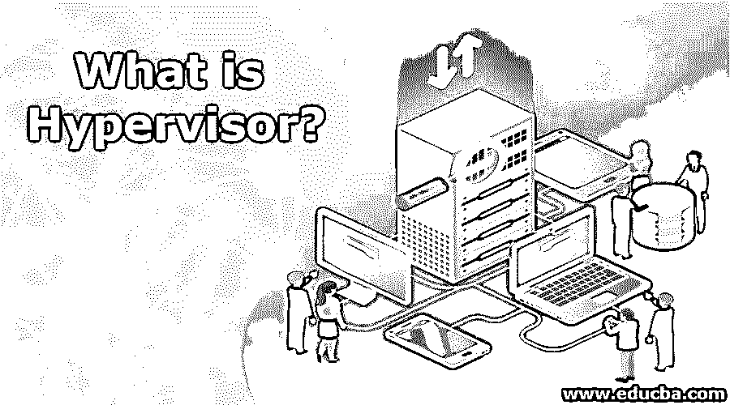
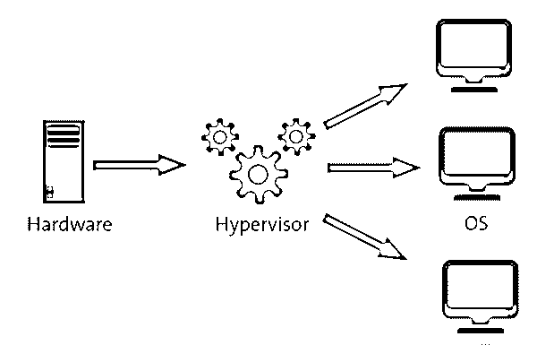
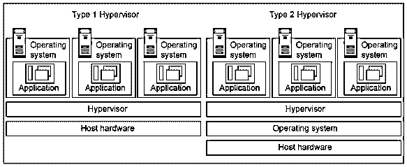

# 什么是 Hypervisor？

> 原文：<https://www.educba.com/what-is-hypervisor/>

## 什么是 Hypervisor？

hypervisor 这个词来源于 supervisor，它是操作系统内核的一个传统术语。它是一种进程或功能，可以将应用程序和操作系统与底层计算机硬件隔离开来。它允许抽象，因此主机硬件可以独立地操作一个或多个虚拟机作为客户；这允许客户虚拟机有效地共享系统资源，例如内存、网络、处理器等。

被称为 VMM 的虚拟机监视器创建并运行虚拟机(VM)实例。它可以是托管虚拟机实例的软件、固件或硬件。有两类可用:类型 1 虚拟机管理程序(裸机)和类型 2 虚拟机管理程序(托管)。裸机直接在主机硬件上运行。托管的是在操作系统上运行的管理程序的软件版本。它有助于通过活力化将虚拟机操作系统和应用程序与底层主机硬件和软件隔离开来。一些流行的是 VMware 服务器和 Oracle 虚拟机。

<small>网页开发、编程语言、软件测试&其他</small>

主要有两种类型。

*   第 1 类虚拟机管理程序或“裸机”
*   第 2 类虚拟机管理程序或“托管”

类型 1 是直接在主机硬件上运行的类型；类型 2 是作为操作系统上的软件层运行的类型。

第一个提供完全虚拟化的管理程序是 SIMMON，它是 IBM 在 1967 年开发的一个测试工具。

上图描述了在一台主机上运行多个 guests 虚拟机的典型功能。

### 谅解

到目前为止，我们已经在很高的层次上讨论了它是什么；让我们深入了解一下，看看我们可以利用虚拟机管理程序和不同的类型做些什么。如前所述，主要有两种类型，即类型 1 和类型 2。

我们来看看两者的区别。

### r 型

这种类型直接在底层主机系统上运行。它不需要任何操作系统作为基础服务器。它可以直接访问硬件资源。

类型 1 的示例包括 VMware、Citrix、ESXi、XenServer 和 Hyper-V 虚拟机管理程序。

让我们看看它们的不同特点是什么:

#### 1.VMware ESX 和 ESXi

[VMware](https://www.educba.com/install-vmware/) 是提供 Type 1 的领导者；它们具有高级功能和可扩展性。这些类型的虚拟机管理程序会产生许可费用。VMware 还提供了一些最适合小型基础架构的低成本虚拟机管理程序。

#### 2.Citrix XenServer

像 VMware 一样，Citrix 也提供免费和商业产品。拥有基本技术的产品是免费的，不具备任何高级功能。

#### 3.Oracle 虚拟机

Oracle VM 缺少 VMware 提供的许多高级功能；和开源的 Xen 很像。基础版免费；但是，对于支持和产品更新，许可费是适用的。

### 第二类虚拟机管理程序

让我们看看第二类虚拟机管理程序:

#### 1.VMware 工作站和播放器

VMware Player 可自由输入 VMware 提供的 II 类内容；它只能运行一个虚拟机，并且不允许多个来宾。VMWare workstation 具有许多高级功能，如虚拟机快照、记录和重放等。

#### 2.VMware 服务器

它非常类似于 VMware workstation，并提供托管虚拟化管理程序。然而，VMware 从 2009 年开始停止了开发

#### 3.微软虚拟个人电脑

它只能在 Windows 7 及以上版本上运行，这是微软最新的 Microsoft 版本 hypervisor 技术。它只提供 Windows 操作系统。

#### 4.Red Hat 企业虚拟化

这是一个基于内核的虚拟机，具有类型 I 和类型 II 的特性。在这里，虚拟机可以直接访问物理硬件，因为 Linux 内核变成了虚拟机管理程序本身。

### 如何选择合适的？

现在，我们已经介绍了两种类型的虚拟机管理程序以及提供虚拟机管理程序的不同供应商及其产品，您必须考虑决定最适合您需求的虚拟机管理程序。如果你也是这么想的，那么你就在正确的轨道上。让我们看看如何选择合适的虚拟机管理程序。在评估利弊之前，首先分析虚拟机管理程序的需求非常重要。

### 我们为什么需要它？

这是任何系统管理员或系统操作员的需要。它允许虚拟化存储资源，以便为管理员创建一个集中式存储池来提供资源调配，而无需考虑存储的物理位置。网络也可以通过虚拟机管理程序进行虚拟化；它允许创建、管理或更改网络设备，而无需考虑网络设备的物理位置。简而言之，我们需要它来有效地利用基础设施，提供可靠的支持，并提高应用程序的可伸缩性。

既然我们已经看到了它的必要性，那就让我们来看看你在选择它之前应该考虑的各种因素。

类型一比类型二表现更好。

一般来说，类型 I 比类型 II 提供了更好的性能，因为它没有任何中间层，这使得它们非常适合于关注速度的项目。

另一方面，类型 II 的托管和设置要简单得多。为了确定哪个最适合项目的需求，您可以比较性能指标。这包括来宾内存、CPU 开销、最大主机数量。此外，虚拟系统在性能上应该比物理系统更好或相当。要寻找的另一个重要参数是产品和支持的许可费。虽然许多入门级产品是免费的，但它们不提供任何高级功能。因此，在许可成本和特性之间取得平衡是很重要的。

### 结论–什么是虚拟机管理程序？

现在我们已经到了文章的结尾，我希望你们对它有一个公平的想法，有哪些不同的类型，为什么我们需要它们，以及如何根据自己的需要选择正确的类型。这是一个非常高层次的讨论；如果您想了解任何特定的产品、其许可成本以及所提供的服务，您可以访问相应供应商的网站。

### 推荐文章

这是什么是虚拟机管理程序的指南？在这里，我们讨论了虚拟机管理程序的基本概念、需求、类型及其功能，以及如何选择合适的虚拟机管理程序。您也可以浏览我们推荐的其他文章，了解更多信息——

1.  [什么是 Shell 脚本？](https://www.educba.com/what-is-shell-scripting/)
2.  [什么是 MapReduce？](https://www.educba.com/what-is-mapreduce/)
3.  什么是 Scrum？
4.  [硒是什么？](https://www.educba.com/what-is-selenium/)

