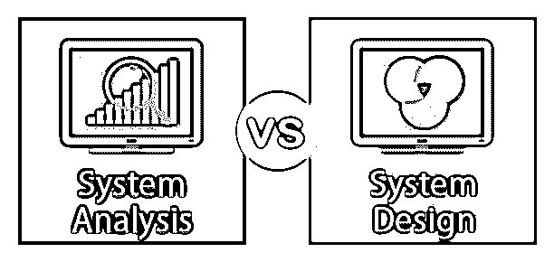

# 系统分析和设计

> 原文：<https://www.educba.com/system-analysis-and-design/>

## 系统分析和设计的区别

系统分析可以定义为对之前已经设计好的模块的结构的一部分进行深入分析。系统设计就是从零开始制作任何一个模块或者结构的一个部分，完全不需要估算就可以构建出来。

系统分析是在现有模型或新创建的模型上完成的过程。但是在系统设计的情况下，模块是由原始数据制成的，并且必须使用他自己的新思想和概念来构建新的结构。

<small>网页开发、编程语言、软件测试&其他</small>

系统分析让你直接在一个项目上工作，而不是在准备模块时想太多。这确保了项目的完美执行和评估。一旦项目被执行，从事这个项目的人必须给客户一个试用的机会。此外，当出现问题时，高管必须坐下来澄清所有问题，并根据客户的要求做出改变。

当他被分配到一个特定的项目时，系统设计角色就开始了。主管的工作是收集所有的原始数据、客户的需求、尺寸参数(如果是机械的)、要设计的结构、边界条件。一旦他完成了所有输入，他就开始和他的团队一起计划，并开始构建工作结构。采取了基本步骤，并按照给定的参数对项目进行了进一步的工作。当系统设计师的工作结束时，系统分析的工作就开始了。

### 系统分析和设计(信息图表)

下面是系统分析和设计之间的 11 大区别

### 分析和设计的主要区别

以下是要点列表，描述了系统分析和设计之间的主要区别:

1.  系统分析处理客户的问题和项目中必须完成的修改，而系统设计处理客户的要求和需要。
2.  如果考虑 IT 行业的系统分析，那么像 IQMS 这样的团队就负责修复错误。如果考虑设计，那么像[网络开发者和安卓开发者](https://www.educba.com/android-developer-vs-web-developer/)这样的人会被考虑。
3.  系统设计包括收集和检查问题，在团队或工具的帮助下进一步解决问题。系统设计是通过定义新模块的组件并满足其关键要求来规划新模块。
4.  系统分析使模块准备好正确执行，没有任何错误。系统设计只是正确设计的一部分，需要并准备提交最佳代码。
5.  如果考虑机械工程，则系统中建模的模型会弹出进行网格化，这将彻底清除所有网格尺寸。因此，不是设计，而是通过考虑其尺寸属性来设计模型。
6.  系统分析和设计的主要区别在于工具及其特性。不幸的是，它们最常见的一点是，这两种工具没有类似的功能，因此单个人或候选人无法同时操作。
7.  在许多行业中，我们已经看到操作系统分析软件的人不知道设计工具。
8.  工作框架和分类通常不属于系统分析部分，但是属于系统设计者。
9.  如果我们考虑给设计者和分析者的工作场景的整体画面，那么我们可以说设计是简单的，但是分析到最后将是令人头痛的。
10.  我假设一个项目正在运行，那么系统设计师就有了编辑现有模块或结构的工作，他就完成了。但是在实时运行的项目中，系统分析员必须呆到最后。
11.  分析师必须处理最终客户的满意度，因为如果模块不被接受，他必须重复工作；相反，如果执行没有完成，并且错误是由于结构或任何维度属性造成的，则设计者角色出现。

### 系统分析与设计对照表

下面是系统分析和设计之间最顶层的比较

| **Sr 号** | **系统分析** | **系统设计** |
| **1。** | 这是在设计完成并准备好进行分析时使用的后处理。 | 这个过程从零开始，利用你所有的新想法。 |
| **2。** | 分析包括处理、执行、错误修复和制作报告。 | 设计包括收集原始数据、需求、需要和计划。 |
| **3。** | 基本上，它类似于从现有模型中消除错误。 | 创建时可能会出现错误，但在开始时无法修复。 |
| **4。** | 分析花费的时间比设计花费的时间少。 | 在设计中，最大时间在工作开始之前。 |
| **5。** | 使用的软件不同于用于设计的工具。 | 所使用的工具是不同的，因为他们所做的工作是不同的。 |
| **6。** | 分析所需的系统应该具有更高的配置。 | 设计 PC 甚至足够好，但较少的配置将维持较小的项目，甚至做大，如果做的部分。 |
| **7。** | 分析需要多个屏幕来检查和修复错误。 | 单一但大的屏幕是绰绰有余的，因为只是细节是主要工作。 |
| **8。** | 预先计划不是强制性的，但是，对结果的讨论确实很重要。 | 前期规划是最重要的工作，关于前期规划的讨论已经完成。 |
| **9。** | 要成为一名系统分析师，你需要在学业上有研究生学历；然后，你就可以在事业上有所成长。 | 设计员需要随身携带毕业证或毕业文凭，以保证自己在设计领域的成长。 |
| 10。 | 分析显示了你在某一特定领域的研究深度。 | 在设计中，你现有的教育要求你对概念有全面的了解。 |
| **11。** | 这个分析让你对那个项目负责，因为你习惯于从中清除错误。 | 设计只能让你对部分结构和尺寸参数负责。 |

### 结论

可以得出结论，系统分析和设计是不同的领域，有相似的知识，但工作是不同的。此外，他们有不同的任务分配与不同的工具坚持他们。

### 推荐文章

这是系统分析和设计之间最大区别的指南。在这里，我们还讨论了系统分析和设计的关键差异，用信息图和比较表。您也可以看看以下文章，了解更多信息–

1.  [玛雅 vs 阿兹特克 vs 印加](https://www.educba.com/maya-vs-aztec-vs-inca/)
2.  [AutoCAD vs Microstation](https://www.educba.com/autocad-vs-microstation/)
3.  [Adobe Lightroom vs Photoshop](https://www.educba.com/adobe-lightroom-vs-photoshop/)
4.  [Photoshop vs InDesign](https://www.educba.com/photoshop-vs-indesign/)

