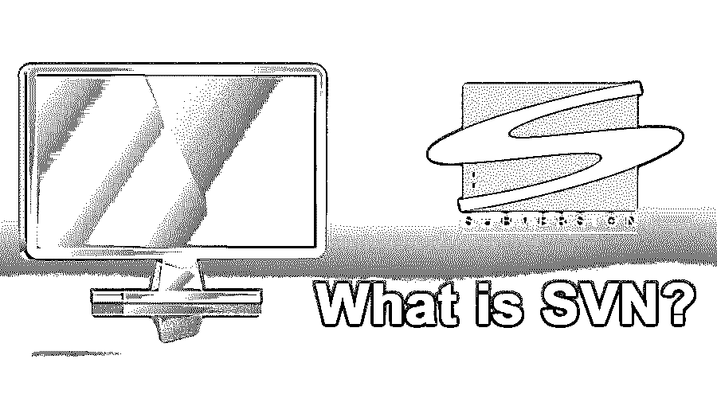

# 什么是 SVN？

> 原文：<https://www.educba.com/what-is-svn/>

## SVN 简介

Subversion 是软件开发人员创造每个人都能使用的编程代码的地方。他们随后可以根据需要执行代码，包括上传当前版本或代码修订的应用程序。大型和小型社区之间的这种协作允许像工具、服务器软件、插件、实用程序、游戏这样的东西，也允许像操作系统这样的大型项目。

SVN (Subversion)是一个自由源码或开源的 VCS(版本控制系统)。这意味着 subversion 处理目录和文件，甚至是对它们的修改。这允许您检索以前版本的信息或评估数据更改的历史。关于这一点，许多人认为 VCS 有点像时间机器。

<small>网页开发、编程语言、软件测试&其他</small>

Subversion 允许个人在不同的计算机上使用，可以在网络上工作。在某种程度上，它可以让许多个人从他们的特定位置更改和处理一组类似的信息，从而促进协作。没有一个唯一的管道，每一个变化都应该发生，进步可以进一步发生。此外，由于工作被版本化，您不需要担心管道失败的解决方案。如果对数据进行了少量不准确的更改，只需撤消更改即可。

很少有 VCS(版本控制系统)是进一步的 SCM(软件配置管理)系统。这些系统是专门为处理源代码树而定制的，并且具有几个软件开发特有的特征。例如，它们可以是本地编程语言或提供软件开发工具。这是一个常用的系统，可以用来维护每一套文件。对你来说，这些文件可能是源代码，对其他人来说，它们可能是购物清单、视频等等。

### 了解 SVN

Subversion (SVN)采用了一个中央数据库，其中包含了您所管理的文件版本的所有内容以及完整的历史记录。数据库也被认为是存储库。存储库通常存在于一个文件服务器上，该服务器运行 SVN 服务器程序，向 SVN 的客户提供内容，如 TortoiseSVN on demand。如果你只是备份一个单一的东西，备份你的仓库，因为它是每个数据的最终主副本。

### 它是如何工作的？

它最初是作为界面命令行创建的。这意味着您将打开终端并键入文本命令。

Subversion (SVN)安装运行所需的关键方面如下所述:

*   每个源文件的每个版本的服务器
*   将副本作为文件的本地副本保存在桌面上

工作文件是指计算机上文件的本地副本。每个用户都可以使用这些文件进行更改。接下来，用户将他们的修改提交给 subversion 服务器，也称为存储库。每次用户做出更改，subversion 都会在新的变体中处理和注册这些更改。比如几乎每个 VCS，用户通常都用最新版本操作。但是，需要一个较旧的版本，因为您可以返回到以前的版本。

### 为什么使用 SVN？

现在有各种各样的商业版本控制系统[，比如 Git](https://www.educba.com/what-is-git/) ，几年前 subversion 就有了需求。然而，SVN 仍然存在，原因有两个:费用和惰性。

*   **费用:**是开源的，表示免费。
*   **惯性:**单独来说，它只是被创造出来的一个巨大的代码基础；可能很难切换版本控制系统。Subversion 从 2004 年开始，使用它的公司有数百万行代码。如果您已经放弃了 subversion 的使用，perforce 有组织的 VCS，允许您无限制地扩展。

### SVN 建筑

Subversion 超越了建筑的传统界限，讨论影响紧迫和长期的社会、经济和环境健康的问题。教堂、住宅、多用途社区、学校、基于社区的组织和公共空间的可管理设计允许项目和建筑的逐渐变化随着时间的推移得以实现。

### SVN 的优势

以下是 SVN 的基本特征:

*   对也包含单个文件的文件夹进行版本控制。
*   复制、删除、添加和重命名文件和文件夹有一个规范。
*   随着时间的推移，文件和文件夹属性被登记，从而建立一个全面的历史。
*   开发人员可以将修改设计成微小的、自我控制的单元。
*   执行当前的网络功能很简单。
*   二进制和文本文件以兼容的方式保存和管理。
*   分支和标签被有效且迅速地建立。
*   SVC 很容易利用不同的编程和软件语言。

### 这项技术将如何帮助你的职业发展？

如果你正在考虑一个快节奏的环境，这个环境有很大的可能性为你的职业自我增值，Subversion IT Services 是你的正确选择。Subversion IT 服务可以为您确定正确的职业关系。

Subversion IT 服务获得了额外的优势、职业发展和诱人的薪酬。为你提供最好的可能性，实现生活稳定的能力，并消除阻碍你的联系。

### 结论

SVN 利用来自文件间分支性能的模型来执行分支和标记。一个分支可以是一个独立的开发线。标记表示在特定的时间点指定存储库，以便将来可以简单地获得它。在 SVN，标签和分支之间的唯一区别也在于它们的使用方式。

所有分支中的每个版本都处理文件到拷贝期间的记录，此外，还处理此后执行的任何修改。任何人都可以在分支之间混合修改。包容性 SVN 给出了许多质量或控制优势，也可以确定有效成本，以改变中间项目。假设大多数 Java 开源开发都使用 Subversion，并且您可以确信它已经成为大多数项目的可靠选择。

### 推荐文章

这是一个什么是 SVN 的指南。在这里，我们讨论了 SVN 优势的基本概念、定义、工作和架构。您也可以浏览我们推荐的其他文章，了解更多信息——

1.  [如何安装 SVN](https://www.educba.com/install-svn/)
2.  [什么是 PHP 数组？](https://www.educba.com/what-is-php-array/)
3.  [卡夫卡是什么？](https://www.educba.com/what-is-kafka/)
4.  [VBScript 是什么？](https://www.educba.com/what-is-vbscript/)

