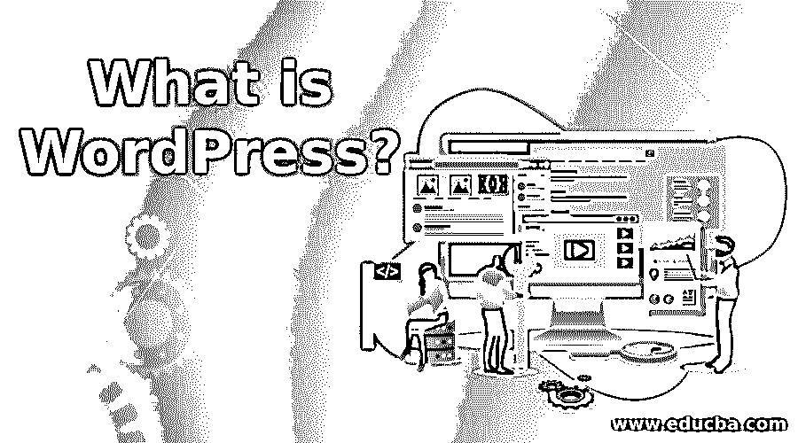
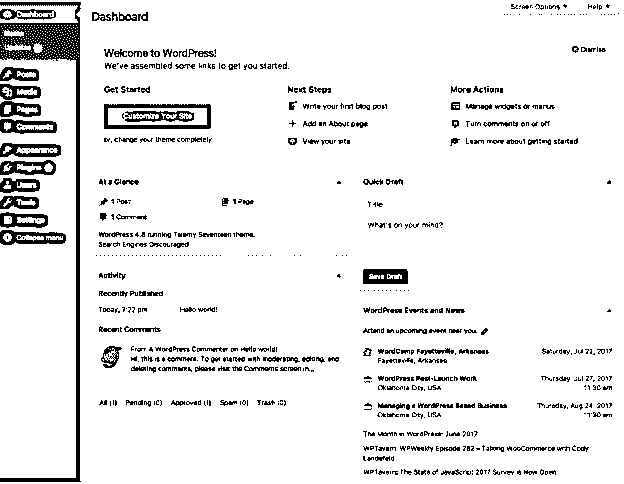
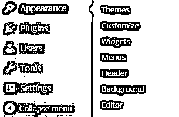

# 什么是 WordPress？

> 原文：<https://www.educba.com/what-is-wordpress/>

## WordPress 简介

WordPress 是一个使用 PHP 和 MYSQL(它们本身也是开源的)开发的内容管理系统，用于开发网站、博客，从简单到复杂都有丰富的定制选项，并且可以以象征性的成本合并到业务中。提供基于网络的用户界面用于设计网站和发布网站。WordPress 是一个内容管理系统，本质上是开源的，基于 PHP 和 MYSQL。WordPress 可以帮助你构建任何东西，从最简单的博客到复杂的专业级网站。根据 wordpress.com 的调查，互联网上 33%的网站都是由它们驱动的。

现在问题来了，为什么人们不再依赖他们以前的方法，而开始使用 WordPress？答案是，如果你是一个新的开发者，或者有一群电脑爱好者，或者你将要主持一个低预算的项目，你需要为你的客户和访问网站的外部利益相关者提供很好的体验，那么 WordPress 是一个最舒适的平台，因为它减少了开发时间，提供了内容管理系统，所以客户可以自己添加内容。博客作者不需要技术来添加内容。有数以千计的免费 WordPress 主题可以整合到你设计的网站中；你也可以修改主题，从而保持网站主题的独特性。因此，你是开放的设计和开发任何电子商务，论坛，投资组合等。

<small>网页开发、编程语言、软件测试&其他</small>

*   在继续之前，让我们了解一下博客和网站的区别。网站由许多页面组成，不经常更新，而博客本质上是动态的，更新更频繁；因此，人们可以说博客可以是网站的一部分，但网站不能被称为博客。博客在本质上可能不是正式的，用户只是通过评论在这里互动。
*   接下来重要的一点来了就是怎么主持？

对于 WordPress 的[安装，会需要一些在线空间，可以选择支持公司；托管公司会为你提供一键安装 WordPress 的服务。另一个选择是 wordpress.com；此外，如果你不想从外部托管你的站点，它也可以托管你的站点。出于商业目的，他们收费接近 300 美元。](https://www.educba.com/install-wordpress/)

如果你即将通过 WordPress 托管，那么你只能使用他们的主题，不允许自定义插件。

接下来就是网站规划了，所以现在你要仔细思考如何处理以下事情:

*   你的主页结构是怎样的，选项卡和目录树将包含什么。
*   如果你想在你的网站中加入一些插件，你会支持哪些插件？
*   网站域名的选择和备份。
*   支付网关，最简单的是选择贝宝。
*   在最坏的情况下，你的网站可能面临多少流量。

### 探索 WordPress 能为我们提供什么

下面展示了 wordpress 能为我们提供什么:

**1。仪表板—**放置在网站中的组件通过该仪表板进行管理；您可以在这里进行所有的定制，如用户的角色分配、网站布局更改、任何行为更改等。

**2。管理栏—**您可以看到黑色的管理栏；将鼠标悬停在这里，你可以访问网站，更新插件，并且可以看到管理细节。

**3。仪表板中的侧栏包含许多选项，它们被详细阐述为** 

*   帖子部分用于编辑、添加或删除网站上的帖子。
*   媒体可以用来添加任何文件，如视频。
*   页面可用于向站点添加新页面，也可以更新现有页面。
*   可以对评论进行处理，即垃圾评论、批准评论或垃圾评论。
*   外观部分处理网站的布局。
*   插件部分帮助管理插件，无论是现有的还是将要引入的新插件。
*   Users 部分用于对用户进行 CRUD 操作。
*   工具可用于将任何外部工具整合到网站中。
*   设置部分处理我们到目前为止一直在谈论的内容管理。
*   点击折叠部分，隐藏侧边栏。

**4。要添加主题，导航至仪表板中的外观，然后点击主题**

然后，在点击主题时，您可以选择添加一个主题选项来合并您想要的主题(也可以从外部资源上传)。主题安装完成后，它将被应用，现在您将被重定向到新页面。通过使用同义选项，主题可以被删除。

**5。同样，也可以添加所需的微件**

**6。现在重点来了，如何创建页面**

做到这一点的步骤很简单:

*   以管理员身份登录你的 WordPress。
*   同样，仪表板的侧边栏带有一个页面选项；一旦你悬停在那里，你可以看到所有的网页或添加一个新的。
*   在添加页面时，您需要给出内容，然后根据需要进行编辑；你可以发表它。

**7。现在，让我们看看如何创建帖子** 

*   再次访问仪表板，会出现一个帖子的选项；你可以写那篇文章并发表它。
*   请注意，在此屏幕上有一个添加媒体的选项；在这里，用户也可以从系统或媒体库上传媒体。
*   同样，视频也可以添加，你只需要把你在网上浏览过的视频的链接粘贴到编辑器上，然后就可以轻松发布了。
*   也可以添加 HTML 代码。
*   音频也可能是一种媒体类型。
*   您添加的帖子也可以使用 dashboard 侧边栏中的类别选项进行分类。
*   接下来就是插件安装；你会知道插件有助于网站的功能扩展，所以再次进入仪表板，这次点击插件并添加新的，现在你可以从搜索框中搜索你想要的插件。安装插件后，必须启用它。

### WordPress 是如何工作的？

*   WordPress 有三个目录——WP-admin、wp-content 和 wp-includes。
*   wp-admin 和 wp-includes 目录包含核心 WordPress 文件，这些文件永远不应该被编辑。主题、插件、媒体等。，放在 wp-content 目录中。如果你改变了任何核心文件，那么它将导致一个不稳定的网站。
*   WordPress 的根目录下有一个 wp-config.php 文件；该文件包含数据库连接的详细信息。
*   设置 WPLANG 选项值会设置 WordPress 的默认语言。相应的机器目标文件也应安装在选定语言的 wp-language/languages 中。
*   机器目标文件是压缩的可移植目标文件，包含特定语言的 WordPress 消息和文本字符串的翻译。
*   在 wp-config 文件中，一些高级选项可以用来设置 WordPress 地址和 blog 地址。

define ('WP_SITEURL '，' http://Facebook . com/WordPress ')；

define ('WP_HOME '，' http://Google . com/WordPress ')；

*   插件开发者使用 WP_PLUGIN_DIR、WP_PLUGIN_URL 来确定插件文件夹的位置。
*   可以使用 WP_POST_REVISIONS 选项来维护文章修订(文章修订有助于限制记录)。有一个自动保存间隔选项

为了定期自动保存这些修订，该时间被设置为 60 秒。

*   在 WordPress 中调试错误可以通过 WP_DEBUG 选项来完成；启用此选项实际上会在屏幕上显示错误，而不是隐藏它们；您只需要将该值设置为 true 来启用它。

定义(' WP_DEBUG '，true)

*   SAVEQUERIES 也算作调试选项之一；激活此选项会将所有数据库查询保存到可在页面上显示的全局数组中。
*   使用 WP_MEMORY_LIMIT 选项也可以在 WordPress 中设置内存限制；网站不能越过内存限制；否则将会抛出一个错误。

define('WP_MEMORY_LIMIT '，8M)

*   现在如何管理 cookies？有多种 cookie 选项，如 COOKIE_DOMAIN、COOKIE_PATH、SITECOOKIEPATH。

定义(' COOKIE_DOMAIN '，'域名')

定义(' COOKIEPATH '，'/')

定义(' SITECOOKIEPATH '，'/')

*   的。htaccess 文件就在那里，它用于为网站创建漂亮的永久链接和关键字注入的 URL。
*   .WordPress 的维护文件用于维护模式。

Functions.php——这个文件包含主要的 WordPress API 函数，插件，主题，WordPress 核心使用这些函数。

1.  current _ time–根据类型检索当前时间。
2.  force _ SSL _ log in–登录 WordPress 需要 https SSL。

Formatting.php**–**这个文件包含了 WordPress API 格式化函数；他们以不同的方式格式化输出

1.  WP-特殊字符-用于将字符转换为 [HTML 实体](https://www.educba.com/html-entities/)
2.  ESC-attr–这是用来清理包含 HTML 的字符串

Plugin.php**–**这个文件包含了 WordPress 插件 API 函数，比如:

1.  add _ filter——在屏幕上显示内容之前，wordpress 核心启动过滤内容的钩子。

Post.php**–**这个文件包含了在 wordpress 的后处理中使用的函数，它使用了:

1.  wq _ insert _ post–创建一个新帖子。
2.  get _ posts–检索最新的帖子。

Category.php——这个文件包含了 wordpress 类别 API 使用的函数。

1.  get _ categories–用于根据参数检索类别对象的数组。
2.  get _ cat _ ID–从类别名称中返回类别 ID。

### WordPress 能做什么？

*   在现代开发时代，您有各种各样的利益相关者，他们有各种各样的需求，很明显，任何具有丰富功能并且对开发人员来说简单的工具都足够了。
*   WordPress 可以帮助你以象征性的商业托管成本建立网站。
*   风险资本低的创业公司很容易瞄准这个工具。
*   你可以随时用 WordPress 定制你的网站，类似的还有你的博客文章，你可以实时发布这些内容。

wordpress.com 明确提到了以下某些特征:

1.  使用方便
2.  你自己的域名。
3.  出色的设计
4.  移动就绪
5.  最佳支持
6.  强大的统计数据

*   您可以根据您在 wordpress.com 列出的计划中需要的功能，在高级和商务计划中选择一个计划。

### 使用 WordPress

当我们审视这一方面时，应涵盖的主要内容是:

**1。数据管理-**WordPress 的默认安装有 11 个表，它们如下:

*   **wp_comments:** 包含 wordpress 中的所有评论。
*   **wp_commentsmeta:** 有评论的元数据。
*   **wp_links:** 通过链接管理器添加链接
*   **wp_options:** 存储设置中出现的网站选项
*   **wp_postmeta:** 有帖子元数据
*   **wp_posts:** 拥有所有帖子、记录和修订
*   wp_terms: 负责关联所有的帖子，链接等等。
*   **wp_terms_relationships:** 将上述关键词与内容连接起来
*   **wp_terms_taxonomy:** 定义分配给每个术语的分类。
*   **wp_users:** 有网站的用户
*   **wp_usermetadata:** 有用户的元数据。

**2。主题开发–**可以借助样式表和 index.php 模板文件创建定制主题。

还有其他像 header.php、footer.php、sidebar.php 等文件。，用于相同的机构。

**3。内容聚合–**它包括社交媒体按钮、广告和来自 wordpress 的推送内容。

### WordPress 的优势

下面是提到的优点:

*   廉价的产品开发可以用这个工具来完成。
*   高度可定制。
*   为网站开发和管理提供了丰富的功能。
*   任何新手都可以承担并交付好的产品。
*   成本是真的。
*   也提供网站托管。
*   提供预先创建的主题模板。
*   [处理 SQL 注入](https://www.educba.com/what-is-sql-injection/)类似数据库中的威胁。
*   它是一个开源框架。
*   需要操作某些文件来处理高级更改。

### 为什么要用 WordPress？

*   你可以用最简单的方式创建看起来有吸引力、结构良好的网站和博客。
*   这个工具目前占据了软件行业 33%的网站开发市场。
*   很容易建立；用最少的努力，你可以得到最好的结果。
*   有适当的渠道让客户看一看正在进行的活动。
*   内容管理很容易处理。

### 我们为什么需要 WordPress？

*   如果你是从零开始开发网站，那么肯定会花费你大量的精力在 UI/UX 设计上，然后是代码开发和框架选择，但是如果你不关心这些开销，只是想让博客和网页以最简单的方式上线，那么 wordpress 是正确的选择。
*   它不仅提供了 php 上其他框架提供的特性，还提供了一些额外的特性。这是一个交互式工具，你可以很容易地把你的东西放在里面。
*   你可以更关注你的商业前景和商业逻辑。WordPress 会处理额外的开销。

### 这项技术将如何帮助你的职业发展？

*   如果你从事自由职业，那么可以肯定的是，你会有很多客户愿意在这个平台上为你工作。
*   小规模的企业家继续寻找便宜可靠的技术，在那里他们可以放置大量的内容，并使他们的功能一致。他们可能也需要一个支付网关，所以这将解决他们的目的。
*   许多 php 相关的创业公司正在整合 wordpress 来完成开发任务。
*   内容作者可以通过这个来放置他们的博客。

### 结论

WordPress 是一个用于内容管理的开源工具；你可以借助它来维护网站和博客，而且成本很低，开发新手或爱好者都可以从事这项工作。

### 推荐文章

这是一个什么是 WordPress 的指南？这里我们讨论了 wordpress 的定义、需求、用途、优点和缺点。您也可以浏览我们推荐的其他文章，了解更多信息——

1.  [WordPress 备选方案](https://www.educba.com/wordpress-alternatives/)
2.  在 WordPress 的职业生涯
3.  [WordPress 面试问题](https://www.educba.com/wordpress-interview-questions/)
4.  [Laravel vs WordPress](https://www.educba.com/laravel-vs-wordpress/)

