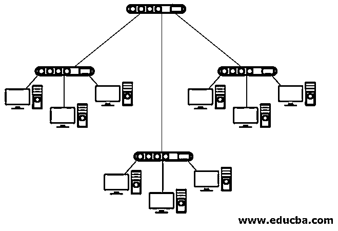
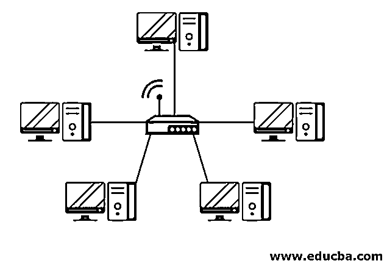
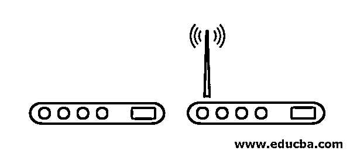

# 什么是 Hub？

> 原文：<https://www.educba.com/what-is-hub/>

## 集线器简介

集线器是一种网络集线器，用于连接网络中的设备。它连接局域网中的几个设备。所有网络连接设备都通过集线器连接，集线器充当所有设备的中央连接。它有许多端口，如果一个数据包只到达一个端口，它会被复制，以便所有端口都能看到该数据包。如果集线器的一个端口有任何问题，这将有所帮助。这三种类型是主动型、被动型和智能型。有源集线器放大输入的电信号，而无源集线器不放大电信号。智能中枢是一种主动中枢。

<small>网页开发、编程语言、软件测试&其他</small>

### 什么是枢纽网络？

网络集线器是连接物理设备的接口，例如打印机、I/O 设备、台式机、[存储设备](https://www.educba.com/data-storage-devices/)和数据中心中的所有服务器。它是根据需求或计划来选择集线器的配置。它在星型拓扑中起主要作用。如果用户正在实施一个 T 形网络，他们连接他们的设备，没有必要使用它，因为他们只有两个系统。

### 集线器的类型

根据它们的用途，部署了三种类型。他们是被动的，主动的，聪明的。最近几天，对提供高性能的集线器进行了修改。

#### 1.无源集线器

*   它有静止的生物作为名字肖像，它不影响性能，但它有助于识别错误和检测有故障的硬件。它们很简单，在一个端口接收数据包，然后广播到所有端口。
*   它有一个 10base-2 端口和 RJ-45 连接器，连接到每个局域网设备。此连接器在您的网络中作为标准连接器使用。AUI 端口位于高级无源集线器中，根据网络设计，这些集线器作为收发器连接。

#### 2.活动集线器

*   除了无源集线器之外，它们还有一些附加功能。它监控发送到连接设备的数据。它在这种网络通信中有着独特的作用，它使用存储技术在发送数据之前检查数据，并确定首先发送哪个数据包的优先级。
*   它可以选择修复损坏的数据包，并保持其余数据包的方向和分布。如果一个微弱的信号在端口被接收，但它仍然是可读的，那么主动集线器在它被重新传输到其他端口之前把它放大成一个更强的信号。
*   如果网络中的任何连接设备不工作，它可以增强信号，其他设备可以通过无源集线器查看信号。因此，它有助于局域网中服务的连续性。
*   但是它们中很少会考虑到任何设备的故障并在局域网中提供相关的诊断能力。它们将能够重新同步分组并再次传输它们。一些电缆经历电磁故障并阻止数据包进入指定的端口，或者很少数据包到达不了端口。在这些时候，它们可以弥补数据包或数据的丢失。它们可用于为较慢的传输和容易出错的连接重新定时端口。

#### 3.智能集线器

*   这比无源和有源集线器有许多优点。希望扩展网络业务的管理层可以分配用户高效地共享一个公共池，并使用智能集线器更快地工作。他们背后的技术是最近开发的，现在市场上需求量很大。
*   事实证明，它为您的局域网提供了无与伦比的性能。如果在任何物理设备上检测到任何问题，都可以使用集线器可以纠正的管理数据轻松地检测、诊断和解决。
*   这是对主动集线器的标准改进。检测集中式管理工具有助于探索耗尽设备的网络，以找到低功能设备。
*   另一个特征是灵活性，其具有到许多设备的高传输速率。他们有自己的标准条款，传输速率为 10，16，100Mbps 到桌面的速度。

### 利益

*   技术信息具有连接多个集线器的物理层功能，具有许多优点。它们检测端口或设备之间出现的关键问题、过度冲突和中断。如果发生任何故障，它会断开信号流，并防止损坏的设备与设备的其余部分分离。
*   如果电缆中有任何不当行为或嘶嘶声，也可以被检测到，并防止设备遭受重大损失。它有一个内置的扭曲的以太网，有助于检测任何故障。在所有分区中，通过中继器将数据传递通过每个段应该是相同的，因为中继器不能将数据与不同的段连接。
*   许多班级有不同的速度范围枢纽。通过在 100BASE-TX 和 100BASE-T4 的范围内设置事务记录，类 1 具有 140 位时间的信号延迟，而类 2 通过访问单个冲突域具有 92 位时间的信号延迟。
*   双速是一种内部端口交换机，适用于 10M/bits 和 100M/bits 网段。当任何设备与这些网段连接时，该端口将变为活动状态。数据信号以更高的速率传输，但这变成了一个失败的模型，因为它未能设计业务流之间的切换。

### 结论

交换机是集线器的一部分，集线器跟踪连接设备的 MAC 地址的所有细节。它知道系统或设备及其连接端口，因此如果收到任何数据包，交换机会选择并将其发送到该端口。网络集线器也称为有源多端口中继器、以太网和中继器。形成网络的具有多个输入和输出端口的集线器和交换机，以及所有连接的设备作为一个网段高效工作，防止数据丢失。

### 推荐文章

这是一个什么是枢纽的指南？.这里我们讨论基本概念，三种类型的集线器，根据其用途和优势进行部署。您也可以阅读以下文章，了解更多信息——

1.  [网络攻击的类型](https://www.educba.com/types-of-network-attacks/)
2.  [计算机网络概论](https://www.educba.com/introduction-to-computer-network/)
3.  [网络类型](https://www.educba.com/types-of-network/)
4.  [集线器 vs 交换机](https://www.educba.com/hub-vs-switch/)

