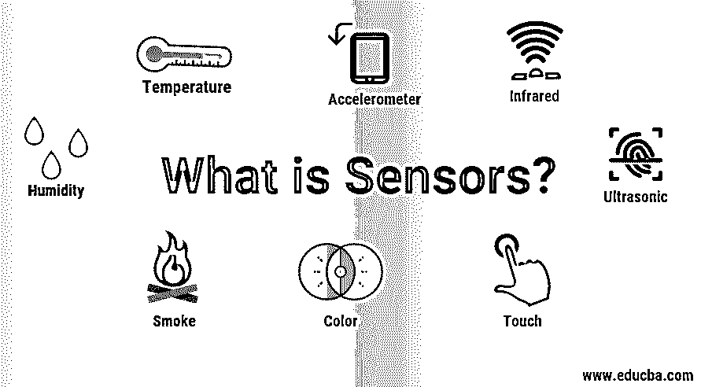

# 什么是传感器？

> 原文：<https://www.educba.com/what-is-sensors/>

## 什么是传感器？

从更广泛的意义上来说，传感器是用于检测附近任何物理对象的存在并向接收端发送相同信息的设备或机器。该设备主要与其他电子设备一起使用。任何物理量，如压力、力、张力、光等。可以被识别并转换成期望的电信号。基本上，这些被分类为模拟和数字传感器。其他包括温度、超声波、压力和接近传感器。它使用更少的能量并且具有高性能。使用传感器从环境中收集数据，并用于物联网。

### 前 12 种传感器

它们可以根据在环境中测量的物理属性进行分类。

<small>网页开发、编程语言、软件测试&其他</small>

#### 1.温度

它用于测量环境中的温度，因此有助于了解温度的变化。它们用于医疗、汽车、航空和农业领域。例如热电偶、热敏电阻和电阻温度检测器。

#### 2.光

它将光能转换成电信号，以查看输出。它们也被称为光传感器或光电器件。手机、电脑、平板电脑都使用光传感器。

#### 3.压力

这个装置用来测量液体和气体的压力。压力被测量，它产生一个信号作为输出。例如压力传感器和压力开关。

#### 4.超声波的

使用该传感器测量发射和接收超声波信号之间的距离。它们以人类听不到的频率发出声波。它们用于测量液位、检测电线断裂、高度控制、机器人传感等等。超声波传感器的类型有接近式和连续式。

#### 5.颜色

它们被用来检测颜色和识别颜色标记。他们应该能够区分不同的颜色。在 RGB 色阶中检测颜色。使用颜色传感器测量光源、物体和接收器之间的相互作用。它们也用于工业和自动控制领域。

#### 6.触觉

触摸就像一个开关，被触摸时会执行特定的操作。手机和笔记本电脑的触摸屏就是最好的例子。它们对人的触摸或施加的任何力或压力都很敏感，由光、磁铁或电制成。

#### 7.流量和液位

流量和液位用于确定特定空间中的液位。它的工作原理是浮力。一个磁铁连接到设备上，当水位上升时，磁铁向开关发出信号，使其工作。

#### 8.烟

用来探测烟雾的装置叫做烟雾传感器。他们身上有一个光源。当烟雾出现时，传感器使光线到达光传感器，使报警器工作。它们被用于建筑、船舶、飞机等。

#### 9.加速计

加速度计用于测量特定设备或车辆的加速度。物体的适当加速度取决于物体的运动或静止，而坐标加速度取决于物体的坐标系。这是一种惯性传感器，用于车辆、安卓设备等。

#### 10.红外线的

测量其视野内的物体发出的红外光的装置称为红外传感器。红外传感器发射或检测红外光。主动和被动红外传感器根据温度或材料来测量红外光。PIR 检测环境中的热量。

#### 11.湿度

湿度传感器也称为湿度计。这些用来测量大气中的湿度或空气温度。来自传感器的信息用于测量湿度，以使人们或车辆感到舒适。

#### 12.倾斜

该设备用于测量参考平面在不同轴上的倾斜或旋转。这用于测量表面的倾斜或旋转。当事故发生时，这可以在车辆中用作安全报警器。

### 实时应用传感器

以下是实时应用程序。

*   传感器从环境中获取信息，并将其传输到计算机。系统将输入转换成所需的输出，并显示给用户。
*   平民和军用飞机以这样或那样的方式使用它们。他们有自动驾驶系统应用，当所有条件稳定时，飞机自己控制飞行。该系统有几个传感器来测量高度、压力、光线、湿度，并将信息保存在系统中。将该信息与预设信息进行比较，这提供了稳定的条件。如果两个信息相同，计算机将信息发送到飞机的各个部分，如机翼、方向舵、稳定器。然后自动驾驶系统控制飞机，直到发现其他情况。所有这些在这个系统中都很重要。
*   另一个应用是在不同的行业中使用无线网络。在不同的地方使用各种传感器来收集与不同领域相关的各种数据。这些数据用于医学、工程和农业领域。
*   当在工业内部探测到火灾时，烟雾探测器向光传感器提供信号。光传感器产生的光可感应工业内部实施的报警系统。这在行业中产生警报，从而警告安全和雇员。
*   Fitbit 是一款活动追踪器，通过感应行走、跑步、睡觉等动作来追踪用户的活动。这有助于跟踪用户的健康状况。
*   它们有助于人们检测烟雾，了解健康，防止事故。它可以用来探测失踪的人以及月球上是否有水。

### 推荐文章

这是一个什么是传感器的指南？.这里我们讨论 12 种最常见的传感器，如温度、光、压力、超声波、颜色等。您也可以浏览我们推荐的文章，了解更多信息——

1.  [物联网管理](https://www.educba.com/iot-management/)
2.  [物联网安全问题](https://www.educba.com/iot-security-issues/)
3.  [传感器的应用](https://www.educba.com/applications-of-sensors/)
4.  [什么是接近传感器？](https://www.educba.com/what-is-proximity-sensors/)

