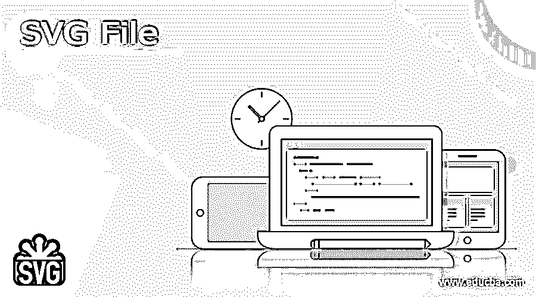
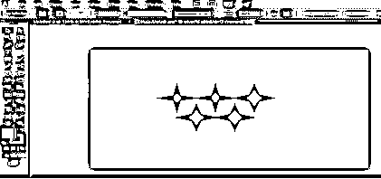
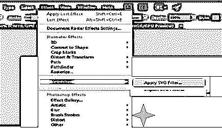
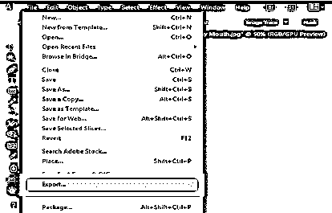
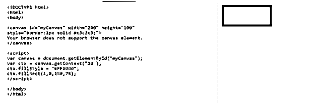

# SVG 文件

> 原文：<https://www.educba.com/svg-file/>

## SVG 文件的定义

可缩放矢量图形(SVG)是一个二维图像格式化图形系统，它使用矢量而不是像素。它是一个基于文本的开放网络标准，用于展示图像。并且可以以所需的尺寸获得最佳质量的图像。SVG 有助于使用不同的 web 标准。它主要用于在不损失质量的情况下将图像放大到任何分辨率。SVG 文件可以 XML 文本文件格式存储。万维网联盟开发了 SVG 文件格式。与其他文件格式相比，SVG 文件格式可以生成高质量的图像。

### 什么是 SVG 文件？

向量既有大小又有方向。理论上，使用一组向量可以生成任何类型的图形。使用这些向量，人们也可以重新绘制图片。SVG 使用这样的图形系统。该图像以 XML 文件格式存储，因此该图像作为图形在互联网上共享，可以使用谷歌、火狐、Opera mini 等浏览器进行搜索。SVG 文件以 XML 文件格式保存，因此这使得它们能够被搜索、索引、编写脚本和压缩。从基本的文本编辑器到高端的图形设计工具都支持 SVG 文件。

<small>网页开发、编程语言、软件测试&其他</small>

SVG 文件可以生成高质量的图像，并且可以以文本格式存储，这使得它们更适合在 Java 等脚本语言中使用。可用于网页设计。现在，图像的质量对于生成一个有吸引力的网页是非常重要的。在正常的 JPEG 或类似 PNG 的图像中，使用像素来放大图像，这在增加尺寸时导致像素断裂，这是不期望的。但是在 SVG 文件格式下，可以将图像调整到所需的大小，同时保持最佳的图像质量。这种文件格式较小，因此可用于动画等动态图形。在 XML 代码中，将描述图像中的大小、颜色、形状和文本。

### SVG 文件格式的主要优点是:

1.可扩展性–图像可以缩放到任何大小。在缩放过程中，图像不会显示任何像素中断，因为此文件类型使用矢量方法，这是一个优势。
2。定制——用户可以使用 SVG 兼容的编辑程序相应地更改尺寸、形状、颜色和其他视觉效果。此外，任何文本都可以添加到图像中，即使文本非常大。当使用任何脚本对图像进行编码时，应该清楚地提到所有的规范。该规范包括形状的几何形状、图像的颜色(如果图像是纯色或渐变格式)、文本的格式以及字体样式。
3。脚本兼容性——它可以兼容许多脚本语言，如 HTML、JavaScript 等。因为它是脚本兼容的，所以可以使用任何编码语言，这增加了使用 SVG 文件格式的灵活性。
4。更小的文件大小——更小的图像可以在互联网上快速加载，并可以用于动画。
5。搜索引擎优化——SVG 图像可以被像 Google 这样的搜索引擎快速搜索。

### 如何打开 SVG 文件？

SVG 文件将与。SVGZ 文件扩展名。SVG 文件可以使用任何网络浏览器如谷歌 Chrome、Edge 等快速打开。，并且可以使用任何这样的网络浏览器来查看图像(不可编辑的格式)。首先，在 web 浏览器上打开 SVG 图像，并将图像下载到您的系统上。要脱机打开映像，可以在您的计算机上使用某些软件包，如下所示。

支持 SVG 文件的 Adobe 程序有 Adobe Illustrator、Adobe Photoshop、Adobe animates、Photoshop elements 和 Indesign 程序。除了 Adobe 之外，其他支持打开 SVG 文件的软件有 Microsoft visio、CorelDraw、Corel Paintshop pro 和 CADSoftTools ABViewer。GIMP、Inkscape 和 Vectornator 是其他可以离线查看 SVG 文件的免费软件。

### 创建 SVG 文件:

可以使用 Adobe illustrator 创建 SVG 文件:

1.打开 Adobe Illustrator。该软件帮助使用不同的工具创建图像。

2.你可以使用左边面板上的工具，画出想要的图像。

3.将 SVG 滤镜应用到您的图像，方法是选择效果，然后选择 SVG 滤镜，然后按应用 AVG 滤镜。

4.然后单击“编辑 SVG 过滤器”选项，对现有代码进行更改，并选择“确定”保存效果。

5.选择左上角的“文件”选项，然后选择“导出”以 SVG 文件格式导出图像，这有助于在 illustrator 之外查看图像。

6.此外，图像可以保存为 illustrator 文件格式，这样图像只能在 Adobe illustrator 中查看/编辑。要在此软件中保存文件，请选择“另存为”菜单，然后选择“Adobe illustrator (*AI)”类型。

7.选择“*”可将图像保存为 SVG 文件格式。SVG”。

8.最后，选择“保存”选项，以所需的文件格式保存图像。

### 使用 Java 创建 SVG 图像:

该绘图将使用 HTML 画布与 Java 脚本。

第一步:首先尝试找到

<canvas>元素。</canvas>

步骤 2:使用“getContext()”为画布创建一个绘图对象

步骤 3:现在使用“ctx.fillstyle”为创建的形状填充颜色。默认填充颜色是黑色。

步骤 4:例如，要填充一个矩形，使用“ctx.fillRect(a，b，c，d)”其中 c 和 d 是宽度和高度。

下面是一个使用 HTML 画布创建红色矩形的例子。

### 结论

SVG 文件是最复杂的文件格式之一，可以很容易地在互联网上创建和导出。由于其不断增加的优势，如较小的尺寸，最佳的图像质量，可伸缩性和它可以创建的文本格式，它有各种优势超过其他文件格式，如 JPEG 或 PNG。

### 推荐文章

这是一个 SVG 文件指南。这里我们讨论定义，什么是 SVG 文件，如何打开 SVG 文件，创建 SVG 文件，优点。您也可以阅读以下文章，了解更多信息——

1.  [C++写文件](https://www.educba.com/c-plus-plus-write-file/)
2.  [Azure 文件存储](https://www.educba.com/azure-file-storage/)
3.  [C++文件头](https://www.educba.com/c-plus-plus-file-header/)
4.  [文件格式](https://www.educba.com/file-formats/)

