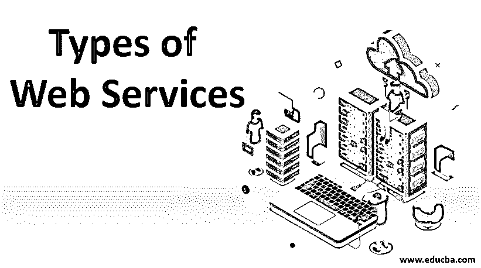

# Web 服务的类型

> 原文：<https://www.educba.com/types-of-web-services/>

## Web 服务类型介绍

在本文中，我们将讨论 Web 服务的类型。最重要的 web 服务是 [REST 和 SOAP](https://www.educba.com/soap-vs-rest/) 。一些著名的使用标记语言的 web 服务有 Web template、JSON-WSP、JSON-RPC、WSDL、WSCL、WSFL、WS-Metadata Exchange 和 XINS。

REST 和 SOAP 是世界上广泛使用的两种流行的 Web 服务类型。REST 表示具象状态转移， [SOAP 表示简单对象访问协议](https://www.educba.com/what-is-soap/)。SOAP 完全是一个协议；同时，REST 实际上是一种架构风格。SOAP 不能使用 REST，因为它是一个协议，而 REST 可以使用 SOAP web 服务，因为它是一个概念。SOAP 使用服务接口来公开业务逻辑，而 REST 使用 URI 来公开业务逻辑。

<small>网页开发、编程语言、软件测试&其他</small>

### 什么是 Web 服务？

web 服务是一种一致的媒介，有助于通过网络在客户机和服务器应用程序之间进行有效的通信。它是一个软件模块，专门用于执行一系列任务。客户机请求服务器调用一系列 web 服务，作为响应，服务器托管 web 服务。这些请求是通过远程过程调用(RPC)发出的。web 服务最重要的元素是客户端和服务器之间在。xml 格式。许多编程语言清楚地理解这种格式。确切地说，应用程序(尽管是用不同的编程语言编写的)用 XML 互相通信。因此，它为程序员提供了一个共同的平台来协调和工作。

Web 服务具有许多优势——降低通信成本、在网络上公开业务功能、拥有每个人都能理解的标准化协议、在各种应用程序之间建立互操作性，以及为特定任务创建服务。web 服务具有面向服务的架构，并为任何组织提供内部和外部服务的组合。它能够为客户生产和提供所需的服务。

### Web 服务的类型

在技术层面上，web 服务可以通过不同的方式实现。下面提到的是两种类型的 web 服务。

#### 肥皂

最初由微软开发，也被称为独立于传输的消息协议。它将 XML 数据作为 SOAP 消息传输。每条消息都有一个 XML 文档。这份文件遵循一种特殊的模式。它使用 HTML 和 SMTP 来传输消息。SOAP web 服务有一个安全和地址标准。它们是硬编码的，并且是在不使用存储库的情况下生成的。SOAP 有一个内置的错误处理系统。对请求的响应包含错误信息，这有助于您跟踪和纠正错误。

SOAP 在分布式企业环境中工作得非常好。当与一些语言产品一起使用时，它有自动化的好处。唯一的主要缺点是，它使用 WSDL (Web 服务描述语言)来发现服务，并且没有其他替代机制。

SOAP 消息包含以下元素:

*   一个包含消息开始和结束的<envelope>。这是根元素。它包括“标题”和“正文”。</envelope>
*   报头包含用于处理消息的属性。
*   主体包括需要发送出去的 XML 数据。
*   处理数据时提供错误消息的一种错误。

#### 休息

表示状态转移(REST)对开发人员很有吸引力，因为它的接口比 SOAP 简单。它是一种架构风格(每个 URL 代表一个单独的对象)。它为基于 API 的任务提供设备和互联网之间的通信和连接。REST 允许不同的数据格式，如 HTML、JSON、XML 等。与 SOAP 相比，它消耗更少的带宽和资源。web 服务可以用任何编程语言编写，并且可以在任何平台上使用。它也可以使用 SOAP web 服务，但是 SOAP 不能使用 REST web 服务。

REST web 服务为使用不同编程语言和平台构建的应用程序提供了灵活性，以便高效地进行通信。现在一切都在不断地向云迁移。因此，所有基于云的架构都是基于 REST web 服务原则开发和工作的。

REST 实现的关键要素是:

*   资源:它命令网络服务器提供所需的细节。
*   **请求动词:**这些动词描述了您想要对特定资源做的任何事情(所需的细节)
*   **请求头:**随请求发送的附加指令；它们定义了所需的请求类型。
*   **请求主体:**请求主体具有需要添加到服务器的特定资源的必要细节。
*   **响应主体:**这是收到的响应的主体。
*   **响应状态代码:**这些是通用代码，与从网络服务器收到的响应一起返回。

### Web 服务的体系结构

每个框架都需要某种体系结构来确保整个框架按照预期的方式工作。在 web 服务的架构中有三个不同的角色:

1.  **服务提供者**:提供者是创建 web 服务的人，并使其完全可用于那些想要使用它来达到特定目的的客户端应用程序。
2.  **服务请求者**:联系 web 服务需要客户端应用程序。客户端应用程序可以是。Net、Java 或任何其他基于编程语言的应用程序，通过 web 服务寻找特定类型的功能。
3.  服务代理(Service Broker):这是提供对 UDDI(通用描述、发现和集成)的访问的应用程序，这是提供可以托管各种 WSDL 文件的存储库的应用程序。

web 服务架构的所有三个元素都有助于查找、绑定和发布 web 服务。

### 结论

随着系统集成和互操作性的发展，现代 web 服务已经完全改变了数字场景。它们提供了现代且不太复杂的功能。所有这些只能说明，随着所有商业领域的数字化发展，网络服务及其需求正在成倍增长。它们的相关性和重要性不能想当然，需要达成一致才能理解技术的功能及其用途。

### 推荐文章

这是一个 Web 服务类型的指南。这里我们讨论 web 服务的介绍和类型以及 web 服务的架构。您也可以看看以下文章，了解更多信息–

1.  [微服务 vs 网络服务](https://www.educba.com/microservices-vs-webservices/)
2.  [云服务的类型](https://www.educba.com/types-of-cloud-services/)
3.  [网络服务的架构](https://www.educba.com/architecture-of-web-services/)
4.  [WCF vs 网络服务](https://www.educba.com/wcf-vs-web-services/)

