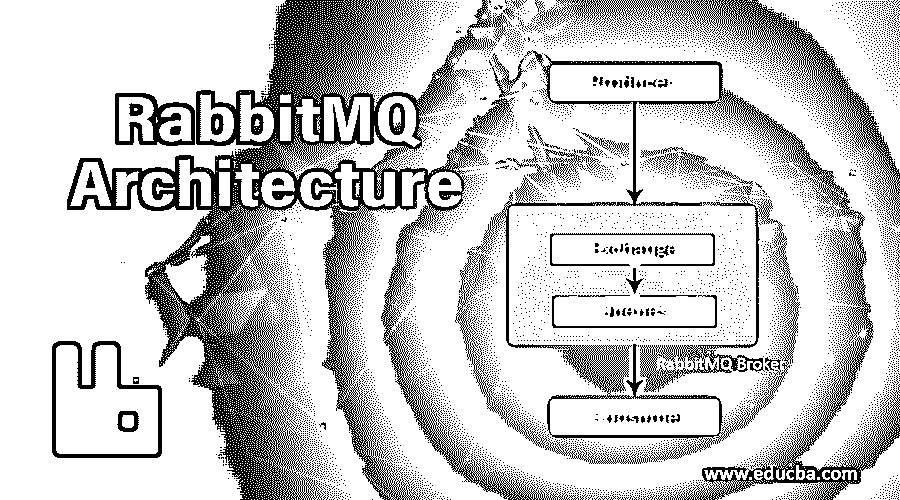
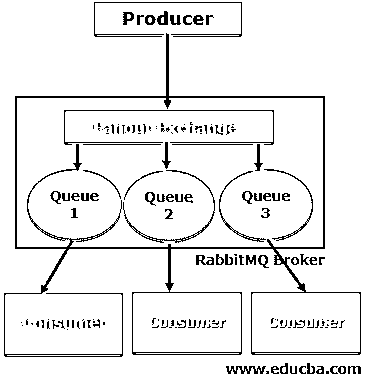
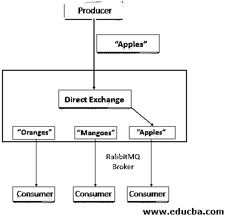
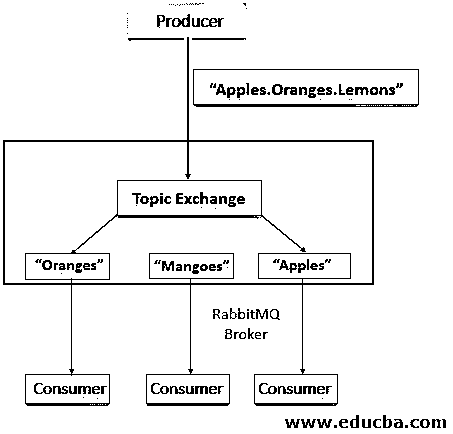
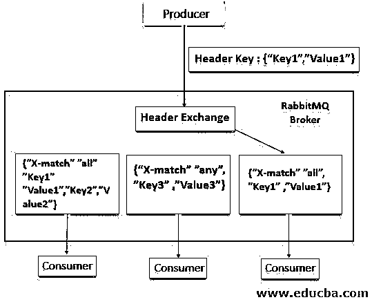

# rabbitmq 体系结构

> 原文：<https://www.educba.com/rabbitmq-architecture/>

## RabbitMq 架构介绍

RabbitMQ 是使用最广泛的开源消息代理之一。它最初是基于高级消息队列协议(AMQP)的。后来，对它进行了修改，以支持消息队列遥测传输(MQTT)、面向流文本的消息协议(STOMP)和其他几种常见协议。在这个主题中，我们将学习 RabbitMQ 架构。

RabbitMQ 的主要组件是生产者、交换者、队列和消费者。这些将在下一节详细讨论。

<small>Hadoop、数据科学、统计学&其他</small>

### rabbitmq 体系结构

RabbitMQ 由以下部分组成:

#### 1.生产者

生产者将消息推送到交易所。消息推送的速度不应高于消费者能够处理的速度。它还负责生成路由关键字。

#### 2.交换

它基本上是消息的路由规则。现在，为了让消息从生产者传到队列或不同的交换，它需要绑定。现在不同种类的交换需要不同的绑定。一些交流是:

##### 扇出交换机

它不加区别地将消息路由到所有可用的队列。如果提供了路由关键字，它将被忽略。这种交换对于实现发布-订阅机制很有用。在使用这种交换时，不同的队列可以独立于其他队列以自己的方式处理消息。

如上图所示，消息被路由到所有队列。

##### 直接汇兑

它根据消息携带的路由关键字来路由消息。路由关键字是由消息的生产者生成的短字符串。消息被路由到具有与路由关键字完全匹配的绑定关键字的交换机/队列。

如上图所示，路由关键字是“apple ”,消息只传递到一个绑定关键字是“apple”的队列

##### 话题交流

它根据与路由关键字的完全或部分匹配来路由消息。在这种情况下，消息以这样的方式发布，即路由关键字由点分隔的一系列单词组成(如 word1.word2.word3)。模式可以有一个星号(*)，它可以匹配路由关键字特定位置的单词，也可以有一个哈希，它可以匹配零个或多个单词。

在上面的例子中，路由关键字是“苹果”。这些消息被路由到两个队列:一个队列的模式为“*.Oranges.*”，另一个队列的模式为“Apples”。*".

##### 标题交换

基于消息头路由消息。将消息头与绑定队列指定的头进行匹配，如果匹配，则将消息发送到该队列。在交换和队列之间的绑定中添加了一个称为“x-match”的特殊参数。现在，该汇整可以有两个值“任意”或“全部”，其中“全部”是默认值。“all”表示所有标题对必须匹配，而“any”表示匹配必须与至少一个标题对匹配。

在上面的例子中，消息被路由到一个队列，该队列的“x-match”被设置为“all ”,并且它的所有键值对(在本例中只有 1 个)都与消息头中的键值对匹配。

##### 一致散列法

这种类型的交换对路由关键字或消息头进行哈希处理，以便将消息仅路由到一个队列。这在我们必须保证消息按照发布的顺序使用的情况下很有用。

#### 3.长队

它是存储消息的缓冲区。命名队列是为了让应用程序更容易引用。应用程序可以决定队列名，也可以要求代理生成队列名。队列名称最多可以是 255 字节的 UTF 8 字符，并且不能以“amq”开头因为这些名称由代理保留供内部使用。队列由以下属性定义:

*   名字
*   持久(此队列可以在代理重启后继续存在，并通过将队列保存到磁盘上来实现。这并不意味着消息也是持久的)
*   Exclusive(仅由一个连接使用，一旦该连接关闭就会被删除。如果任何其他连接试图访问一个独占队列，它将抛出一个名为 RESOURCE_LOCKED 的通道级异常
*   自动删除(当最后一个订阅队列的用户取消订阅时，队列会自动删除)
*   参数(这是可选的；即使在队列被声明之后，这些参数中的大部分都可以被动态地改变。这些参数可以通过两种方式设置:a)使用策略对一组队列进行设置；b)基于每个队列进行设置，并且在客户端声明队列时设置参数

在使用队列之前，需要对其进行声明。如果队列不存在，声明将导致创建队列。现在，在队列已经存在的情况下，如果指定的属性与现有的属性相同，那么声明将不会产生任何效果，否则它将抛出一个名为 PRECONDITION-FAILED 的通道级异常。

#### 4.消费者

它从队列中读取消息。每个消费者都可以设置一个称为预取限制(也称为 QoS 限制)的东西。这个数字表示消费者在一个实例中可以处理的未确认消息的数量。

### 结论

RabbitMQ 在业界被广泛使用，因为它支持复杂路由。它已被许多大公司/组织采用，如 JP 摩根、NASA(用于星云云计算)和 Google。事实上，它在印度的 Aadhar 项目中也有应用，该项目是世界上最大的生物特征数据库。

### 推荐文章

这是 RabbitMQ 架构的指南。这里我们讨论 RabbitMQ 的基本含义和主要组件，如生产者、交换者、队列和消费者。您也可以看看以下文章，了解更多信息–

1.  [rabbitq 替代品](https://www.educba.com/rabbitmq-alternatives/)
2.  [卡夫卡的应用](https://www.educba.com/kafka-applications/)
3.  [卡夫卡式建筑](https://www.educba.com/kafka-architecture/)
4.  [卡夫卡是什么？](https://www.educba.com/what-is-kafka/)

