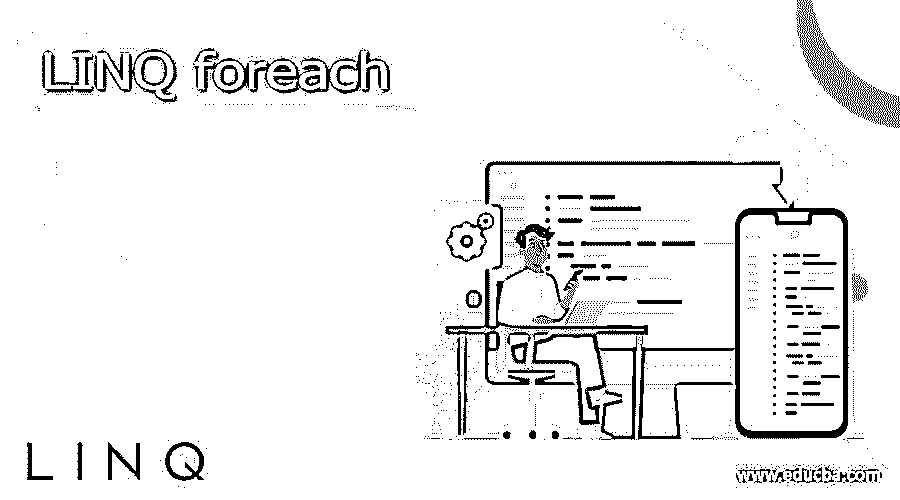
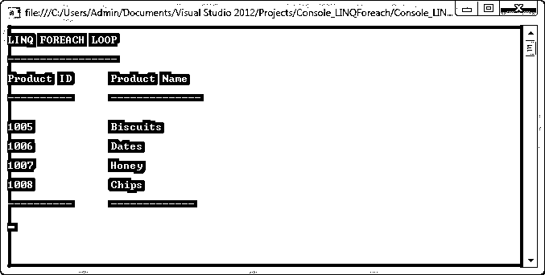
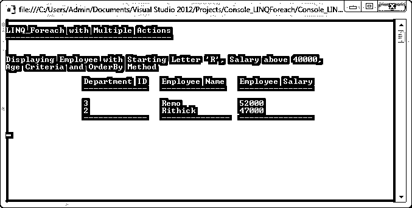

# LINQ foreach

> 原文：<https://www.educba.com/linq-foreach/>




## LINQ 外语学院简介

LINQ foreach 循环在集合中的快速循环过程中非常出色。Foreach 循环使得遍历项目集合变得容易。当检索集合中的每个元素时，LINQ Foreach 变量支持恰当的访问。它支持所有容易检索元素的方法；它使用 LINQ 扩展方法。

**语法**

<small>网页开发、编程语言、软件测试&其他</small>

LINQ foreach 循环有助于以非常快速的方式轻松地检索集合；让我们看看下面的语法，

```
values.ForEach(val=> Console.WriteLine(val));
```

集合项 LINQ-Foreach 语法如下:

```
userList.ToList().ForEach(s => Console.WriteLine(u.userName));
```

### 外国公司在 LINQ 是如何运作的？

在检索集合中的每个元素时，Foreach 变量支持轻松访问数据。它支持所有容易检索元素的方法；它使用 LINQ 扩展方法。来看看 LINQ Foreach 的几个工作流程，

我们将使用 LINQ Foreach 中的条件。当 where 条件返回 true 时，它执行项目列表。这里我们包含了具有相同条件的 foreach 代码行；不需要在单独的行中编码。使用 Foreach 有助于减少代码和执行时间。

```
var values = new List<int>() { 10, 20, 30, 40, 50 };
values
.Where (val => val > 20)
.ToList()
.ForEach (val=>Console.WriteLine(val));
```

在上面的代码中，我们结合了查询条件和 foreach 循环；它快速检索元素。在一行代码中，整个过程就完成了。结果将是 30、40 和 50。

foreach 循环的另一个过程，其条件为 along with contains in it。它组合两个集合并返回在两个集合中包含相同数字的值；在一行代码中，我们可以对整个过程进行编码；让我们检查下面一行代码，

```
var values_1 = new List<int>() { 100, 200, 300 };
var values_2 = new List<int>() { 200, 500, 700 };
values_1.Where(val => values_2.Contains(val))
.ToList()
.ForEach(val => Console.WriteLine(val));
```

它将结果返回为“200”，因为数字 200 同时出现在两个列表中。

### 例子

Foreach 循环使得在项目集合中循环变得容易；为了更好地理解，让我们看一下示例程序，

#### 示例#1

**代码:**

```
using System;
using System.Collections.Generic;
using System.Linq;
using System.Text;
using System.Threading.Tasks;
namespace Console_LINQForeach
{
class ProductMaster
{
public int productID { get; set; }
public string productCategory { get; set; }
public string productName { get; set; }
public int productPrice { get; set; }
}
class Program_LINQForeach
{
static void Main(string[] args)
{
// building the product class List
IList<ProductMaster> product_ItemList = new List<ProductMaster>();
product_ItemList.Add(new ProductMaster { productID = 1005, productCategory = "Pantry", productName = "Biscuits", productPrice = 20 });
product_ItemList.Add(new ProductMaster { productID = 1006, productCategory = "Pantry", productName = "Dates", productPrice = 60 });
product_ItemList.Add(new ProductMaster { productID = 1007, productCategory = "Pantry", productName = "Honey", productPrice = 110 });
product_ItemList.Add(new ProductMaster { productID = 1008, productCategory = "Pantry", productName = "Chips", productPrice = 35 });
product_ItemList.Add(new ProductMaster { productID = 1009, productCategory = "Stationery", productName = "A4 Sheet Bunddle", productPrice = 100 });
product_ItemList.Add(new ProductMaster { productID = 1010, productCategory = "Stationery", productName = "Pencil Box", productPrice = 52 });
product_ItemList.Add(new ProductMaster { productID = 1011, productCategory = "Stationery", productName = "Ink-Bottle", productPrice = 45 });
product_ItemList.Add(new ProductMaster { productID = 1012, productCategory = "Stationery", productName = "NoteBooks", productPrice = 75 });
Console.WriteLine("\nLINQ FOREACH LOOP");
Console.WriteLine("\n-----------------");
Console.WriteLine("\nProduct ID\tProduct Name");
Console.WriteLine("\n----------\t-------------- \n");
product_ItemList.Where(p => p.productCategory.StartsWith("P"))
.ToList()
.ForEach(p => Console.WriteLine("\n" + p.productID+"\t\t"+p.productName));
Console.WriteLine("\n----------\t-------------\n");
Console.ReadKey();
}
}
}
```

在上面的代码中，我们必须检索以产品类别“P”开头的产品列表

```
product_ItemList.Where(p => p.productCategory.StartsWith("P"))
.ToList()
.ForEach(p => Console.WriteLine("\n" + p.productID+"\t\t"+p.productName));
```

在列表中，产品类别以字母' P '开头，是 pantry，所以在 Pantry 类别下列出的项目带有产品 id 和产品名称。让我们看看下面的输出如下。

**输出:**




#### 实施例 2

在这个示例程序中，我们使用了通过 Foreach 循环执行的多个操作，例如显示雇员姓名的雇员详细信息，以“R”开头，他们的工资必须在 40000 英镑以上，年龄限制应小于 25 岁，并使用 Orderby 方法对雇员姓名列表进行排序。

**代码:**

```
using System;
using System.Collections.Generic;
using System.Linq;
using System.Text;
using System.Threading.Tasks;
namespace Console_LINQForeach
{
class Program_LINQ_ForEach
{
public class EmployeeMaster
{
public int eID
{ get; set; }
public string eName
{ get; set; }
public string eQuali
{
get;
set;
}
public int eSalary { get; set; }
public int deptID { get; set; }
public int eAge { get; set; }
public static List<EmployeeMaster> Get_Employees()
{
return new List<EmployeeMaster>()
{
new EmployeeMaster() {eID = 1000, eName = "Joseph",deptID=1,eQuali = "MCA", eAge=21,eSalary=25000},
new EmployeeMaster() {eID = 1005, eName = "Rithick", deptID=2,eQuali = "B.E",eAge=23, eSalary=47000},
new EmployeeMaster() {eID = 1001, eName = "Sara",deptID=1,eQuali = "MCA",eAge=21, eSalary=60000},
new EmployeeMaster() {eID = 1007, eName = "Rio",deptID=3, eQuali = "B.E",eAge=27,eSalary=35000},
new EmployeeMaster() {eID = 1003, eName = "David",deptID=1, eQuali = "M.Sc",eAge=21, eSalary=30000},
new EmployeeMaster() {eID = 1004, eName = "Remo",deptID=3, eQuali = "B.E",eAge=24, eSalary=52000},
};
}
}
static void Main(string[] args)
{
Console.WriteLine("\nLINQ_Foreach with Multiple Actions");
Console.WriteLine("----------------------------------\n");
Console.WriteLine("\nDisplaying Employee with Starting Letter 'R', Salary above 40000,\nAge Criteria and OrderBy Method\n");
Console.WriteLine("\t\tDepartment ID\tEmployee Name\tEmployee Salary");
Console.WriteLine("\t\t-------------\t-------------\t---------------\n");
EmployeeMaster.Get_Employees()
.Where(emp => emp.eName
.StartsWith("R") && emp.eSalary > 40000 && emp.eAge<25)
.OrderBy(emp=>emp.eName)
.ToList()
.ForEach(emp => Console.WriteLine("\t\t"+emp.deptID+"\t\t"+emp.eName +"\t\t" + emp.eSalary));
Console.WriteLine("\t\t-------------\t--------------\t---------------\n");
Console.ReadKey();
}
}
}
```

在这段代码中，我们使用了循环，并通过使用 where 条件、order by 方法执行了几个操作，如下所示，

```
EmployeeMaster.Get_Employees()
.Where(emp => emp.eName
.StartsWith("R") && emp.eSalary > 40000 && emp.eAge<25)
.OrderBy(emp=>emp.eName)
.ToList()
.ForEach(emp => Console.WriteLine("\t\t"+emp.deptID+"\t\t"+emp.eName +"\t\t" + emp.eSalary));
```

在一行代码中，我们执行了多个动作，这有助于减少代码行，并可以看到下面清晰的输出。

**输出:**




### 结论

在本文中，我们已经看到了 LINQ-Foreach 循环的编程用法。LINQ Foreach 用于快速检索值；使用这种方法；我们可以很容易地编码我们的程序，这有助于减少编码行。希望这篇文章有助于理解 Foreach 的用法。

### 推荐文章

这是一本 LINQ 导游手册。在这里，我们通过示例和输出来讨论 LINQ-Foreach 循环的编程用法。您也可以看看以下文章，了解更多信息–

1.  [LINQ 左加入](https://www.educba.com/linq-left-join/)
2.  [LINQ 包括](https://www.educba.com/linq-include/)
3.  [LINQ 截然不同](https://www.educba.com/linq-distinct/)
4.  [LINQ 内部加入](https://www.educba.com/linq-inner-join/)


