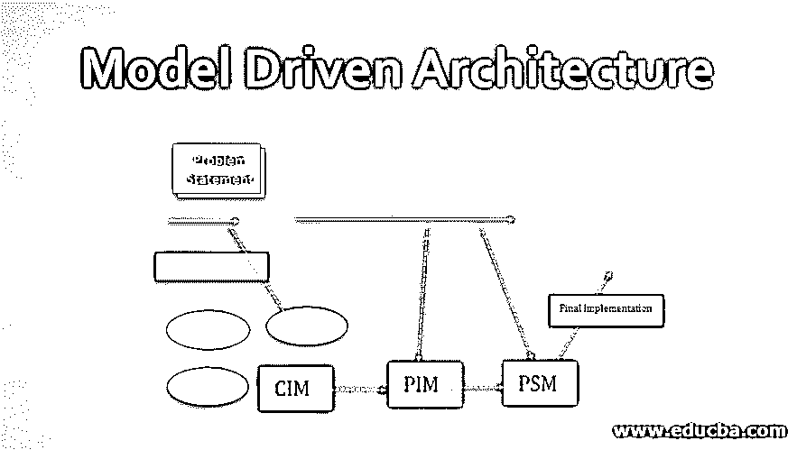
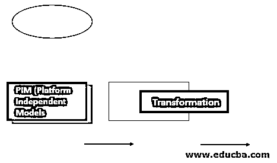
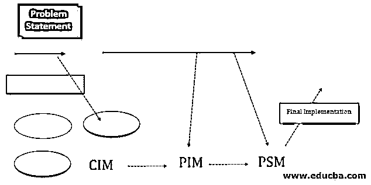

# 模型驱动架构

> 原文：<https://www.educba.com/model-driven-architecture/>

## 模型驱动架构简介

MDA 或模型驱动架构只不过是一种设计软件的方法。MDA 是由 OMG 或对象管理小组在 2001 年引入的。在这种方法中，想法是建立进一步用于指定模型结构的指导方针。MDA 涉及统一建模语言(UML)、公共仓库模型(CWM)、元对象设施(MOF)、对象管理架构(OMA)和 XML 元数据交换(XMI)等标准。这里有一点值得注意，MDA 中的架构并不是指软件系统的架构；相反，它指的是软件系统架构中遵循的标准架构。MDA 为转换技术提供了指导方针，转换技术用于将平台无关的模型转换为平台特定的模型。使用 MDA 技术，也可以在特定于平台的模型之间进行转换。

### 什么是模型驱动架构？

简而言之，MDA 是一种用于软件开发、设计和实现的方法。MDA 为结构化软件模型中使用的规范提供了一套指导方针。它将应用程序逻辑与平台技术区分开来。根据 MDA 系统，first 是用 PIM(独立于平台的模型)定义的，它包含与任何技术或语言都不相关的业务功能和应用程序逻辑的信息。这实际上将应用程序逻辑与任何技术隔离开来。

<small>网页开发、编程语言、软件测试&其他</small>

适用于任何模型的平台有 CORBA、J2EE。NET、Web 服务等。;PIM 可以转换成任何可用的模型，或者仅仅是特定于平台的模型(PSM)。该模型的实现可以使用任何 DSL(领域特定语言),如 C#、python、java 等。MDA 通过其指定的模型转换工具提供了灵活性，这提供了 PIM(独立于平台的模型)和任何 PSM(特定于平台的模型)之间的简单转换。这种灵活性为探索不同的可用模型和技术并充分利用它们提供了机会。由于我们看到架构是模型驱动的，所以称之为模型驱动架构。

MDA 带来了模型创建和实现的效率。MDA 支持跨平台和平台内部的翻译功能。这使得应用程序逻辑和业务方面脱离集成平台和技术而发展成为可能。如果有新的应用程序逻辑和新的技术增强，可以根据业务需要将两者集成起来。

### 带有图表的模型驱动架构

一天的技术正在迅速出现；这就需要找到一种方法使应用程序独立于基础设施。这使得企业能够利用最新技术获得竞争优势。按照模型驱动架构使用的方法包括以下要点:

1.  定义一个独立于平台的系统。
2.  指定可用的平台。
3.  选择一个开发系统的平台。
4.  将系统规格转换到所选平台。

如果一个系统有一个通用的描述，那么这个系统就是平台无关的，但是如果这个系统是用 java 或者。Net 技术，它被称为特定于平台的。MDA 促进的转换技术使得 PIM 的操作能够转换为 PSM 的操作。

上图显示了一个非常基本的概念，模型驱动的架构是如何通过转换技术促进模型之间的交流的；下图显示了 MDA 的概念是如何工作的。

一开始，问题陈述是用独立于计算的观点来理解的(CIV)。这个视图的焦点是收集系统的需求，而不考虑所需的计算；因此，我们得到了一个独立于计算的模型(CIM)。CIM 拥有关于模型的所有数据和信息。为了找到任何问题的解决方案，需要遵循包含特定操作的流程。独立于平台的视图(PIV)致力于创建不依赖于任何平台的操作或分析方法。独立于平台的模型包括所有这样的操作，而不考虑任何特定平台的任何特征。特定于平台的观点(PSV)考虑平台执行操作，以便设计/实现相同的操作。特定平台的功能在特定平台模型(PSM)中得到利用。可能需要用原型来比较不同的平台，以分析最适合工作流程中的问题。

### 模型驱动架构的组件

我们已经讨论了 MDA 的特性，现在我们将讨论其他重要的组件，比如映射和转换。

#### 1.映射

映射是为了将信息从 PIM 转换到 PSM 而必须遵循的一组规则或规范。映射考虑模型类型来为特定的模型元素提供映射。这就是 PIM 元素映射到特定 PSM 的方式。PIM 的元素被标记以跟踪它们是如何被转换的。根据不同的模型及其元素定义不同的映射。

#### 2.转换

转换是一个流程，它提供了如何将 PIM 转换为 PSM 而不丢失任何信息的工作流。映射用于模型和模型实例转换。在实例的情况下，转换 PIM 标记提供了关于 PIM 的什么实例应该被映射为 PSM 中的什么实例的有用信息。

例如，一个被标记的 PIM 将被转换成 java 平台(PSM1 ),而同样被标记的将被转换成。微软的. Net 平台(PSM2)。在这两个 PSM 转换中，映射都是在 MDA 中定义的，它可以是相同的，也可以是不同的，这进一步取决于考虑映射的模型的实例。

### 结论

MDA 提供了解决问题的方法。MDA 利用不同模型的知识来解决复杂的问题。模型驱动架构提供了与特定于模型的方法的独立性，并让思想在独立于平台的模型中流动。此外，使用 MDA 中定义的转换技术和映射，将 PIM 信息转换成特定于平台的模型。MDA 提供了查看/处理问题的灵活性，而不受平台的任何限制。一旦在具有 MDA 转换的独立于平台的系统中很好地定义了操作，它们将被转换为 PSM。

### 推荐文章

这是模型驱动架构的指南。在这里，我们还将讨论模型驱动的架构，包括一个图和组件。您也可以看看以下文章，了解更多信息–

1.  [Nodejs 体系结构](https://www.educba.com/nodejs-architecture/)
2.  [数据流架构](https://www.educba.com/data-flow-architecture/)
3.  [软件系统架构](https://www.educba.com/software-system-architecture/)
4.  [安全架构](https://www.educba.com/security-architecture/)

