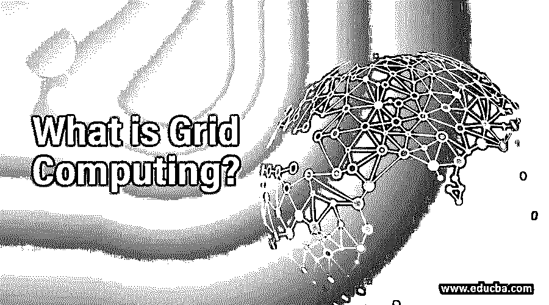

# 什么是网格计算？

> 原文：<https://www.educba.com/what-is-grid-computing/>

## 什么是网格计算？

通过使用分布式计算机来获得一个共同的目标被称为网格计算。它的最高效率使它不同于其他任何技术。因为，在这里，每个不同的节点被分配到不同的任务，它们作为一个集群朝着一个目标或结果工作。由于它们在物理上和地理上是分离的，所以它们的行为是异质的。一个单独的网格被分配来执行一个公共的应用程序，并且一起用于不同的目的。网格是一个由中间件软件库构建的大型系统。本文解释了网格系统的工作和组成以及它的重要特性。

### 网格计算是如何工作的？

网格计算系统的发展与日俱增。网格计算中还有许多其他种类的研究和高级开发，支持新标准和协议的实现。但是标准网格计算系统的工作如下，

<small>网页开发、编程语言、软件测试&其他</small>

CPU、内存和存储单元是网格计算系统的基本单元。根据要求和需要，可能有一个或多个 CPU 的计算机。他们有一个微处理器，通过它来完成所有的数学功能。最后，处理后的信息被发送到不同的存储位置。计算机的存储器类似于临时电子存储器，为微处理器保存相关数据。微处理器必须从永久存储部件中搜索和提取数据，例如任何硬盘或 USB 驱动器或没有任何存储部件的可靠数据库。存储是网格计算中的一个重要功能，应该是开源的，可以随时访问。

有了自己的资源，计算机只能在一定的限制下工作。网格计算能够在单台计算机上增加最大的功率或容量，从而支持升级并提高性能。弹性和快速操作使得大数据的存储成为可能。所有计算机的能量被累积起来，增加了系统的能量。此外，资源连接在一起，让任何人都可以访问计算机。考虑到这一点，从个人用户的角度来看，他的计算机已经变成了一台性能和运行速度都很高的超级计算机。

### 网格计算的组件

网格计算的组成部分是用户界面、安全性、调度程序、数据管理、工作负载管理和资源管理。

由于计算机被安排在具有多个应用程序的网格中，it 发现很难管理任何敏感或有价值的数据。因此，网格系统的安全性至关重要，它是通过一些先进的授权、加密和解密技术来实现的。访问或检索网格系统上的任何信息都很困难，因此用户界面是以简化版本实现的。

例如当用户执行时由应用程序提供的界面或网格管理界面，非常类似于提供对网格系统上的应用程序和可用资源的访问的 web 门户。最重要的部分是门户风格的界面，因为它在帮助用户学习如何在网格上查询和执行各种功能方面起着重要作用。只有当用户要求在网格上执行的应用程序知道可用的资源时，才能实现紧凑的工作负载管理。

现在，应用程序与工作量管理器进行交互，以找到可用的资源并相应地更新状态。需要一个调度程序来将计算机放置在应用程序可用的位置，并为其分配所需的作业。作业队列优先级有助于考虑替代的可用资源，并使其成为一项简单的任务。调度器还有其他重要的任务，包括维护工作负载、查找未完成的任务、揭示保留的资源以及监视整个系统。

假设应用程序在一个不存储应用程序需求并将其作为安全网络进行管理的系统上执行。因此，一致的数据管理服务负责将数据跨管理各种协议的不同机器移动到合适的位置。资源管理完美地完成了处理关键任务，例如使用显式资源调度作业、监控作业状态以及提取结果。它可能包括操作网格系统的整个协议，并将其范围扩展到不同的应用程序，使其更加可靠和成功。

### 网格计算的用例

从学术界到研究团体，对网格计算的概念进行了全方位的探索。与互联网类似，网格计算的范围和部署在市场上变得必不可少和强制性的。但是企业已经开始坚持网格计算的优势，支持新型的商业和金融模式。

在工业和金融服务中，可以实施网格计算来加速交易和缩减任何高容量的数据。在 IT 领域，网格计算使任何关键任务和环境都有可能继续执行，而这些任务和环境可能根本不允许任何停机。政府机构使用网格计算来保护、隔离和汇集更高维度的信息储存。

像军事和民用机构这样的组织可能需要数据完整性能力和更快的信息访问速度，包括与数百万个跨代理数据库的协作。有许多组织参与分析，如制药领域的基因组资源和开发，它依靠网格计算来清理、处理、比较和交叉制表大量的数据。更快的数据处理速度是决定性因素中的一个显著优势。

### 结论

生物特征验证系统和生物特征信息安全领域也将网格计算作为一项大规模的事业来利用。BIS 被认为是一个中央工作流引擎，而不是传统的网格系统。

一个真实的测试案例显示，通过拥有一个先进的网格中间件系统来计算系统的集成和工作流使它变得不同。它代表多任务活动，并行调度任务以有效完成任务。

### 推荐文章

这是一本关于什么是网格计算的指南？这里我们讨论网格计算的工作原理、组件和使用案例的详细信息。您也可以看看以下文章，了解更多信息–

1.  [什么是效用计算？](https://www.educba.com/what-is-utility-computing/)
2.  [云计算的历史](https://www.educba.com/history-of-cloud-computing/)
3.  [雾计算](https://www.educba.com/fog-computing/)
4.  [云计算 vs 网格计算](https://www.educba.com/cloud-computing-vs-grid-computing/)

