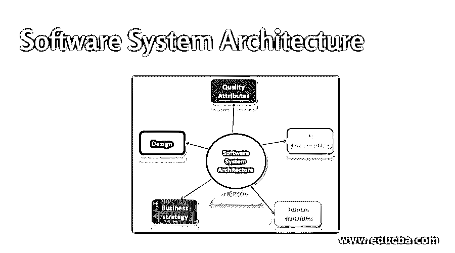
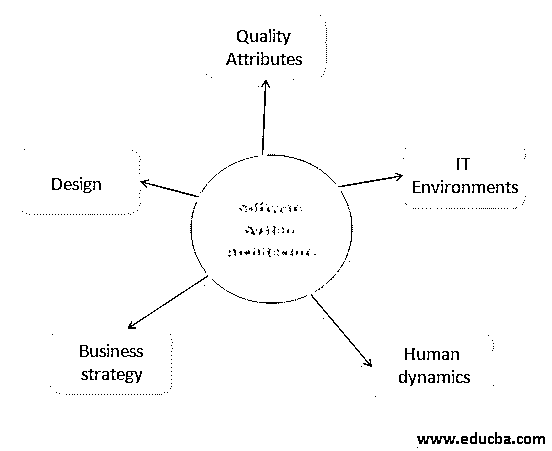

# 软件系统架构

> 原文：<https://www.educba.com/software-system-architecture/>

## 软件系统架构介绍

解释软件元素的基本结构及其排列的体系结构被称为软件系统体系结构。元素之间的关系和链接连同结构一起被解释。元素的需求和属性给出了对架构及其工作的理解。性能和设计参数可以从解释系统复杂性和协调性的架构中获得。元素之间进行协作。由于结构庞大，它被分成子结构，以便降低复杂性。让我们来看看架构的细节。

### 软件系统架构的解释

*   软件架构具有质量属性、设计、技术环境、人力动态和商业策略。所有的功能和属性都在体系结构中进行了解释，以影响和修改更好的体系结构。该技术解释和验证环境，并很好地修改它。

<small>网页开发、编程语言、软件测试&其他</small>

*   设计在任何结构中都起着主要作用，这是结构中的基本节点。软件设计有助于检查需求，并根据客户的需求对其进行修改。它有助于在开发过程中理解基础知识和开发结构元素。与所有元素的集成和测试也在设计阶段完成。编码有助于开发和设计元素。所有这些都是在对领域、需求和风险进行适当和详细的分析之后完成的。风险可以通过测试来处理，领域分析有助于更好地开发架构。
*   适当的交流有助于软件元素和涉众相互了解。沟通是建筑的关键。链接软件元素有助于通过消除缺陷和连接元素使它们变得更好。修改设计和领域，以便结构有助于体系结构的质量。此外，涉众之间的交流有助于了解领域元素的需求和想法。
*   通过分离不同元素的方式降低了复杂性。这些元素被分解后会更容易理解。这也有助于开发人员分离和测试元素，使它们在架构中更有用。识别风险，并进行测试以评估和消除风险。测试也提高了系统的质量和可靠性。
*   在体系结构中遵循几个标准，因此遵循的模式没有太大的变化。标准也有助于留住客户，因为一些客户将标准和模式作为他们的主要关注点。向后兼容性和可用性是架构的其他属性，因为测试和标准化在架构中管理得很好。
*   利益相关者的沟通有助于理解商业战略和组织在市场中的未来。理解业务有助于修改需求并消除架构中的风险。借助测试和重现场景，恶意软件和其他攻击得以消除。容错也是架构的一个属性。
*   信息技术有助于用新的方法改进体系结构，这使得体系结构更加强大。编码和技术属性在一定程度上开发了架构，并帮助开发人员引入其他技术和修改架构。在编码的帮助下，所有涉众的关注都可以通过更新的技术得到满足。所有的质量属性，连同功能需求，都是通过编码和技术解决的。
*   人类动力学主要处理质量和理解架构的容易程度。随着复杂性的解决和涉众需求的满足，可以很容易地说人类动态是架构中的一个属性。
*   任何架构都解释了系统应该如何执行，以及应该如何在系统中执行。了解概念和完整性有助于使架构以自己的方式变得强大。系统中的数字和操作约束有助于遵循系统中的概念完整性。
*   为了评估和分析软件元素，应该知道体系结构的演变。进化包括基本结构及其维护和属性。这有助于在系统中轻松地分析架构。当前的设计可以根据领域进行修改，这就修改了结构本身。很少有方法可以用来分析和评估架构，以便可以对软件元素进行定量计算。此外，架构中的一些框架有助于很好地设计它。
*   在进行设计和领域修改时，记录架构变更是很重要的。本文档为执行系统架构的开发人员和架构师提供支持系统。应该提供动态视图和部署视图，以便了解系统和硬件的所有操作。所有建筑师的视图描述可能不尽相同。了解另一个视图有助于更好地增强系统，这从整体上改善了体系结构。

### 软件系统架构的优势

*   架构的结构是众所周知的，开发者可以理解和修改软件元素的工作。
*   通过架构来理解和满足客户的需求是可能的。
*   一个架构很少同时处理结构中的功能和质量需求。软件系统架构就属于那种。
*   一旦开发人员完全了解架构及其开发，组织的市场地位就会提高，因为谁会拒绝一个非常了解客户的供应商。
*   通过了解场景，所有的用例都在架构中得到理解和解决。这有助于开发人员提高他们的信心和士气。工作满意度，从而提高公司的收入。

架构中需要标准化的工具和适当的分析。此外，如果开发人员非常了解设计过程，就可以提前一步改进架构。领域专家和设计专家以质量作为架构的主干来构建架构。

### 推荐文章

这是一个软件系统架构的指南。在这里，我们还讨论了软件系统架构的介绍和详细解释以及优点。您也可以看看以下文章，了解更多信息–

1.  [系统软件工具](https://www.educba.com/system-software-tools/)
2.  [软件质量控制](https://www.educba.com/software-quality-control/)
3.  [软件工程中的凝聚力](https://www.educba.com/cohesion-in-software-engineering/)
4.  [软件指标](https://www.educba.com/software-metrics/)

