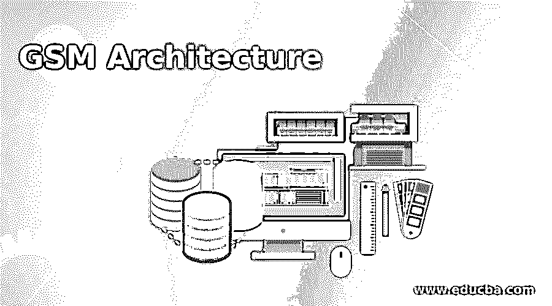
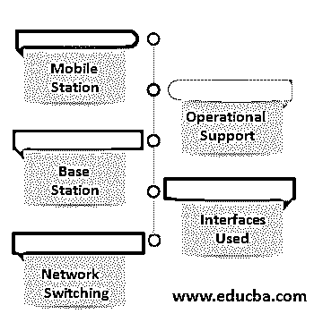

# GSM 架构

> 原文：<https://www.educba.com/gsm-architecture/>

## GSM 架构介绍

无线移动通信在连接人、飞机、船只、车辆和许多其他移动中的事物方面起着重要的作用，而不管它们的地理位置如何。它实现了上述对象的 24×7 数字连接，以及实时应用的发展，以监控它们的位置和性能。

移动通信是经济的，因为它不消耗任何电线/电缆，也不需要维护，持续的技术进步使它更快更准确。任何移动通信框架都应该是可扩展的，能够平衡负载，健壮地管理复杂性，安全，支持漫游，并通过有效的设备管理策略(MDM)来管理设备。全球移动通信系统(GSM)是第二代蜂窝网络中广泛使用的移动通信标准之一。在本文中，让我们研究移动通信技术的发展，特别是 GSM 的特点。

<small>网页开发、编程语言、软件测试&其他</small>

### 移动通信技术的演进

在过去的 40 年里，移动协议经历了几次变化，其发展是:

| G **代** | **Platform/****信号波段** | **Technology/****频率。利用率** | **年** | **特性** |
| 1G(模拟) | NMT 824-894兆赫 | FDMA 30 千赫 | One thousand nine hundred and eighty-one | 具有多个蜂窝和传输设施的第一代移动电话。数据有限的模拟双工语音通话。语音质量差，容量有限，手机体积大是缺点。 |
| 2G(数字) | GSM/IS-951900 兆赫 | TDMA/FDMA/ CDMA0.2 兆赫 | One thousand nine hundred and ninety-one | 支持数据服务和语音。支持短信和彩信。无法处理视频和其他丰富的数据文件。 |
| 3G(数字) | UMTS, IS-20002100 兆赫 | W-CDMA 5 MHz | Two thousand | 分组交换实现了视频和丰富的 3D 数据内容的传输@ 3Mbps，视频会议；直播是强项。 |
| 4G

(数字)

 | LTEs 波段 | OFDMA20 兆赫 | Two thousand and nine | 高达 1Gbps 的数据传输高带宽。使用 802.16 和 802.16e 标准。 |
| 5G(数字) | 5GNR毫米波 | OFDMA400 兆赫 | Two thousand and twenty | 更快更高的数据传输速率。服务于无人驾驶汽车、物联网设备和智能城市应用。 |

*   **缩写 UMTS:** 通用移动电信系统。
*   NMT: 北欧移动电话。
*   **W-CDMA:** 有线频带码分多址。
*   **DMA，LTE:** 长期演进。
*   **OFDMA:** 正交频率数字多址，5GNR -5G 新无线电。
*   **TDMA:** 时分多址。

### GSM 架构

GSM 是用于移动通信的数字蜂窝协议，于 20 世纪 80 年代在欧洲和亚洲采用，其特征是

*   它属于第二代(2G)蜂窝技术，是一种使用电路交换概念来传输语音和数据的数字技术。
*   GSM 最初指的是参与开发“特殊移动分组”标准的欧洲技术专家小组。采用后，被改为“全球移动通信系统”。
*   GSM 在全球范围内被广泛接受，它是许多国家遵循的默认网络标准。
*   它在 20 世纪 90 年代和 21 世纪初统治了移动世界，提供了高质量的语音、文本和多媒体消息服务。我在全球市场享有 80%的市场份额。
*   更多数字技术的出现引发了通过网络传输高分辨率视频和数据密集型内容的需求。这为 3G 技术的出现和智能手机的进入铺平了道路。
*   尽管如此，GSM 的存在是为了服务功能手机，澳大利亚电信和美国电话电报公司等主要服务提供商已经在 2017 年停止了 GSM 服务。

### GSM 部署

GSM 部署中的基本组件包括

#### 1.移动电台

它由用于语音通话和数据服务(SMS/MMS)的便携式电话组成，由 IMEI(国际移动设备身份)号码唯一识别。它会记录附近小区的信号质量，以便在漫游时轻松转移。每部手机都应有一张 SIM 卡(用户识别模块),其中有一个国际移动用户识别(IMSI)号码，用于语音通话和数据传输。这种可更换的 SIM 卡有密码保护，保存网络识别数据和激活/停用功能。

#### 2.基站

它为移动台连接到消息交换中心(MSC)提供了一个无线传输环境，并在移动台和其它 GSM 部分之间提供了一个完美的接口。基站的两个重要组成部分是

*   基站收发信台(BTS)(蜂窝塔)接收来自移动站的信息，并将其发送到站控制器。它还对接收到的信息进行调制、加密、多路复用，并通过无线电接口将其提供给移动台。
*   基站控制器(BSC)给所有移动站分配频率/时隙，并与移动交换中心(MSC)以及 BTS 通信。

#### 3.网络交换

它在交换功能上支持 MSC 与 ISDN 和 PSTN 网络进行通信，并且它包含
移动交换中心在管理呼叫建立、路由、交换、注册、位置更新、计费信息和网关功能方面发挥着关键作用。

*   归属位置寄存器(HLR)管理移动用户数据库。
*   访问者定位寄存器(VLR)保存新移动站进入者的临时数据。
*   认证中心通过维持严格的安全程序来保护入侵者。
*   设备身份注册(EIR)跟踪手机 IMEI 号码。

#### 4.操作支持

它帮助系统管理员维护 GSM 操作和监控性能。

#### 5.使用的接口

嗯，接口管理 MS 与 BTS 之间的通信，BTS 与 BSC 之间的 Abis 接口，BSC 与 MSC 之间的接口，MSC 与其他网络之间的 SS7 协议。

### GSM 的类型

在 GSM 所属的 2G 网络中，有三种常用的通信技术，它们是

*   **频分多址(FDMA):** 可用频谱带宽被分割成相等带宽的语音信道，就像多个无线电台在频带中的指定频率上广播信号一样。虽然它能够进行数字传输，但主要用于模拟传输。
*   **时分多址(TDMA):** 一个频率信道中可用的窄带宽通过分割成多个时隙与多个用户共享。用户通过相同的信道在他们的时隙中连续泵送数据。语音被转换成数字格式，它在信道中消耗较少的带宽。
*   **码分多址(CDMA):** 它遵循一种不同的方法，在这种方法中，几个呼叫被容纳在用唯一的序列码界定的信道中。该信道有效地传输多个呼叫的数据包，并且是扩频的一种形式。它不是由 GSM 使用，而是由 2G 家族中的 IS-95 使用。

### GSM 架构的优势

GSM 架构的一些优点是:

*   一项成熟且经过时间考验的技术，在全球范围内被采用，甚至在今天的功能手机中也存在。
*   性价比高。
*   这种技术无处不在，因此对国际漫游用户的干扰最小。
*   易于建立和维护 GSM 网络，工程师们有丰富的知识。
*   它提供了与其他技术的无缝接口。

### 推荐文章

这是 GSM 架构指南。在这里，我们还讨论了移动通信技术的介绍和演变以及 GSM 的类型。您也可以看看以下文章，了解更多信息–

1.  [安卓架构](https://www.educba.com/android-architecture/)
2.  [安全架构](https://www.educba.com/security-architecture/)
3.  [SOA 架构](https://www.educba.com/soa-architecture/)
4.  [模型驱动架构](https://www.educba.com/model-driven-architecture/)

