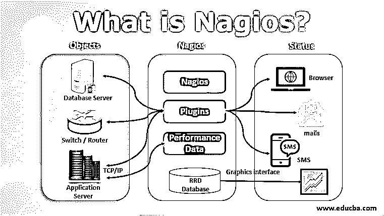

# 什么是 Nagios？

> 原文：<https://www.educba.com/what-is-nagios/>

## 什么是 Nagios？

Nagios 是一种开源软件，用于监控计算机系统。它可以在 Linux 操作系统上执行，以筛选在 Windows、Unix 和 Linux 操作系统上执行的设备。它对关键的应用程序、服务器资源、网络和任务执行连续的检查。监视器和磁盘的内存使用、微处理器的负载、处理器的数量以及当前运行的日志。它还可以检查其他服务，如邮局协议 3、简单邮件传输协议、HTTP 协议和其他可用的标准网络协议。主动和重要的检查由 Nagios 触发，而其他辅助检查由链接到监控工具的外部应用程序触发。本文简要解释了 Nagios 的用法、重要性和结构。

### Nagios 的使用

Nagios 的重要用途是，

<small>网页开发、编程语言、软件测试&其他</small>

*   它可以识别各种服务器和网络问题，并帮助用户分析问题的根本原因。因此，用户可以想出解决常见问题的永久解决方案。
*   它筛选整个业务流程和端到端基础设施，并使用户能够解决服务器的性能问题。它还帮助用户规划他的基础设施，并在过时的应用程序造成混乱时相应地更新它。Nagios 使用单路监控整个基础设施。
*   服务器的维护和安全可以由 Nagios 进行标准化和管理，并自动修复问题，即使在危急情况下也是如此。如果系统中有任何波动，它就会触发警报，以防止出现恐慌情况。因此，它是相对安全、可管理和可伸缩的。
*   Nagios 有一个可靠的数据库和一个高效的日志跟踪系统，该系统带有信息丰富的 web 界面。如果该进程在预定时间正确执行，它不能确保主机的活动状态。
*   Nagios 帮助用户找到服务器崩溃和网络故障。它会定期跟踪服务器的性能问题。这些问题可以在监控时自动修复和发现。Nagios 使用所有的拓扑来定义依赖关系。
*   通过用首选语言编写新插件，产品的架构很简单。它使用户能够从 active directory 中读取用于描述如何解释和配置各个文件的配置。
*   Nagios 用于定期监控网络服务，如 SMTP、HTTP、NNTP、ICMP、FTP、POP、SNMP 等。Nagios 通过使用父主机，可以定义网络主机的层次结构。

### 纳吉奥斯的建筑

Nagios 基于客户机-服务器架构。在这个网络中，Nagios 服务器在一台主机上执行，插件在所有需要定期监控的远程主机上启用。调度器是 Nagios 的重要组件和服务器部分。它发送一个信号来运行远程位置的插件。插件接收远程主机的状态。然后信息从插件发送到进程调度器。进程调度器持续更新 GUI，然后通知发送给管理员。

用户可以在命令行界面中选择作业，也可以选择基于 web 的图形用户界面。Nagios 的仪表板提供了资产上监控的重要参数的摘要。根据定义的阈值和参数，一旦达到优先级，它就会发送警报。该通知可以通过各种方法传送，包括文本消息和电子邮件。授权管理使管理员能够配置有限的访问权限。它可以在无代理和代理相关的配置上执行。独立代理可以在任何软件和硬件系统中实现，以收集可以再次报告给管理系统的信息。无代理监控利用现有协议与代理竞争，后者可以监控文件系统的使用情况、操作系统指标、流程和服务状态。NRDP、NCPA 等 Nagios 代理可以通过远程脚本执行，而 NRPE 则通过使用插件来执行。NRPE 用于监控系统性能、负载、内存和使用情况。它由保存在本地监控系统上的 check_nrpe 和在远程机器上执行的 NRDP 组成。在数据到达管理服务器进行进一步处理之前，它使用一个插件来组织来自 NRPE 代理的数据。窗口代理可以与 NRPE 进行通信，以监控窗口服务器。

Nagios 使用插件、扩展和替代程序来定义要监视的目标上所有重要参数的位置。插件处理命令行参数，这些参数用于与 Nagios core 进行命令交互。插件被分离到涉及软件、硬件、操作系统、安全性、云、网络连接和日志文件的列表中。Nagios 插件可以交换温度、气压和湿度等环境参数的数据。

### Nagios 的重要性

下面给出了 Nagios 的一些重要性:

*   Nagios 可以描述在主机事件或服务发生时执行的事件处理程序，以便采取主动问题的解决方案。它还用于支持监控主机中的冗余。
*   它还可以在硬件工具中进行监控，如用于报警的探针，可以通过配置的书面插件通过网络发送收集的信息的温度。可以通过 Nagios remote plugin executor 经由 SSL 和 SSH 加密通道建立远程监控。使用 Nagios 可以实现日志文件的自动循环和服务检查的并行执行。
*   Nagios 在数据库后端执行这个过程，绘制数据并在监控主机时实现冗余。查看网络当前状态、问题历史、通知管理器、文件、日志等的 web 界面
*   Nagios 有其他服务，如 Nagios 远程插件执行器缩写为 NRPE，Nagios 远程数据处理器(NRDP)，Nagios 跨平台代理，对于 windows 客户端机器，它使用 NSClient+。+.

### 结论

它还可以在医疗保健监控系统中实施，这些系统包括各种设备，如网络和服务器节点、单一控制台应用程序监控、带应用程序监控的事务级脉冲、带中间件监控组件的消息组件、可定制的仪表板和报告、UPS 备份系统、生物识别系统、温度和湿度控制系统、NVR 和 CCTV 系统。

### 推荐文章

这是一个指南什么是 Nagios？.在这里，我们还将讨论 nagios 以及架构的用途和重要性。您也可以看看以下文章，了解更多信息–

1.  [Zabbix vs Nagios](https://www.educba.com/zabbix-vs-nagios/)
2.  [Splunk vs Nagios](https://www.educba.com/splunk-vs-nagios/)
3.  [GitLab vs GitHub](https://www.educba.com/gitlab-vs-github/)
4.  [DevOps 自动化](https://www.educba.com/devops-automation/)

