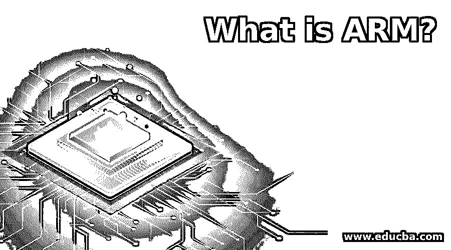

# 什么是艺术

> 原文：<https://www.educba.com/what-is-arm/>

## ARM 简介

CPU 是计算机的大脑，它按照程序代码/逻辑流程执行指令，也称为处理器。处理器的速度用赫兹表示，当前处理器的时钟速度超过 1 千兆赫兹(1，000，000，000 周期/秒)。英特尔和 AMD 处理器用于服务器、台式机和笔记本电脑。ARM、IBM 和 ATI 处理器主要用于移动平板电脑、智能手机、汽车、游戏机以及所有安装了嵌入式系统的设备。不同的处理器使用不同的指令集，它有自己的优缺点。

### ARM 处理器

下面给出的是 ARM 处理器:

<small>网页开发、编程语言、软件测试&其他</small>

#### 1.个人储蓄账户

处理器在不同的指令集架构(ISA)上工作。ISA 描述了访问存储器、处理指令和管理输入/输出操作的方式，而体系结构定义了将所有部件连接在一起并构成处理器的方式。ISA 是程序员和处理器之间有效的通信媒介，尽管它们之间有许多正式的层。

#### 2.复杂指令集电脑(complex instruction set computer)

有两个主要的指令集，即。精简指令集计算(RISC)和复杂指令集计算(CISC)。英特尔 x86、AMD、摩托罗拉、VAX、PDP-11 处理器采用 CISC 架构，而 ARM、MIPS、PA-RISC、PIC、AVR、Power 处理器采用 RISC 架构。

#### 3.精简指令集计算

ARM 处理器属于 RISC 家族架构，先进的 RISC 机器开发出来的。有一段时间，CISC 是唯一的 ISA，当时没有 ISA 的正式分类。发明 RISC 时，分类是为了识别不同的 isa。RISC 是最新的 ISA，在大约一个时钟周期内执行一条简单(精简)的指令。专注于增强性能的软件利用 RAM 来处理多条指令，并更快地执行指令。

**ARM 处理器的特点:**

*   单周期执行一条指令，
*   由于其统一的指令格式(正交指令集)，寄存器和地址模式可互换使用。
*   功耗更低。
*   部署在简单的小型设备中。
*   ARM 处理器是 32 位 64 位多核处理器。
*   它以更高的速度处理数量减少的指令，每秒完成数百万条指令(MIPS)。“减少”一词表示教学中的工作内容减少了，与 CISC 相比变得简单了。
*   需要更多内存来执行更多指令。
*   加载/存储架构使硬件更快更简单。
*   支持高效的多核处理。简化编程并减少编码工作。

**ARM 处理器的应用:**

*   ARM 处理器广泛应用于智能手机、平板电脑、手机手表和多媒体播放器。
*   由于精简的指令集，对硬件(晶体管)的要求较低，因此可以用 ARM 处理器设计小型化的设备。

### ARM 架构橡子

ARM 是 Advanced RISC Machine 的首字母缩写，但它的原名是 Arm Holdings 开发的 Acorn RISC machine，这种架构被授权给第三方开发者，将其封装在他们的产品中。基于 6502 的 BBC 微系列是发布的第一款 ARM 产品。它不支持图形界面。

#### 1.ARM2

在提供 ROM 支持的 VLSI 的帮助下，Acorn 开发了 ARM2。实现了低延迟以及 6502 的效率。ARM2 的大小为 32 位，其中 26 位用于地址，6 位用于寄存器。它只有 3 万个晶体管，而摩托罗拉有 4 万个晶体管。这有助于实现低功耗、散热、更好的性能，并领先于英特尔 80286。ARM3 后来发布，提供了高速缓存以提高性能。

#### 2.ARM6

Acorn 与苹果电脑和超大规模集成电路技术合作，成立了新公司 ARM 有限公司和新处理器。ARM6 发布了，苹果使用基于 ARM6 的 ARM610 构建了他们的苹果牛顿 PDA。这些处理器被 Acorn 用于个人电脑。DEC 使用该处理器开发了 Strongarm。英特尔在 i960 处理器中采用了相同的处理器。ARM6 中的晶体管数量仅增长到 35000 个。2005 年，98%的手机采用 ARM 处理器。ARM6 继续用于移动设备，2013 年市场份额为 60%。

ARM 设计了 ARM7 和 ARM8，在 ARM6 的基础上进行了许多改进。ARMv5 至 ARMv7 用于移动设备、手机和 PDA。ARM 处理器由于其独特的功能被部署在嵌入式系统中，安装在设备上。ARMv8 目前用于高端小工具。

### 创新的许可模式

ARM holding 从最初的 Acorn 发展而来，以可变的成本和交付模式向第三方供应商出售 IP 内核。第三方供应商可以使用 ARM core 和其他产品构建自己的处理器，以构建自己的 CPU、微控制器、片上系统和设备，并可以将其出售给其他原始设备制造商。它只向希望使用 ARM 内核开发自己的芯片设计的第三方供应商出售内核。Arm holding 不允许转售其许可证。它出售知识产权只是为了获得并交付给客户的价值。

### ARM 架构列表

下表显示了 ARM 及其第三方供应商开发的各种架构。

| **架构** | **Core****(位)** | **臂芯** | **第三方** |
| ARMv1 | Thirty-two | ARM1 |  |
| ARMv2 | Thirty-two | ARM2、ARM3、ARM250 | 安珀，暴风开启软核 |
| ARMv3 | Thirty-two | ARM6、ARM7 |  |
| ARMv4 | Thirty-two | ARM8 | StrongARM，ZAP，FA526 |
| ARMv4T | Thirty-two | ARM7TDMi、ARM9TDMI |  |
| armv 5 你 | Thirty-two | ARM7EJ、ARM9E、ARM10E | XScale、feroceon、FA626T3 |
| ARMv7-A | Thirty-two | 手臂皮层-A5、A6、A7、A8、A9 | 高通蝎子，Pj4，苹果雨燕 |
| ARMv8-A | 32/64 | 手臂皮层-A35，A53，A72 | x 基因，苹果，高通，三星 |

### 手臂的优点和缺点

下面给出了优点和缺点:

#### 优势

以下是优点:

*   它消耗的能量更少，产生的热量也更少。
*   与他人相比经济实惠。
*   工作速度更快。
*   需要更少的硬件，因此是迷你小工具的理想选择。
*   由于更好的支持基础架构和易用性，成为最终用户的首选。

#### 不足之处

以下是缺点:

*   与 Windows 操作系统不兼容。
*   速度和性能并非在所有情况下都是一致的。
*   调试困难。
*   性能取决于程序员正确执行的能力。

### 结论

ARM 处理器广泛应用于移动设备、PDA、手机、微软 Surface 等。它还为服务器和超级计算机提供高能效解决方案。

### 推荐文章

这是一个什么是 ARM 的指南？在这里，我们讨论了 acorn 架构的 ARM 处理器简介，创新的许可模式，优点和缺点。您也可以看看以下文章，了解更多信息–

1.  [什么是 Docker Swarm？](https://www.educba.com/what-is-docker-swarm/)
2.  什么是域欺骗？
3.  [群体智能应用](https://www.educba.com/swarm-intelligence-applications/)
4.  [Docker Swarm 架构](https://www.educba.com/docker-swarm-architecture/)

