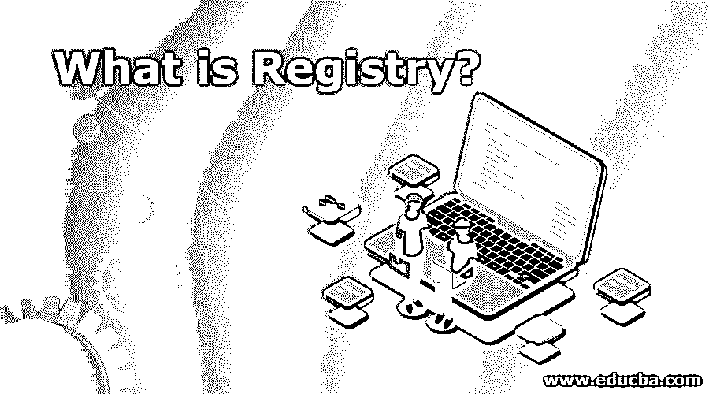

# 什么是注册表？

> 原文：<https://www.educba.com/what-is-registry/>

## 注册表简介

存储所有窗口设置的数据库称为注册表。它按层次顺序排列，以便在系统中需要和使用时检索数据。大多数情况下，基本设置存储在注册表中，以便于访问和使用。它可以是关于应用程序的信息、关于系统中安装的窗口和软件的数据。注册表在 Windows 系统中工作，由微软开发。它帮助人们容易地获得数据，并使用它们进行进一步的处理。所有系统都有一个注册表，因为数据存储在那里。

### 注册表的重要性

**1。**它充当系统的数据库，因此所有与硬件和软件相关的重要信息都存储在注册表中。配置设置、关于应用程序的信息、使用软件的用户以及相关数据都存储在注册表中。

<small>网页开发、编程语言、软件测试&其他</small>

**2。当程序员需要任何数据时，他可以查看注册表，并且肯定会得到相关信息。注册表充当需要快速数据的人的数据存储。**

**3。**有时，注册表会被相关和不相关的数据填满，这时就有必要清理注册表，删除垃圾文件。对于急需数据而又无法浏览系统中所有文件的用户来说，注册表可以起到节省时间的作用。

**4。**服务数据存储在注册表中，因此它有助于安全管理员在需要时检查细节。可以对系统进行适当的用户认证，以使用注册表而不被泄露。

**5。**当需要数据时，Windows 会检查注册表并获取信息。因此，为了更快地获得数据，注册表不应该堆积大量数据。必须对注册表进行压缩，并在两者之间进行检查，以便向窗口中提供数据。

**6。**为了让注册表更高效，应该定期清理，检查错误条目。应该删除不需要的数据，并向系统提供适当的输入。

### 如何使用注册表？

注册表是计算机的灵魂。它展示了系统如何工作，并用系统中的数据描述了一切。在注册表中，数据有不同的存储级别。最高层是由 HKEY 表示的蜂巢，它存储关于用户、系统中的程序、系统的配置以及关于 PC 及其资源的数据的信息。因此，这些信息应该存储在文件夹和子文件夹所在的配置单元中。文件夹具有值或路径，数据通过这些值或路径存储在系统中。这有助于用户检查数据位置并在需要时访问它们。

当必须编辑注册表或检查数据时，必须使用注册表编辑器程序。这有助于修改注册表，并检查数据是否保存在文件夹中，或者文件夹是否为空，是否有任何默认值。注册表中的数据不应删除，而应检查信息，如果不需要，应禁用。这使得系统不检查数据的特定文件夹。值作为存储在文件夹中的文件保存在键中。这有助于用户识别层次结构，如果需要，他可以修改它们。

当注册表打开时，左侧显示一个层次结构，右侧显示值。注册表的用户界面是基本的，非常容易理解。文件夹中的值显示在系统的右侧。此外，窗格底部会显示每个文件夹的路径。这有助于理解文件结构和浏览它们。有时，该文件夹不显示任何文件，但会链接到下一级文件夹。

### 为什么我们需要注册？

*   Windows 注册表在现实生活中是一个实际的注册表，所有信息都保存在其中，以备将来使用或作为过去的参考。在这里，数据被存储，设置被保存，以便在需要时可以检查和修改。这使得系统能够有效地处理手头的所有数据。
*   如果系统中安装了新软件，注册表中会创建一个新的文件夹或项。每当我们使用该软件时，所有数据都存储在注册表中，以便在需要时可以检索。配置设置、关于登录详细信息的数据以及软件的所有存档都存储在注册表中。由于注册表很容易访问，有了数据，软件启动更快。即使用户登录到系统，数据也存储在注册表中。
*   注册表保存在 Windows 的 config 文件夹下，系统必须根据应用程序的配置设置在注册表中进行更改。基本上，有五个存储数据的根键，必须对其进行修改，并且必须进行例行检查，以便不需要的文件不会占用注册表中的空间。
*   通过 windows 命令按钮和 regedit 查看注册表文件，这使您能够查看和检查文件。注册表中需要管理权限，以便根据用户需求进行编辑和修改。
*   必须检查注册表中的恶意软件，以免暴露给网络中的其他用户。只有经过授权的用户才可以查看注册表并进行必要的更改。

### 结论

所有数据库都存储在注册表中，因此应该确保注册表的正确使用。这使得系统最大限度地使用注册表，并在需要特定数据集时向用户提供。注册表对于存储配置设置甚至系统硬件都很重要。

### 推荐文章

这是一个什么是注册指南？.这里我们讨论注册表的介绍以及如何使用它。我们还讨论了为什么我们需要注册及其重要性。您也可以浏览我们推荐的其他文章，了解更多信息——

1.  [理解 Scala 的概念](https://www.educba.com/what-is-scala/)
2.  [科特林 vs Scala |十大对比](https://www.educba.com/kotlin-vs-scala/)
3.  [Scala 版本介绍](https://www.educba.com/scala-versions/)
4.  [Scala 数据类型概述](https://www.educba.com/scala-data-types/)

