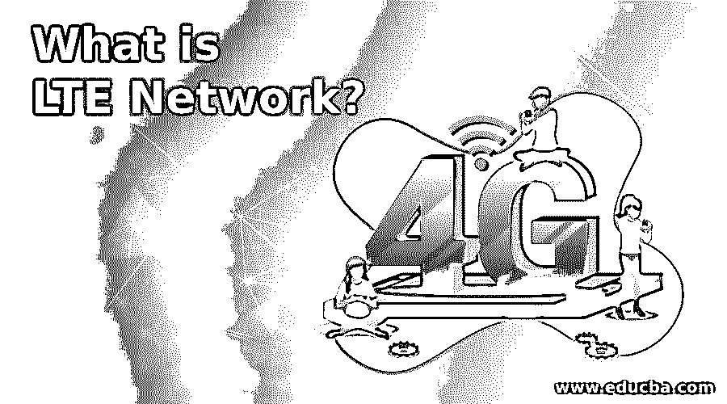

# 什么是 LTE 网络？

> 原文：<https://www.educba.com/what-is-lte-network/>

## LTE 网络简介

LTE 作为 4G 无线通信的长期演进进行了扩展，可在平板电脑、手机、上网本、无线热点和笔记本电脑上运行的 3G 网络中提供最高 10 倍的速度。LTE 的重点是基于千年执行的数字信号处理和调制来提高无线数据的速度和容量。LTE 的重要目标是通过基于 IP 的系统来调整和简化网络架构，从而减少延迟。无线 LTE 的接口与 3G 或 2G 网络不兼容，因此它使用不同的无线电频谱。

### 我们为什么要用 LTE 网络？

LTE 提供了最高的数据传输速度，使移动和互联网用户的生活更加便利，同时也提高了个人或企业的生产力。但 LTE 的部署存在一些限制。LTE 在技术上并不具备真正的 4G，但一些用户正在为此付费。威瑞森确实有 LTE 覆盖的快速网络，但人们必须支付合理的费用。更新所有的塔是强制性的，这需要从用户那里收取巨额费用，如果他需要更快的速度，用户应该成为订阅计划的一部分。

<small>网页开发、编程语言、软件测试&其他</small>

基于需求和对 LTE 必要安装的考虑，手机应该是健壮的，并且每天都在升级。快速数据永远意味着用户试图依赖移动设备的更大数据量。更快的数据传输也会影响设备电池，从而影响电池的寿命。对于移动用户来说，电池的寿命是一个热点问题，因此用户应该选择具有最大电池容量的移动设备，以便更好地利用网络和设备。

### LTE 网络是如何工作的？

*   LTE 的过程改变了将数据传输到 IP 系统的现有方法，而不是像 GSM 和 CDMA 那样移动少量数据。
*   他们还移动最大的数据包来调节和缩小服务范围。
*   LTE 的重点是消耗传输数据时的延迟。
*   GSM 的原理是基于延时双工，而 CDMA 是基于码分双工。
*   两种技术的编码数据都是通过无线电波传输的。
*   在最初的过程中，GSM 被标记为更快，全球跟随它的过程，在过去的几年中，GSM 被升级到 HSPA，这是高速分组接入，随后是 LTE，通过以快速的速率传输最大块的信息。
*   技术人员认为 HSPA 和 LTE 是可替代的术语。
*   在威瑞森，位置在美国有最广泛的 CDMA 载波被证明访问强大和快速的 LTE 网络。
*   虽然，LTE 致力于数字信号处理，以提供数据包传输的最佳裁决。
*   LTE 覆盖了无线技术的整个过程，它标志着自己是遍布全球的 CDMA 或 GSM 移动应用的增压器。

### LTE 网络的特点

以下是独特的功能:

*   LTE 网络在下行链路过程中也基于 OFDMA，它通过将单个信道分成有限的正交子载波集来实现多址接入，该正交子载波集根据每个用户的要求分布成组。
*   在上行链路过程中，SC-FDMA 使用了 FDMA 的哪个单载波。但是这里的限制是输出信号中存在功率波动，因此必须使用特殊的低效率线性放大器。因为上行链路的功耗很大，因此使用单信道 FDMA。它在节省和遵循 OFDMA 优点的电源方面变得更加有效。
*   频谱的灵活性是 LTE 的一个重要特征。在依赖于部署的地理位置的框架中存在可变的规定，该框架结合了用户、系统和服务的操作，是对带内部署后的带宽灵活性进行管理的命令。
*   它可以在成对的 FDD 和不成对的 TDD 中工作。它支持动态频谱分配，以更好地利用无线电频谱。它能够基于每个频率块和时刻的信道条件在合适的前提下选择用户。它包括使用具有极化分集的多个天线。
*   它使 MIMO 技术能够提供最大数据速率，实现并行多通道。上行链路具有功率控制，该功率控制临时增加系统的容量并最小化功率消耗。LTE 的过程实现了小区间干扰协调，使得能够找到位于不同中心的用户，并管理小区间设备的频率干扰。

### LTE 网络的优势和劣势

下面给出了优点和缺点:

#### 优势

以下是优点:

*   流量管理通过实施 LTE 得到高度监管，并减少了数据传输的流量。
*   它使多个用户能够在一个特定的频道上工作在相同的频率上，从而发展更多的移动宽带用户。
*   它提供快速的数据传输，从而实现最大的上传和下载速率。
*   如果这一比率增加，它将影响互联网连接的滞后。
*   LTE 提供最大的数据容量，目标是 IP 语音。
*   它支持许多应用程序以最高速度工作。
*   它隔离各种通道中的频率，以保护每个通道中的任何干扰事件。
*   LTE 通过通用接入促进现有网络中的短信和语音通话。

#### 不足之处

以下是缺点:

*   LTE 的限制需要在基站实施天线来传输数据。
*   增加了网络基础设施的实施成本。

### 结论

考虑到这一要求，LTE 应该安装在合适的位置，通过克服其较小的局限性并享受其剩余优势来有效地利用它。

### 推荐文章

这是一个什么是 LTE 网络的指南？这里我们讨论一下 LTE 网络的介绍、用途、工作方式、特点、优缺点。您也可以看看以下文章，了解更多信息–

1.  [神经网络的类型](https://www.educba.com/types-of-neural-networks/)
2.  [什么是 VLAN 网络？](https://www.educba.com/what-is-vlan-network/)
3.  [网络类型](https://www.educba.com/types-of-network/)
4.  [神经网络机器学习](https://www.educba.com/neural-network-machine-learning/)

